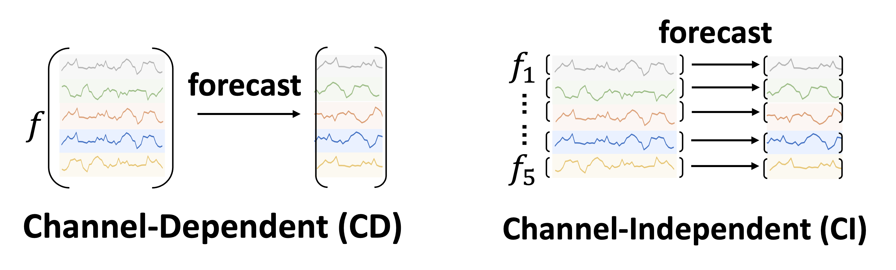
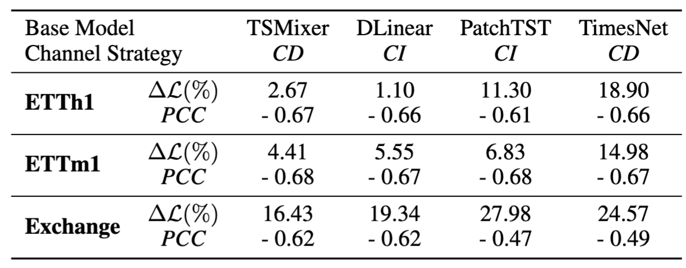
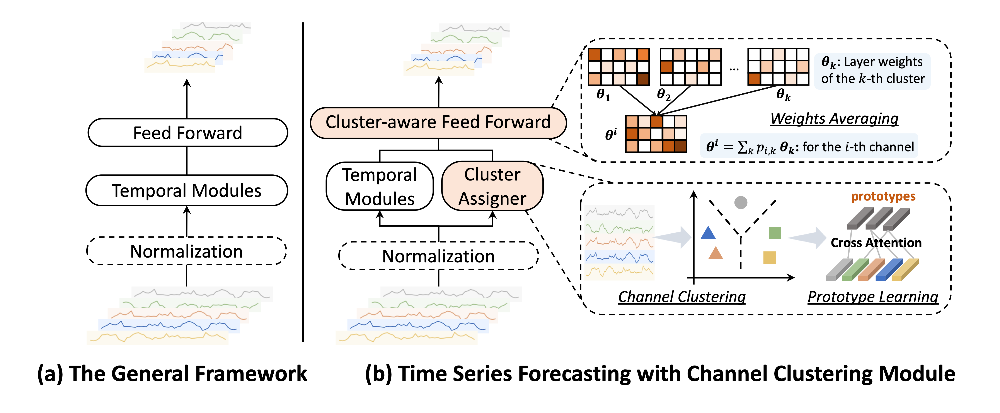
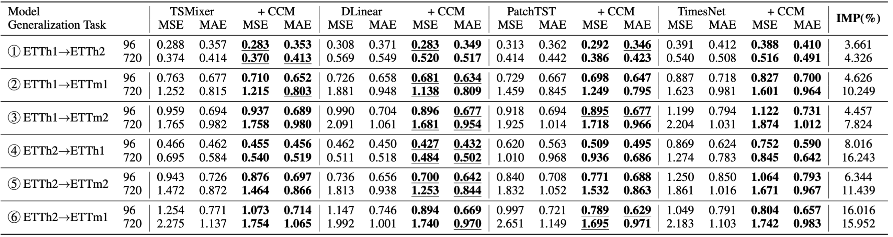
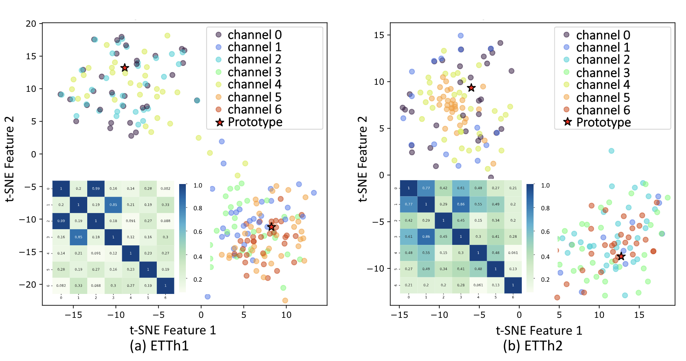

import { Authors, Badges } from '@/components/utils'

# From Similarity to Superiority: Channel Clustering for Time Series Forecasting

<Authors
  authors="Jialin Chen, Yale University; Jan Eric Lenssen, Kumo.AI; Max Planck Institute for Informatics; Aosong Feng, Yale University; Weihua Hu, Kumo.AI; Matthias Fey, Kumo.AI; Leandros Tassiulas, Yale University; Jure Leskovec, Kumo.AI, Stanford University; Rex Ying, Yale University"
/>

<Badges
  venue="NeurIPS 2024"
  github="https://github.com/Graph-and-Geometric-Learning/TimeSeriesCCM"
  arxiv="https://arxiv.org/abs/2404.01340"
  pdf="https://arxiv.org/pdf/2404.01340"
/>

## Introduction
Time Series Forecasting has been a critical research direction across diverse domains, including traffic, energy, weather, finance, etc. Two channel strategies have been explored in multivariate time series modeling: Channel-Independent (CI) and Channel-Dependent (CD) strategies.

CD models process all channels together, offering better generalization by capturing cross-channel dependencies. However, they suffer from **lower accuracy** when channels vary in granularity, scale, or frequency, and can **mix irrelevant information** from different channels. On the other hand, CI models handle each channel separately, leading to better forecasting performance. Yet, they face challenges like **limited generalizability** to unseen channels, **ignoring cross-channel interactions**, and **higher parameter complexity**. This raises a critical research question: How can we develop a channel strategy that effectively **balances between individual channel treatment and cross-channel interactions?**

## Method
### Motivation for Channel Similarity
In a toy experiment, we train a time series forecasting model on randomly shuffled channels and compare with the one trained on normal dataset. Channel Shuffling removes the channel identity information. Let $\mathcal{L}_i$ and $\mathcal{L}_i^\prime$ indicate the MSE loss on the $i$-th channel of the model trained on the original dataset and shuffled dataset, respectively. $\Delta\mathcal{L}=\text{Avg}_i(\mathcal{L}_i^\prime-\mathcal{L}_i)$ indicates average performance gain across all channels. We define the similarity between the $i$-th and the $j$-th channel based on radial basis function kernels: 
$$\text{SIM}(X_i, X_j)=\text{exp}(\frac{-\|X_i-X_j\|^2}{2\sigma^2}).$$ We investigate Pearson Correlation Coefficients (PCC) between $|\Delta\mathcal{L}_i−\Delta\mathcal{L}_j |$  and $\text{SIM}(X_i,X_j)$, indicating the correlation between model’s performance and channel similarity, as shown in the following.

We empirically observe: 
- Existing forecasting methods consistently rely on channel identity information, as $\Delta\mathcal{L}$ is always positive. 
- This reliance clearly anti-correlates with channel similarity: for channels with high similarity, channel identity information is less important. 

We therefore propose to create clusters based on channel intrinsic similarity and provide the model with cluster identity instead of channel identity. In this way, we combine the best of both worlds: **expressiveness** and **generalization**.

### CCM Architecture

We propose **Channel Clustering Module (CCM)**, which explores the optimal trade-off between channel individual treatment and cross-channel modeling.
CCM is a plug-and-play, model-agnostic method that is adaptable to most mainstream models.

In **Cluster Assigner**, each channel $i$ ($1 \leq i \leq C$) is assigned to a cluster $k$ ($1 \leq k \leq K$). The probability that a given channel $𝑋_𝑖$ is associated with the $𝑘$-th cluster is computed as $p_{i,k}=\text{Normalize}(\frac{c_k^\top h_i}{\|c_k\|\|h_i\|})\in[0,1]$, where $𝑐_𝑘$ is the embedding of cluster $𝑘$ and $ℎ_𝑖$ is the embedding of channel $𝑖$. We then sample the clustering membership matrix $\mathbf{M}\in\mathbb{R}^{C\times K}$ where $\mathbf{M}_{ik}\approx\text{Bernoulli}(p_{i,k})$. Higher probability $p_{i,k}$ results in $\mathbf{M}_{ik}$ close to 1, leading to the deterministic existence of certain channels in the corresponding cluster.

In **Cluster-aware Feed Forward**, we assign a separate Feed Forward layer to each cluster. Let $\theta_k$ indicate the layer weights for the $k$-th cluster. The weights for the $i$-th channel is $\theta^i=\sum_k p_{i,k}\theta_k$, which utilizes the underlying shared time series patterns within the cluster to replace channel identity.

Let $\mathbf{C},\mathbf{H}$ indicate embeddings of clusters and channels. In **Prototype Learning**, $\mathbf{C}$ is updated by cross-attention during the training phase for subsequent clustering probability computing:
$$\widehat{\mathbf{C}}=\text{Normalize}\left(\text{exp}(\frac{(W_Q\mathbf{C})(W_K\mathbf{H})^\top}{\sqrt{d}})\odot \mathbf{M}^\top\right)W_V\mathbf{H}$$

We propose a new cluster loss: $\mathcal{L}_C=-\operatorname{Tr}\left(\mathbf{M}^\top\mathbf{S}\mathbf{M}\right)+\operatorname{Tr}\left(\left(\mathbf{I}-\mathbf{M} \mathbf{M}^\top\right)\mathbf{S}\right)$, which maximizes the channel similarities within clusters and encourages separation between clusters. This cluster loss captures meaningful time series prototypes without relying on external labels or annotations. The overall loss function thereby becomes $\mathcal{L}=\mathcal{L}_F+\beta\mathcal{L}_C$, where $\mathcal{L}_F$ is the general forecasting loss such as MSE loss; and $\beta$ is a regularization parameter for a balance between forecasting accuracy and cluster quality.

### Zero-shot Generalization
Zero-shot forecasting is useful in time series applications where data privacy concerns restrict the feasibility of training models from scratch for unseen samples. **The prototype embeddings acquired during the training phase serve as a compact representation of the pre-trained knowledge, which can be harnessed for seamless knowledge transfer to unseen samples in a zero-shot setting.** One can use the cluster embedding to calculate the probability of an unseen channel being classified to a certain cluster.

## Experiments
We test CCM based on four SOTA time series models:
- [TSMixer](https://arxiv.org/pdf/2303.06053): MLP-based model (CD)
- [Dlinear](https://arxiv.org/pdf/2205.13504): single linear layer (CI)
- [PatchTST](https://arxiv.org/pdf/2211.14730): transformer model with a patch mechanism (CI)
- [TimesNet](https://arxiv.org/pdf/2210.02186): convolutional network (CD)

### Long-term and Short-term Forecasting
We test the CCM's ability of improving time series models' long-term and short-term forecasting accuracy. The datasets involve 9 long-term forecasting datasets from finance, weather, electricity, etc., and M4 dataset for short-term forecasting scenario. We also curate a new stock dataset, including 1390 univariate time series from different companies spanning 10 years.

From the table, we observe that the model enhanced with CCM outperforms the base model in general. Specifically, CCM improves long-term forecasting performance in $90.27\%$ cases in MSE and $84.03\%$ cases in MAE across 144 different experiment settings. 

 
The efficacy of CCM is consistent across all M4 sub-datasets with different sampling frequencies. Specifically, CCM outperforms the state-of-the-art linear model (DLinear) by a significant margin of $11.62\%$, and outperforms the best convolutional method TimesNet by $8.88\%$. We also observe a significant performance improvement on the stock dataset, achieved by applying CCM.

### Zero-shot to Unseen Time Series
We test the CCM's ability in zero-shot scenarios on ETT dataset collection. ETTh1 and ETTh2 are hourly recorded, while ETTm1 and ETTm2 are minutely recorded, where “1” and “2” indicate two different regions. As shown in Table 5, there are cross-domain and cross-granularity challenges within ETT datasets:
- ①④ require cross-domain generalization
- ②⑤ require cross-granularity generalization
- ③⑥ require cross-domain + cross-granularity generalization

We make the following observations. 
- CCM exhibits more significant performance improvement with longer forecasting horizons, highlighting the efficacy of memorizing and leveraging pre-trained knowledge in zero-shot forecasting scenarios
- CCM demonstrates a better effect on originally CI base models.

### Cluster Visualization

As shown in Figure 3, in ETTh1 dataset, we discern a pronounced clustering of channels 0, 2, and 4, suggesting that they may be capturing related or redundant information within the dataset. Concurrently, channels 1, 3, 5, and 6 coalesce into another cluster. Clustering is also observable in ETTh2 dataset, particularly among channels 0, 4, and 5, as well as channels 2, 3, and 6. Comparatively, channel 1 shows a dispersion among clusters, partly due to its capturing of unique or diverse aspects of the data that do not closely align with the features represented by any clusters.