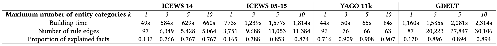

import { Authors, Badges } from '@/components/utils'

# Online Detection of Anomalies in Temporal Knowledge Graphs with Interpretability

<Authors
  authors="Jiasheng Zhang, University of Electronic Science and Technology of China; Rex Ying, Yale University; Jie Shao, University of Electronic Science and Technology of China"
/>

<Badges
  venue="SIGMOD 2025"
  github="https://github.com/zjs123/ANoT"
  arxiv="https://arxiv.org/abs/2408.00872"
  pdf="https://arxiv.org/pdf/2408.00872"
/>

## Introduction
Temporal knowledge graphs (TKGs) are valuable resources for capturing evolving relationships among entities,
yet they are often plagued by noise, necessitating robust anomaly detection mechanisms. Existing dynamic
graph anomaly detection approaches struggle to capture the rich semantics introduced by node and edge
categories within TKGs, while TKG embedding methods lack interpretability, undermining the credibility of
anomaly detection. Moreover, these methods falter in adapting to pattern changes and semantic drifts resulting
from knowledge updates. To tackle these challenges, we introduce AnoT, an efficient TKG summarization
method tailored for interpretable online anomaly detection in TKGs. AnoT begins by summarizing a TKG into
a novel rule graph, enabling flexible inference of complex patterns in TKGs. When new knowledge emerges,
AnoT maps it onto a node in the rule graph and traverses the rule graph recursively to derive the anomaly
score of the knowledge. The traversal yields reachable nodes that furnish interpretable evidence for the validity
or the anomalous of the new knowledge. Overall, AnoT embodies a detector-updater-monitor architecture,
encompassing a detector for offline TKG summarization and online scoring, an updater for real-time rule
graph updates based on emerging knowledge, and a monitor for estimating the approximation error of the rule
graph. Experimental results on four real-world datasets demonstrate that AnoT surpasses existing methods
significantly in terms of accuracy and interoperability. 

## Anomalies in Temporal Knowledge Graphs

- **Conceptual Errors**: Extraction methods may introduce noised facts with error entities or relations in TKGs, e.g., (𝐽𝑜𝑒𝐵𝑖𝑑𝑒𝑛, 𝐵𝑜𝑟𝑛𝐼𝑛, 𝐼𝑟𝑒𝑙𝑎𝑛𝑑, 1942/11/20).
- **Time Errors**: Knowledge updating may make existing facts invalid, but update delays will let these invalid facts not be removed from TKGs, e.g., (𝑂𝑏𝑎𝑚𝑎, 𝑃𝑟𝑒𝑠𝑖𝑑𝑒𝑛𝑡 𝑜𝑓,𝑈𝑛𝑖𝑡𝑒𝑑 𝑆𝑡𝑎𝑡𝑒𝑠, 2023/10/21).
- **Missing Errors**: Insufficient updates also prevent some correct facts not being added to TKGs. For instance, a TKG might include the knowledge Barack Obama left office but lacked his
inauguration.

## Motivation
we recognize that a rule-based summarization approach could effectively tackle these issues. 
- First, rules encapsulate the most common patterns within a graph in a human-readable form. If we can map new knowledge as a set of rules, then they can provide interpretable evidence for its validity. 
- Second, the complex patterns observed in TKGs stem from the composition of simpler, independent patterns. If we can appropriately link these simple rules, then the complex patterns can be flexibly deduced based on the individual rules. 
- Last, rules describe the properties of a TKG in a more compact and refined way. Thus ideally, any semantic and pattern shifts can be described as modifications of the rules.

## Solution

In this paper, we propose AnoT, a novel summarization method for TKG anomaly detection. As depicted in the above Figure, AnoT takes an online updating TKG as input, identifies anomalies,
and then filters valid knowledge. The process initiates with the detector module, which constructs
a rule graph based on the offline preserved part of TKG. Upon the arrival of new knowledge, this
module evaluates it against the rule graph to compute an anomaly score. Subsequently, the updater
module receives valid knowledge identified by the detector module, and then reforms them as edit
operations on the rule graph to handle online semantic and pattern changes. The monitor module
estimates the approximate error of the rule graph in representing the TKG. When the approximate
error exceeds the threshold, the monitor will inform the detector to refresh the rule graph based
on the current TKG. In this way, the reachable nodes during walking will give readable evidence
for detection, while the complex patterns can be flexibly described by the walking paths, and the
online changes are uniformly handled.

## Experiments

### Anomaly detection accuracy

### Long-term inductive detection performance

### Rule graph construction efficiency 

### Extracted rule edge examples

