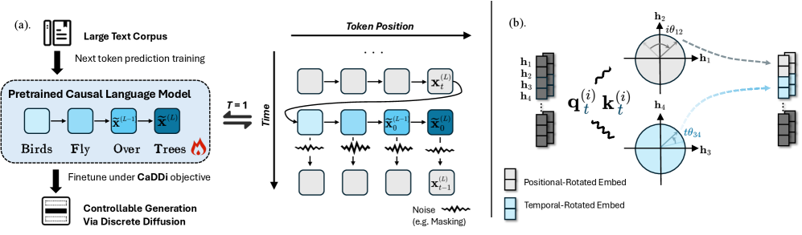
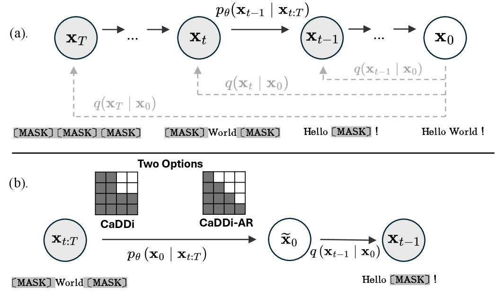
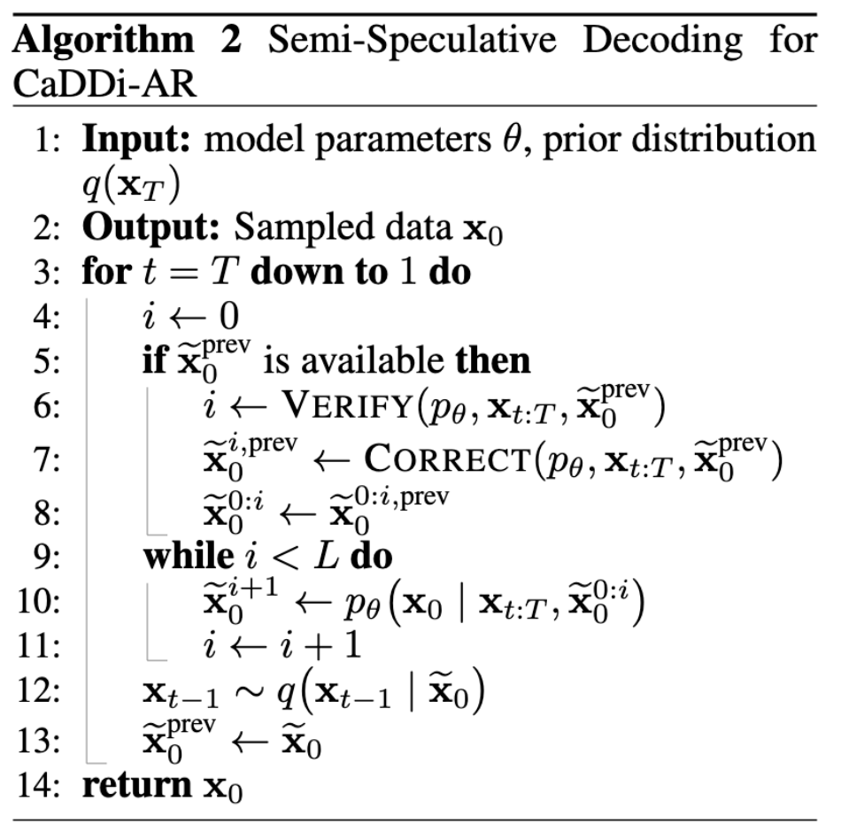
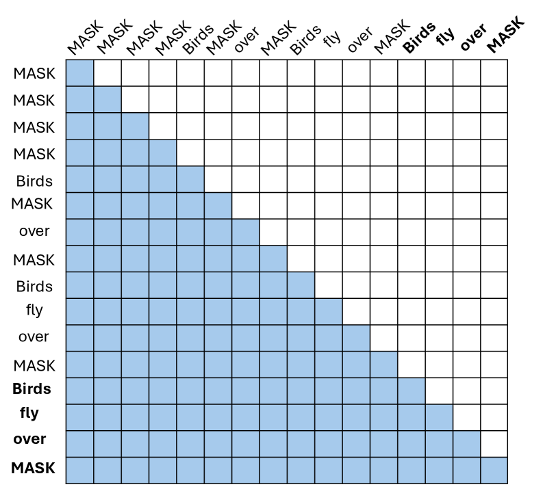
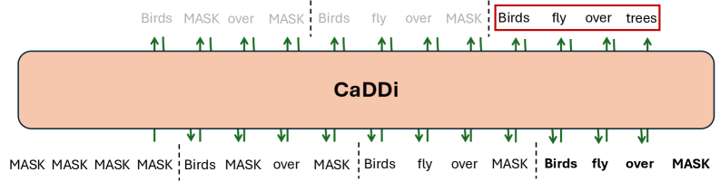

import { Authors, Badges } from '@/components/utils'

# Non-Markovian Discrete Diffusion with Causal Language Models (CaDDi)

<Authors
  authors="Yangtian Zhang, Yale University; Sizhuang He, Yale University; Daniel Levine, Yale University; Lawrence Zhao, Yale University; David Zhang, Yale University; Syed A. Rizvi, Yale University; Shiyang Zhang, Yale University; Emanuele Zappala, Idaho State University; Rex Ying, Yale University; David van Dijk, Yale University"
/>

<Badges
  venue="NeurIPS 2025"
  arxiv="https://arxiv.org/abs/2502.09767"
  pdf="https://arxiv.org/pdf/2502.09767"
/>

## Overview
Diffusion models offer controllable generation by iteratively refining sequences, yet discrete diffusion still trails causal language models in expressive power. CaDDi lifts the Markovian assumption used in prior discrete diffusion work and lets each denoising step condition on the full generative trajectory. The result is a decoder-only transformer that unifies bidirectional diffusion-style refinement with the simplicity and efficiency of left-to-right language modeling.

- **Problem**: Markovian discrete diffusion compresses the trajectory to a single latent state, making sampling brittle and error-prone compared with causal LLMs.
- **Approach**: Inject independent noise into the clean sequence at every timestep and learn a non-Markovian reverse process that conditions on the entire trajectory.
- **Outcome**: CaDDi and its autoregressive variant CaDDi-AR outperform recent discrete diffusion baselines on language modeling benchmarks while remaining compatible with pretrained LLM checkpoints.

## Method Highlights

The illustration contrasts CaDDi-AR with a standard causal LM and shows how 2D rotary embeddings extend token positions with diffusion timesteps.

### Non-Markovian Trajectory Conditioning
The forward process perturbs the clean sequence independently at each timestep, breaking the traditional Markov chain. During denoising, the model predicts the clean tokens by attending to the entire latent trajectory, allowing it to revisit earlier predictions and reduce uncorrectable errors.

### Decoder-Only CaDDi Architecture
CaDDi keeps the causal masking of standard transformers but augments token positions with the diffusion timestep through a 2D rotary positional encoding. This design keeps inference efficient, supports key-value caching, and enables partial sequence editing and infilling in the same architecture.

### CaDDi-AR and Pretrained LLMs
The token-level variant CaDDi-AR collapses to a standard causal language model when the diffusion horizon is $T=1$. This equivalence makes it straightforward to fine-tune existing LLMs under the CaDDi objective, preserving their pretrained knowledge while gaining iterative denoising control. The authors also propose semi-speculative decoding that reuses previous timestep drafts to cut inference cost without changing the sampling distribution.

### Key Equations
CaDDi is formulated as a hierarchical variational autoencoder without the Markov restriction. The learning objective maximizes
$$
\max_{\theta, \phi}\; \mathbb{E}_{\mathbf{x}_{1:T} \sim q_\phi(\mathbf{x}_{1:T} \mid \mathbf{x}_0)}
\Bigg[\sum_{t=1}^T \log p_\theta(\mathbf{x}_{t-1} \mid \mathbf{x}_{t:T}) + \log p_\theta(\mathbf{x}_T) - \log q_\phi(\mathbf{x}_{1:T} \mid \mathbf{x}_0)\Bigg],
$$
where the forward corruption process samples each latent independently from the clean sequence,
$$
q(\mathbf{x}_{0:T}) = q(\mathbf{x}_0) \prod_{t=1}^T q(\mathbf{x}_t \mid \mathbf{x}_0),
$$
and the reverse model predicts a denoised $\mathbf{x}_0$ conditioned on the entire trajectory before resampling,
$$
p_\theta(\mathbf{x}_{t-1} \mid \mathbf{x}_{t:T}) = q\bigl(\mathbf{x}_{t-1} \mid \mathbf{x}_0 = \mu_\theta(\mathbf{x}_{t:T}, t)\bigr).
$$
These equations capture how CaDDi generalizes Markovian diffusion while remaining compatible with $\mathbf{x}_0$-parameterization.

### Inference Algorithm

The algorithmic overview shows how CaDDi iteratively denoises from $t = T$ to $1$ while accessing the entire trajectory $\mathbf{x}_{t:T}$. Starting from a noisy prior $\mathbf{x}_T \sim q(\mathbf{x}_T)$, the model produces $\mu_\theta(\mathbf{x}_{t:T}, t)$, samples the next latent via the learned posterior, and repeats until a clean sample $\mathbf{x}_0$ is obtained.

### Semi-Speculative Decoding

Because CaDDi-AR shares the same denoising target across timesteps, the authors adapt speculative decoding to the diffusion setting. The previous timestep's draft $\widetilde{\mathbf{x}}_0^{\text{prev}}$ is reused as a proposal. Tokens are verified in parallel, and only the low-confidence positions are resampled. This reduces the $\mathcal{O}(L \times T)$ complexity of naive decoding while preserving the sampling distribution and enabling compatibility with acceleration techniques like KV caching.

### Causal Bidirectional Augmentation

To retain bidirectional context within each diffusion block while staying compatible with causal attention, CaDDi repeats the last timepoint of the context window before predicting the next block. The augmented sequence lets every token use the standard autoregressive mask yet attend to both past and future positions inside the repeated block. As a result, CaDDi keeps the efficiency advantages of causal LMs (flash attention, KV cache) while approximating bidirectional modeling during block-wise generation.

## Experiments

### Language Modeling on LM1B
On the One Billion Word benchmark, CaDDi sets new lows for guided generative perplexity across GPT-2, Llama-2 7B, and Llama-3 3B oracles. At a low temperature (T = 0.5), CaDDi achieves PPL 45.96 (GPT-2 oracle) and 23.81 (Llama-2), substantially ahead of the best prior diffusion models such as SEDD (81.44 and 46.91). CaDDi-AR is strongest at higher temperatures, matching or surpassing CaDDi while maintaining diversity entropy on par with baselines.

### Likelihood Modeling on Text8
With only 64 denoising steps, CaDDi reports a bits-per-dimension upper bound of ≤ 1.41 on Text8, improving over MDLM, SEDD, and UDLM under the same discretization. The model approaches the quality of any-order autoregressive models while using far fewer refinement steps.

### Reasoning Benchmarks with Fine-Tuned LLMs
Fine-tuning a 1.5B-parameter QWen model under the CaDDi-AR objective enables evaluation on ARC-Challenge, ARC-Easy, BoolQ, PIQA, RACE, Social IQA, and LAMBADA. The study benchmarks against comparably sized causal models (QWen2, GPT-2, TinyLlama) and diffusion baselines, illustrating that CaDDi-AR retains compatibility with pretrained LLMs while adding diffusion-style control.

## Additional Insights
- Scaling the number of denoising steps smoothly reduces generative perplexity, hinting at compute-quality scaling laws for non-Markovian discrete diffusion.
- Ablations highlight the importance of longer diffusion horizons, 2D rotary encodings, and appropriately truncated latent contexts for stable training.
