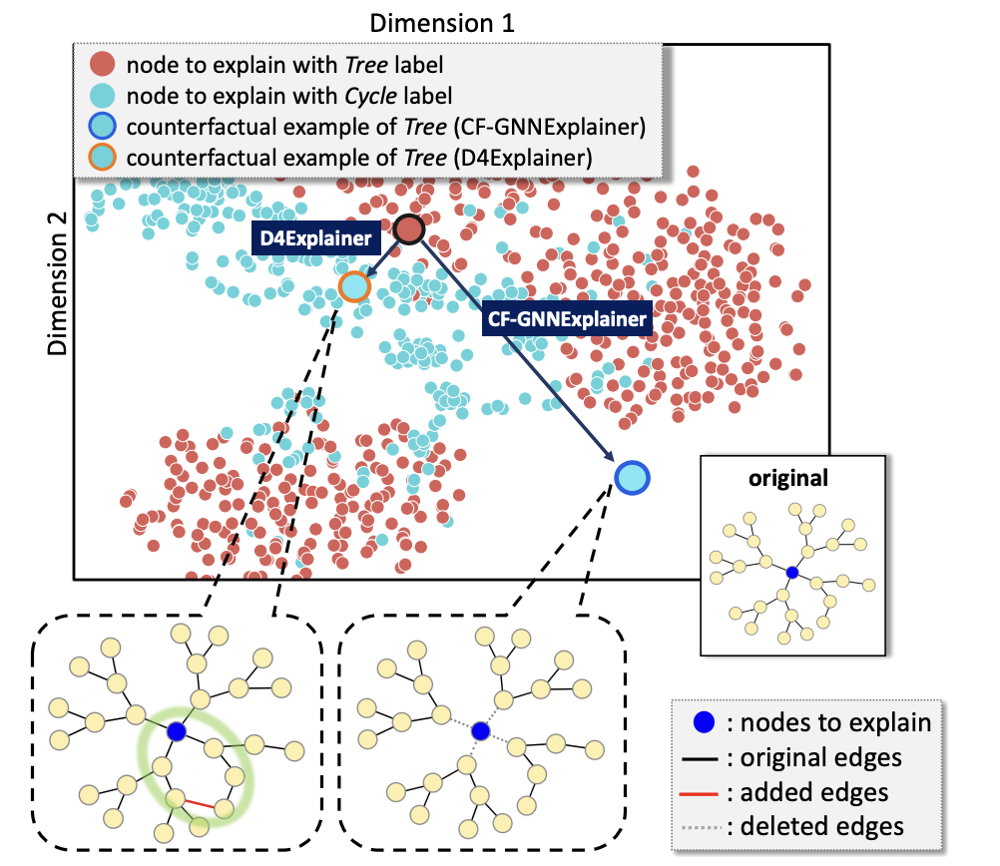
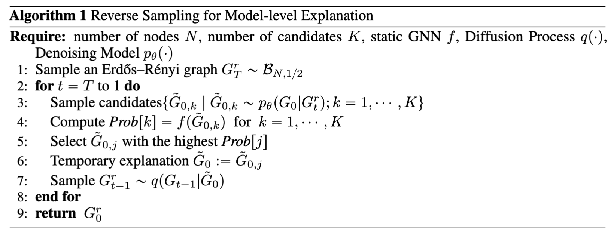
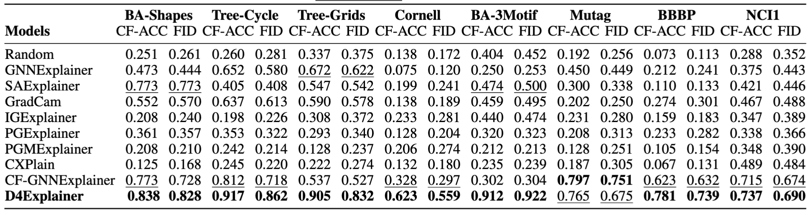
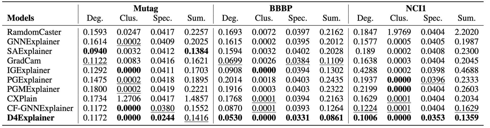
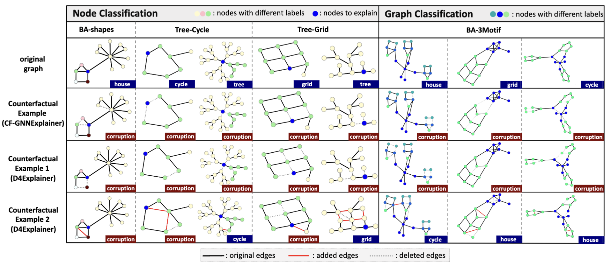
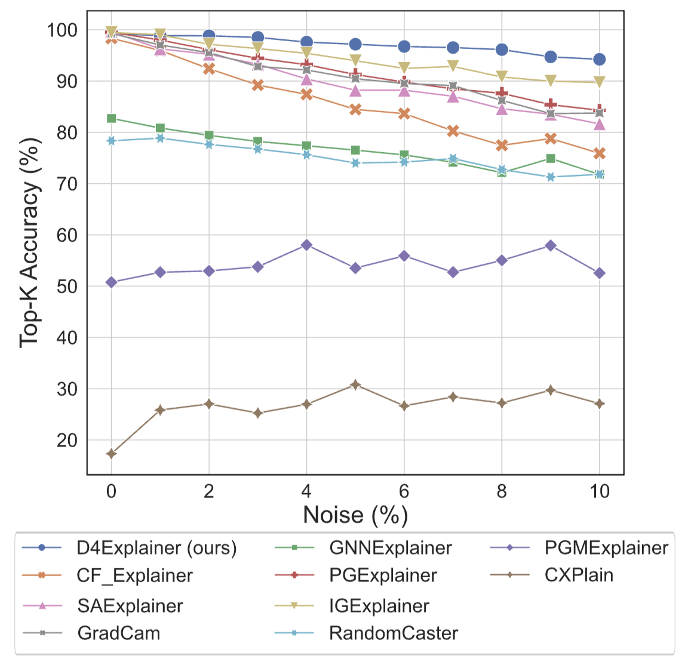
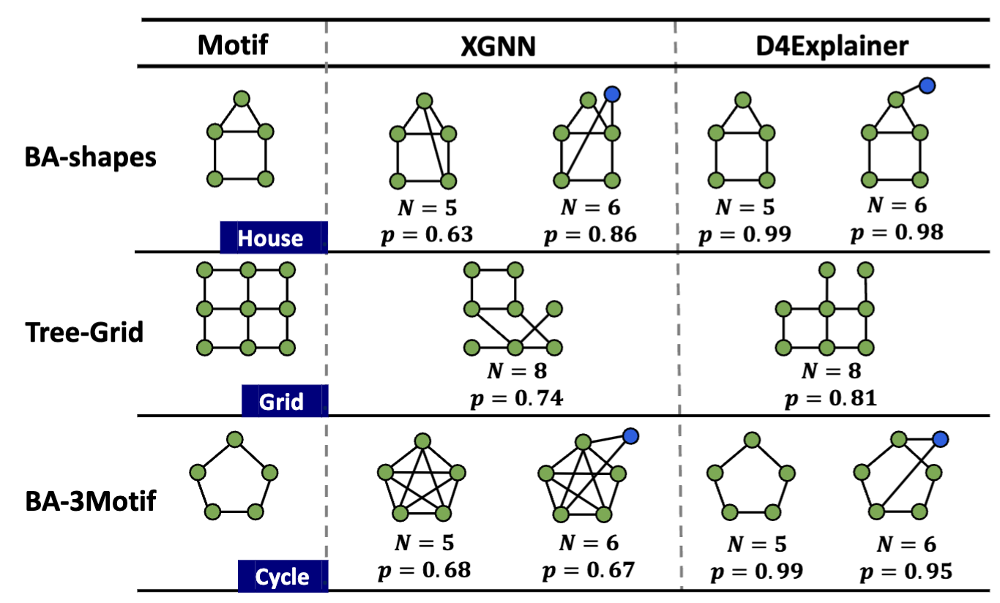

import { Authors, Badges } from '@/components/utils'

# D4Explainer: In-Distribution GNN Explanations via Discrete Denoising Diffusion

<Authors
  authors="Jialin Chen, Yale University; Shirley Wu, Stanford University; Abhijit Gupta, Yale University; Rex Ying, Yale University"
/>

<Badges
  venue="NeurIPS 2023"
  github=" https://github.com/Graph-and-Geometric-Learning/D4Explainer"
  arxiv="https://arxiv.org/abs/2310.19321"
  pdf="https://arxiv.org/pdf/2310.19321"
/>

## Introduction
Graph neural networks (GNNs) have rapidly gained popularity recently due to their ability to model relational data. However, when it comes to critical decision-making and high-stake applications, such as healthcare, finance, and autonomous systems, the explainability of GNNs is fundamental for humans to understand the model’s decision-making logic and build trust in the deployment of GNNs in real-world scenarios.

<!-- Counterfactual explanation considers  "what-if" scenarios of model predictions, addressing the question of how slight adjustments to the input graph can lead to different model predictions. Model-level explanation, on the other hand, aims to generate the most discriminative graph pattern for a target class, thus shedding light on the overall decision-making behavior and internal functioning of the model.  -->

However, existing methods often rely on out-of-distribution (OOD) effects to generate counterfactual explanations, neglecting the in-distribution properties that are critical for producing reliable explanations. Figure 1 shows the t-SNE projection of the Tree-Cycle dataset, where graphs are labeled as Tree or Cycle based on whether they present the corresponding structures. Specifically, CF-GNNExplainer generates counterfactual explanations for a node with Tree label by removing its neighbor edges. While the explanation doesn't maintain any discriminative information on the Cycle class, it could still be predicted as Cycle with high probability due to the **OOD effect**, making the explanation unreliable. Additionally, current explainers struggle to handle multiple explanation scenarios, such as instance-level and model-level explanations. 

Leveraging graph diffusion models, which effectively capture complex distributions on graphs, offers a promising direction to address these limitations and enhance the robustness and versatility of GNN explainability methods. In this work, we propose **D4Explainer** based on graph diffusion models, a novel approach to generate in-distribution, diverse and robust explanations. Moreover, D4Explainer is the first framework to unify both counterfactual and model-level explanation scenarios.

## Method
D4Explainer is designed for two distinct explanation scenarios: **counterfactual** explanation and **model-level** explanation. In counterfactual explanation, D4Explainer employs a Forward diffusion process to create a sequence of noisy versions and trains a Denoising model to effectively capture the desired distribution of counterfactual graphs. For model-level explanation, D4Explainer trains a Denoising model to recover the underlying original distribution and leverages a well-trained GNN to progressively enhance the explanation confidence during the reverse sampling. An overview is shown in Figure 2. 

![Figure 2: Overview of D4Explainer. (a) Diffusion Model for counterfactual explanations. The diffusion process $q(G_t|G_{t-1}$) transforms an input graph $G_0$ to the pure noise $G_T$. Then the Denoising Model $p_\theta(\cdot)$ outputs the clean graph $\~{G}_0$ given a noisy graph $G_t$, under the constraints of the counterfactual loss $\mathcal{L}_{cf}$ and the distribution loss $\mathcal{L}_{dist}$. (b) Reverse Sampling for model-level explanations. We leverage a well-trained GNN to select a temporary graph with the highest confidence score from the candidate graphs and obtain $G_{t-1}^r$ from $G_{t}^r$ recursively until we achieve the final model-level explanation $G_0^r$. |scale=0.9](./assets/pipeline.png)

### Counterfactual Explanation Generation

#### Forward Diffusion Process
Let $t\in [0, T]$ denote the timestep of the diffusion process, which is also a noise level indicator. Let $\boldsymbol{A}_t$ denote the one-hot version of the adjacency matrix at timestep $t$, where each element $\boldsymbol{a}^{ij}_t$ is a 2-dimensional one-hot encoding of the presence or absence of the $ij$-th element in the adjacency matrix. The forward diffusion process is a Markov chain with a transition matrix $\boldsymbol{Q}_t\in \mathbb{R}^{2\times 2}$, that progressively transforms the input graph into pure noise. Mathematically, the forward diffusion process can be written as $$q(\boldsymbol{a}^{ij}_t|\boldsymbol{a}^{ij}_{t-1})=\hbox{Cat}(\boldsymbol{a}_t^{ij}; \boldsymbol{P}=\boldsymbol{a}_{t-1}^{ij}\boldsymbol{Q}_t),$$ where $\hbox{Cat}(\boldsymbol{x}; \boldsymbol{P})$ is a categorical distribution over the one-hot vector $\boldsymbol{x}$ with probability vector $\boldsymbol{P}$. The multi-step diffusion has a closed form as  $q(\boldsymbol{a}^{ij}_t|\boldsymbol{a}^{ij}_{0})=\hbox{Cat}(\boldsymbol{a}_t^{ij}; \boldsymbol{P}=\boldsymbol{a}_{0}^{ij}\bar{\boldsymbol{Q}}_t)$, where $\bar{\boldsymbol{Q}}_t=\prod _{i=1}^{t}\boldsymbol{Q}_i$. 

#### Denoising Model
The Denoising Model $p_\theta(G_0|G_t)$ takes as input the noisy adjacency matrix $A_t$ corresponding to a noisy graph $G_t$, the node features of the original graph $X_0$, noise level indicator $t$, and then predicts the dense adjacency matrix. The Denoising Model is set as an extension of the [Provably Powerful Graph Network (PGNN)](https://arxiv.org/abs/1905.11136).

#### Loss Function
Counterfactual explanations necessitate both counterfactual property and proximity to the original graph. The overall training objective includes two parts: $\mathcal{L}_{dist}$ and $\mathcal{L}_{cf}$.
$$\mathcal{L}_{dist} =-\mathbb{E}_{q\left(G_0\right)} \sum_{t=1}^T\left(1-2 \cdot \bar{\beta}_t+\frac{1}{T}\right)\mathbb{E}_{q\left(G_t \mid G_0\right)} \log p_\theta\left(G_0 \mid G_t\right).$$
The distribution loss $\mathcal{L}_{dist}$ is equivalent to the cross-entropy loss between $G_0$ and $p_\theta(G_0|G_t)$ over the full adjacency matrix, which guarantees the proximity of generated counterfactual explanations to the original graph.
To optimize the counterfactual property, $\mathcal{L}_{cf}$ is defined as 
$$\mathcal{L}_{cf} = -\mathbb{E}_{q(G_0)}\mathbb{E}_{t\sim[0,T]}\mathbb{E}_{q(G_t|G_0)}\mathbb{E}_{p_\theta(\~{G}_0|G_t)}\log\left(1- f(\~{G}_0)[\hat{Y}_{G_0}]\right),$$
where $f$ is the well-trained GNN classifier, $f(\~{G}_0)[\hat{Y}_{G_0}]$ denotes the  probability for the original label $\hat{Y}_{G_0}$ predicted by $f$, given the generated graph $\~{G_0}$. The overall loss is $\mathcal{L(\theta)} = \mathcal{L}_{dist} + \alpha \mathcal{L}_{cf}$, where $\alpha$ is a hyper-parameter that balances the counterfactual and in-distribution properties.

### Model-level Explanation Generation
The goal of model-level explanation is to generate class-wise graph pattern. Let $C$ denote the target class. Each reverse sampling step $q_C(G^r_{t-1}|G^r_{t})$ can be formulated as a conditional generation satisfying the following equation,
$$q_C(G^r_{t-1}|G^r_{t})\propto p_\theta(\~{G}_0|G^r_{t})q(G^r_{t-1}|\~{G}_0)f(C|\~{G}_0).$$

In model-level explanation scenario, a denoising model is trained with $\mathcal{L}_{dist}$ only. The reverse sampling algorithm is shown as follows.

Specifically, we repeat the sampling steps and progressively increase the explanation confidence (i.e., $f(C|\~{G}_0)$) by selecting $\~{G}_0$ with the highest confidences (in Step 5).

## Experiments
### Datasets and Baselines
We evaluate our approach on both node classification and graph classification tasks.
**Node Classification:**
- Synthetic Datasets: BA-Shapes, Tree-Cycle, Tree-Grids, where structural motifs determine node labels. A vanilla GCN achieves over $95\%$ accuracy.
- Real-World Dataset: Cornell, a heterophilous webpage graph with complex relationships. EGNN, designed for heterophilous graphs, achieves $83\%$ accuracy.

**Graph Classification:**
- Synthetic Dataset: BA-3Motif with three graph classes (cycle, grid, house motifs).
- Real-World Molecule Datasets: Mutag, BBBP, and NCI1, where chemical functionalities determine graph labels. A GCN is used for BA-3Motif, BBBP, and NCI1, while GIN is used for Mutag.
Baselines:

We select CF-GNNExplainer, GNNExplainer, SAExplainer, GradCam, IGExplainer, PGExplainer, PGMExplainer, CXPlain as baselines for counterfactual explanations, where factual explainers are adapted by constructing subgraphs with the least important edges.

XGNN, the state-of-the-art method for GNN model-level explanations is selected as the baseline for model-level explanations.

### Counterfactual Explanation Performance

Counterfactual Accuracy (CF-ACC) is defined as the proportion of generated explanations that change the model’s prediction, while Fidelity (FID) measures the change in output probability over the original class. As can be seen from the table, D4Explainer achieves the best performances on seven out of eight datasets, with especially strong CF-ACC AUC values ($>90\%$) on Tree-Cycle, Tree-Grids, and BA-3Motif. Notably, D4Explainer consistently works well on explaining both node classification and graph classification tasks, while the efficacy of baselines is unstable across datasets.

#### In-Distribution Evaluation

To evaluate the in-distribution property of the generated explanations, we adopt the maximum mean discrepancy (MMD) to compare distributions of graph statistics between the generated counterfactual explanations and original test graphs, as reported in Table 2. The MMD results verify the effectiveness of D4Explainer in capturing the underlying distribution of datasets and generating in-distribution and more faithful explanations.

#### Explanation Diversity Evaluation

We evaluate the diversity of counterfactual explanations in Figure 3. There are two main approaches to generating counterfactual explanations. 
- The first one is deleting determinant edges and destroying the original motif, thus greatly influencing the model's prediction. 
- The second one is converting the original motifs to truly counterfactual motifs through both deleting and adding essential edges. 

Previous methods can only produce the first type of counterfactual explanations, while D4Explainer makes the second approach possible and successful.

#### Robustness Evaluation

We compare the counterfactual explanations produced on the original graph and its perturbed counterpart. A robust model would predict the same explanation for both inputs. We identify the $K$ most relevant edges in the original counterfactual explanation and compute the fraction of these edges present in the explanation of its noisy version, denoted by Top-$K$ Accuracy. Results on BBBP dataset are shown in Figure 4. We observe that D4Explainer outperforms all baselines over different noise levels from 0 to $10\%$.

### Model-level Explanation

We qualitatively evaluate the generated explanations with different pre-defined numbers of nodes $N$, shown in Figure 5. We observe that D4Explainer can produce more determinant graph patterns with nearly $100\%$ confidence for synthetic datasets, e.g., BA-shapes and BA-3Motif.