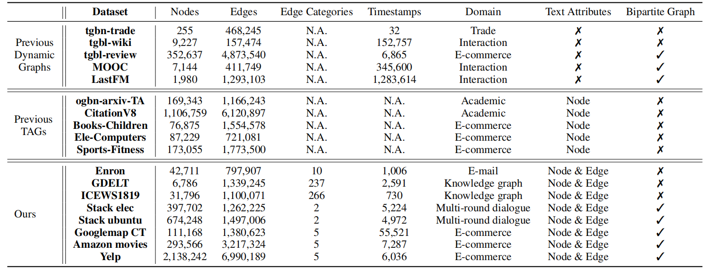
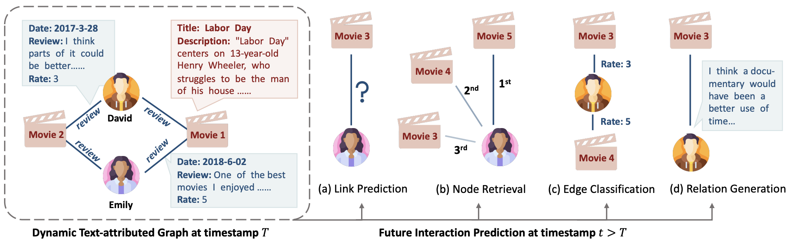
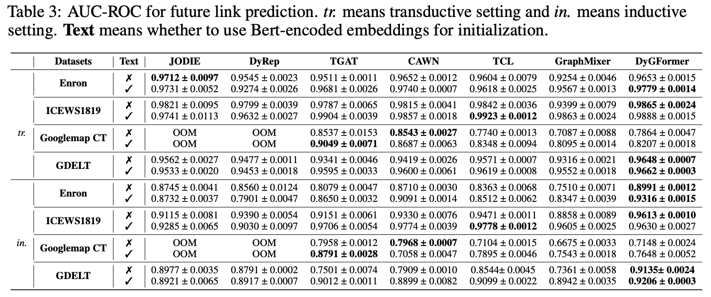
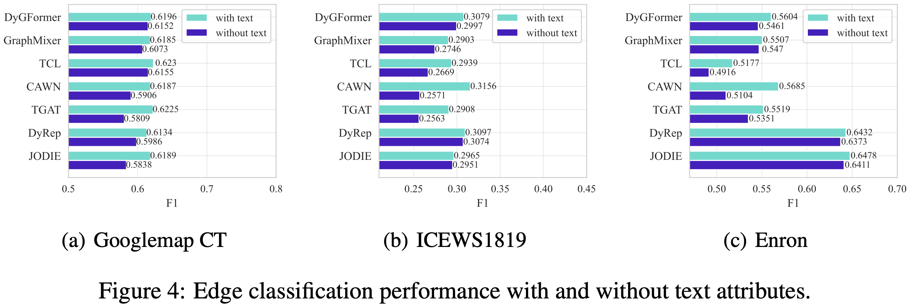
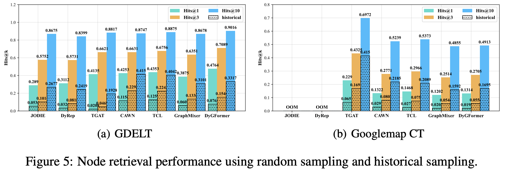
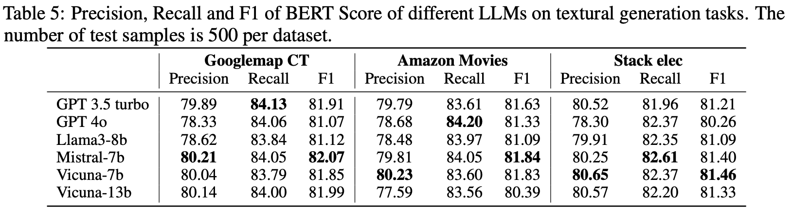

import { Authors, Badges } from '@/components/utils'

# DTGB: A Comprehensive Benchmark for Dynamic Text-Attributed Graphs

<Authors
  authors="Jiasheng Zhang, University of Electronic Science and Technology of China; Jialin Chen, Yale University; Menglin Yang, Yale University; Aosong Feng, Yale University; Shuang Liang, University of Electronic Science and Technology of China; Jie Shao, University of Electronic Science and Technology of China; Rex Ying, Yale University"
/>

<Badges
  venue="NeurIPS 2024"
  github="https://github.com/zjs123/DTGB"
  arxiv="https://arxiv.org/abs/2406.12072"
  pdf="https://arxiv.org/pdf/2406.12072"
/>

## Introduction
Dynamic text-attributed graphs (DyTAGs) are prevalent in various real-world scenarios, where each node and edge are associated with text descriptions, and both the graph structure and text descriptions evolve over time. Despite their broad applicability, there is a notable scarcity of benchmark datasets tailored to DyTAGs, which hinders the potential advancement in many research fields. To address this gap, we introduce **D**ynamic **T**ext-attributed **G**raph **B**enchmark (DTGB), a collection of large-scale, time-evolving graphs from diverse domains, with nodes and edges enriched by dynamically changing text attributes and categories. To facilitate the use of DTGB, we design standardized evaluation procedures based on four real-world use cases: **future link prediction, destination node retrieval, edge classification, and textual relation generation**. These tasks require models to understand both dynamic graph structures and natural language, highlighting the unique challenges posed by DyTAGs. Moreover, we conduct extensive benchmark experiments on DTGB, evaluating 7 popular dynamic graph learning algorithms and their variants of adapting to text attributes with LLM embeddings, along with 6 powerful large language models (LLMs). Our results show the limitations of existing models in handling DyTAGs. Our analysis also demonstrates the utility of DTGB in investigating the incorporation of structural and textual dynamics. The proposed DTGB fosters research on DyTAGs and their broad applications. It offers a comprehensive benchmark for evaluating and advancing models to handle the interplay between dynamic graph structures and natural language.

## Dataset Overview

- **Enron**: This dataset is derived from the email communications between employees of the ENRON energy corporation over three years (1999-2002). The nodes indicate the employees while the edges are e-mails among them. The text attribute of each node is extracted from the department and position of the employee (if available). The text attribute of each edge is the raw text of e-mails. Non-English statements, abnormal symbols, and tables are removed from the raw text and we perform length truncation on these e-mails. The edge categories are extracted from the e-mail archive of the raw resource. There are 10 kinds of categories such as calendar, notes, and deal communication. We order edges in this dataset based on the sending timestamps of e-mails.

- **GDELT**:  This dataset is derived from the Global Database of Events, Language, and Tone project, which is an initiative to construct a catalog of political behavior across all countries of the world. Nodes in this dataset indicate political entities such as United States and Kim Jong UN. We directly use the names of these entities as their textual attributes. Edges in this dataset represent the relationships between entities (e.g., Prisident of and Make Statement). We use the descriptions of these relationships as the textual attributes of edges. Each edge category refers to a kind of political relationship or behavior. We order edges in this dataset based on the occurring timestamps of these political events.

- **ICEWS1819**: This dataset is derived from the Integrated Crisis Early Warning System project, which is also a temporal knowledge graph for political events. We extract events from 2018-01-01 to 2019-12-31 to construct this dataset. We organize the name, sector, and nationality of each political entity as its text attribute, while the edge text attributes are the descriptions of the political relationships. The edge categories refer to the types of political relationships or behavior. Similar to the GDELT dataset, we order edges in this dataset based on the occurring timestamps of the political events. Note that the major difference between the ICEWS1819 and GDELT datasets is that first, the time granularity of GDELT is 15 minutes, while that of ICEWS1819 is 24 hours. Therefore GDELT describes political interactions in a more fine-grained way. Second, ICEWS1819 has a 4 times larger node set compared with GDELT and thus represents a more sparse scenario.

- **Stack elec**: Stack Exchange Data is an anonymized dump of all user-contributed content on various stack exchange sites. It includes questions, answers, comments, tags, and other related data from these sites. We regard the questions and users in these sites as nodes, while the answers and comments from users to questions are regarded as text-attributed edges, subsequently constructing a dynamic bipartite graph that describes the multi-round dialogue between users and questions. We extract all the questions related to electronic techniques as well as the corresponding answers and comments to construct the Stack elec dataset. For user nodes, we use the self-introductions of users as their text attributes, which describe the technical areas that the user is familiar with. For the question node, we use the title and the body of each question post as its text attribute. We use the raw text of answers and comments as the text attributes of edges. We construct two categories based on the voting of each answer: Useful if the voting count is larger than 1, otherwise Useless. We order edges in this dataset based on the answering timestamps from users.

- **Stack ubuntu**: This is another dataset from Stack Exchange Data, which contains all the questions related to the Ubuntu system. Besides the size and the topic, the biggest difference between this dataset and Stack elec is that the answers in this dataset are usually a mixture of codes and natural language, which brings more challenges to the understanding of the semantic context of interactions.

- **Googlemap CT**: This dataset is extracted from the Google Local Data project, which contains review information on Google map as well as the user and business information up to September 2021 in the United States. We extract all the business entities from Connecticut State to construct this dataset. Nodes are users and business entities while edges are reviews from users to businesses. Only the business nodes are enriched with text attributes, containing the name, address, category, and self-introduction of the business entity. The edge text attributes are the raw text of user reviews. The edge categories are integers from 1 to 5, derived from the ratings from users to businesses. We have removed emojis and meaningless characters from reviews. Edges in this dataset are ordered based on the review timestamps from users.

- **Amazon movies**: This dataset is extracted from the Amazon Review Data project, which contains product reviews and metadata from Amazon spanning May 1996 to July 2014. To construct this dataset, we extract products in the class of Movies and TV and the corresponding reviews. The text attribute of each product node contains its name, category, description, and rank score. The text attributes of edges are review text from users to products. Similarly, the edge categories are integers from 1 to 5, derived from the ratings from users to businesses. We still order edges in this dataset based on the review timestamps from users.

- **Yelp**:  This dataset is extracted from the Yelp Open Dataset project which contains reviews of restaurants, shopping centers, hotels, tourism, and other businesses from users. The text attribute of each business node contains its name, address, city, and category. The text attribute of each user node contains its first name, number of reviews, and register time. Edge text is the reviews from users to businesses. Edge categories are also the ratings from 1 to 5. All the edges are ordered based on the review timestamps from users.

## Experiments

### Future Link Prediction

- Simply using pre-trained embeddings to integrate the text information can result in performance degradation for memory-based models (e.g., DyRep)
- Text information is helpful, especially in the inductive setting where test nodes are unseen during training.
- Memory-based methods suffer from high consumption for large dynamic graphs.

### Edge Classification

- Existing models fail to achieve satisfactory performance on this task, especially on datasets with a large number of categories, because of their neglect of edge information modeling.
- Text information consistently helps models achieve better performance on each dataset, verifying the necessity of integrating text attributes into temporal graph modeling.

### Destination Node Retrieval

- Although existing models can achieve high accuracy on link prediction (more than 0.95), they still fail to get satisfactory performance on node retrieval.
- Existing models perform significantly worse in the historical sampling setting, showcasing these models fall short in capturing the semantic relevance.

### Textural Relation Generation

- Open-source LLMs such as Mistral and Vicuna perform comparably well to proprietary LLMs in this task.
- Supervised fine-tuning helps LLM to get better performance on this task.

