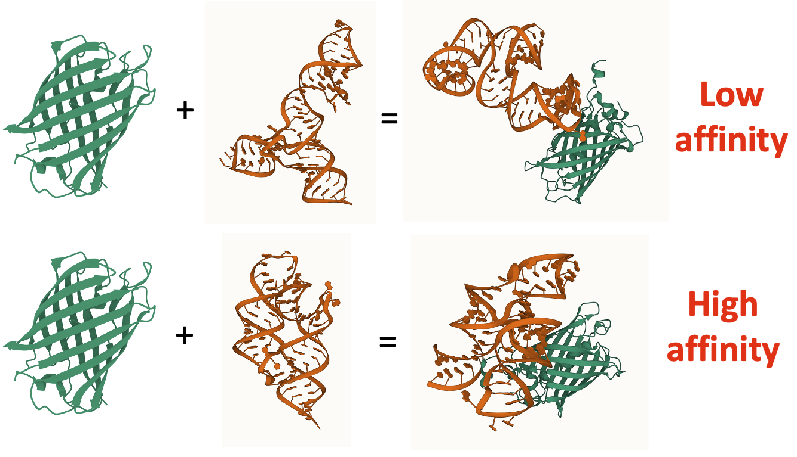
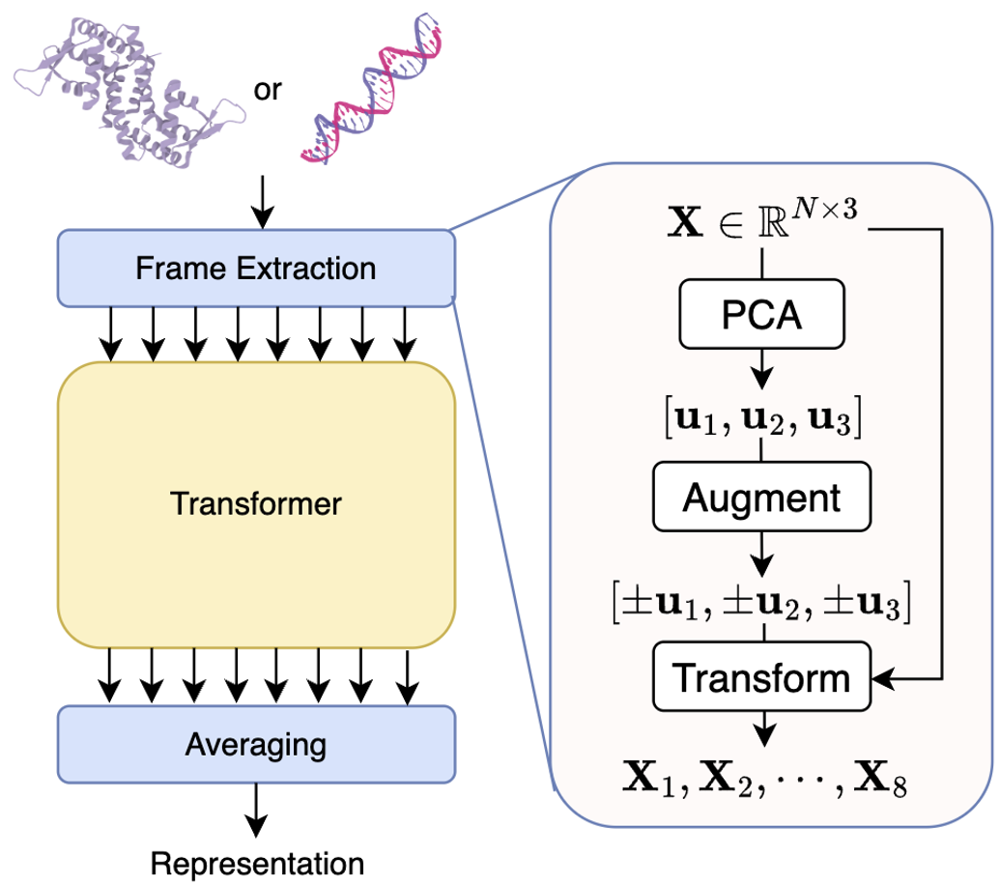
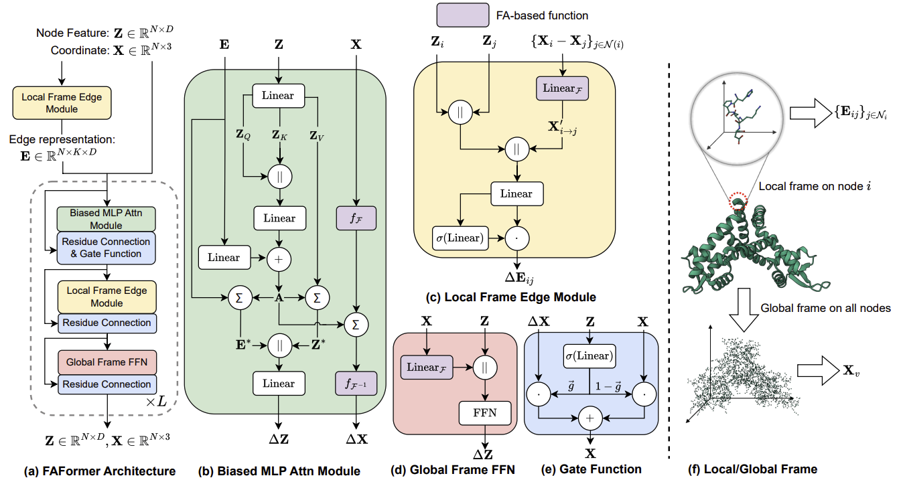
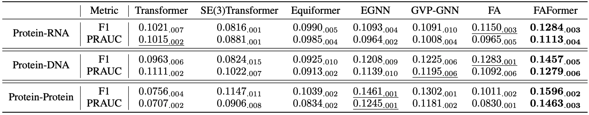
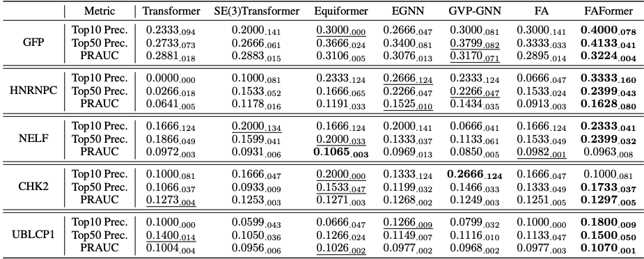

import { Authors, Badges } from '@/components/utils'

# Protein-Nucleic Acid Complex Modeling with Frame Averaging Transformer

<Authors
  authors="Tinglin Huang, Yale University; Zhenqiao Song, Carnegie Mellon University; Rex Ying, Yale University; Wengong Jin, Northeastern University, Broad Institute of MIT and Harvard"
/>

<Badges
  venue="NeurIPS 2024"
  github="https://github.com/Graph-and-Geometric-Learning/Frame-Averaging-Transformer"
  arxiv="https://arxiv.org/abs/2406.09586"
  pdf="https://arxiv.org/pdf/2406.09586"
/>

## Introduction
Understanding and predicting how protein forms a complex with nucleic acid/protein offers insights into binding affinity, which can be applied to high-throughput screening of drug candidates, such as aptamers (RNA-based drugs), **without** labels, as shown in Figure 1.

Motivated by this, we propose **contact map prediction-based aptamer screening paradigm**. Specifically, as presented in Figure 2(a), our model is trained to identify specific contact pairs between residues and nucleotides when forming a complex. The maximum contact probability across all pairs is then interpreted as the binding affinity, which is subsequently used for aptamer screening.

Learning E(3) equivariant transformation is the key factor to modeling the protein/nucleic acid 3D structures. In this paper, we propose **FAFormer**, an equivariant Transformer architecture that integrates FA as a geometric module within each layer, as shown in Figure 2(b). FA as a geometric component offers flexibility to effectively integrate geometric information into node representations while preserving the spatial semantics of coordinates and without major modicification on the architectures. FAFormer opens new possibilities for designing equivariant architectures in this domain.

## Method

### Frame Averaging (FA)

Frame averaging (FA) is an encoder-agnostic framework that can make a given encoder equivariant to the Euclidean symmetry group. Specifically, FA proposes to model
the coordinates in eight different frames extracted by PCA, achieving equivariance by averaging the encoded representations, as presented in Figure 3. 

You can consider FA as a model "wrapper", where the model architecture doesn't need to be modified but would seperately process 8 inputs. We use $f_{\mathcal{F}}(\mathbf{X})=\{\mathbf{X}^{(g)}\}_{\mathcal{F}}$ to denote the FA operation, where $\mathbf{X}^{(g)}$ is the input in the $g$-th frame. Besides, we use $f_{\mathcal{F}^{-1}}(\{\mathbf{\hat{X}}^{(g)}\}_{\mathcal{F}})=\hat{X}$ to represent the inverse mapping, which is an E(3) equivarnat operation. Note that $\hat{X}^{(g)}$ could be obtained from the encoder. The outcome could be invariant when simply averaging the representations without inverse matrix.

Building on such foundation, we generalize the vanilla Linear module to FA Linear module: 
$$
\text{Linear}_{\mathcal{F}}(\mathbf{X})=\frac{1}{8}\sum_{g}\mathbf{X}^{(g)}\mathbf{W}_g
$$
where $\mathbf{W}_g\in\Bbb{R}^{3\times D}$. Note that the output of FA Linear module is E(3) invariant.

### Overall architecture of FAFormer

As shown in Figure 4(a), the input of FAFormer comprises the node features $\mathbf{Z}\in\Bbb{R}^{N\times D}$, coordinates $\mathbf{X}\in\Bbb{R}^{N\times 3}$, and edge representations $\mathbf{E}\in\Bbb{R}^{N\times K\times D}$ where $K$ is the number of nearest neighbors. Each core modules are dedicatedly integrated with FA, including 

* Local frame edge module focuses on local spatial context by constructing the frames on the point cloud centered around each node;
  * As shown in Figure 4(f), the edge module builds frame locally around each node’s neighbors, which is compatible to the self-attention operation.
* Biased MLP attention module applies FA to enable equivariant multi-head attention on the geometric features;
  * The multi-head attention on coordinate is conduct based on FA.
* Global frame FFN extends the FFN by incorporating geometric information within node representations using FA.

## Experiments
### Contact Map Prediction

This task aims to predict the exact contact pairs between protein and protein/nucleic acids, which conducts binary classification over all pairs. This task is challenge due to the sparsity of the contact pairs. We compare FAFormer with six state-of-the-art models, and the results are presented in Table 1.

### Unsupervised Aptamer Screening

This task aims to screen the positive aptamers from a large number of candidates for a given protein target. We quantify the binding affinities between RNA and the protein target as the highest contact probability among the residue-nucleotide pairs. The models are first trained on the protein-RNA complexes training set using the contact map prediction, then the aptamer candidates are ranked based on the calculated highest contact probabilities. Top-10 precision, Top-50 precision, and PRAUC are used as the metrics.

