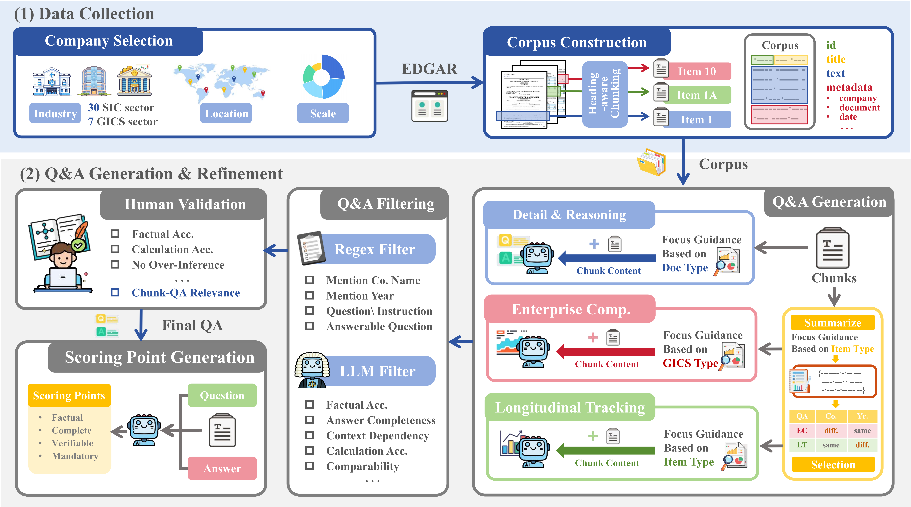
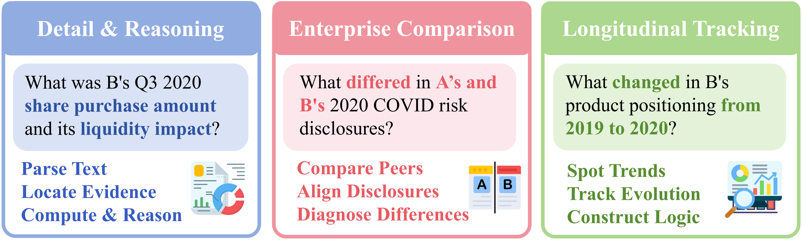
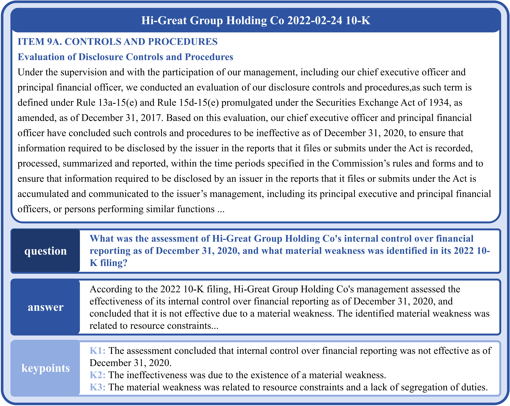
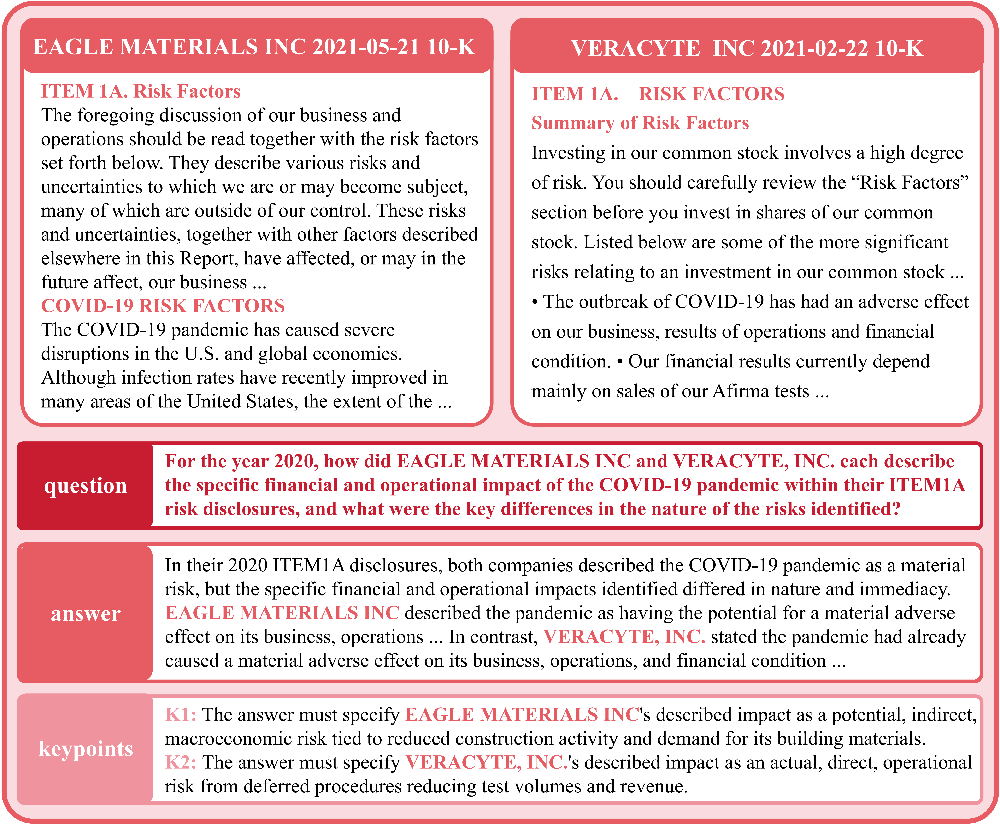
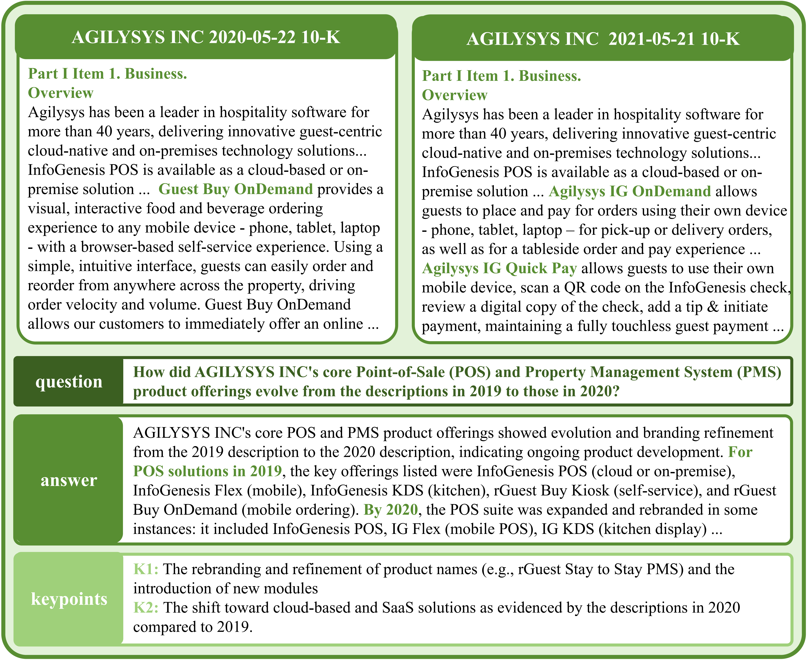

# Fin-RATE: Financial Analytics and Tracking Evaluation Benchmark for LLMs on SEC Filings

**Fin-RATE** is a real-world benchmark to evaluate large language models (LLMs) on professional-grade reasoning over **U.S. SEC filings**. 
It targets financial analyst workflows that demand:

- 📄 **Long-context understanding**
- ⏱️ **Cross-year tracking**
- 🏢 **Cross-company comparison**
- 📊 **Structured diagnosis of model failures**

> 📘 [Paper](https://arxiv.org/abs/2602.07294) | 🤗 [Dataset](https://huggingface.co/datasets/JunrongChen2004/Fin-RATE)
> ⬇️ SEC-based QA benchmark with 7,500 instances + interpretable evaluation.

---

## 🔍 Overview

Fin-RATE includes **three core QA tasks**, modeling real-world financial reasoning:

|  |                                                  |
| --------- | ------------------------------------------------------------ |
| **DR-QA** | Detail & Reasoning: fine-grained reasoning within one SEC section |
| **EC-QA** | Enterprise Comparison: reasoning across peer firms in the same industry/year |
| **LT-QA** | Longitudinal Tracking: analyzing trends across years for the same firm |

### DR-QA Example

### EC-QA Example

### LT-QA Example

---

