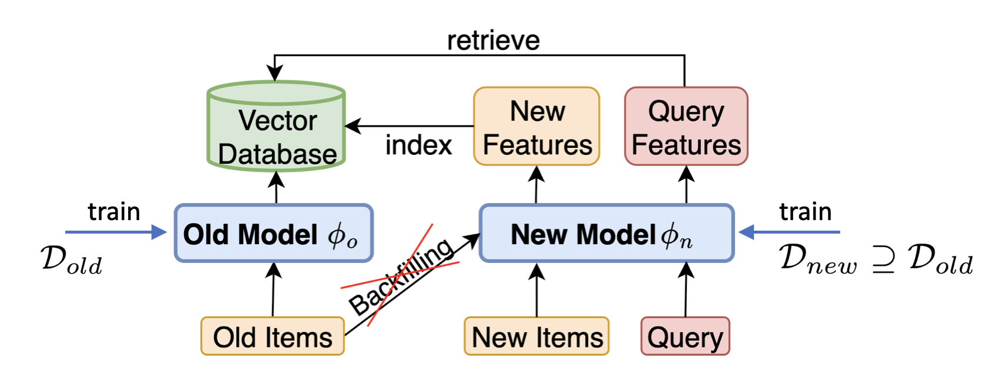
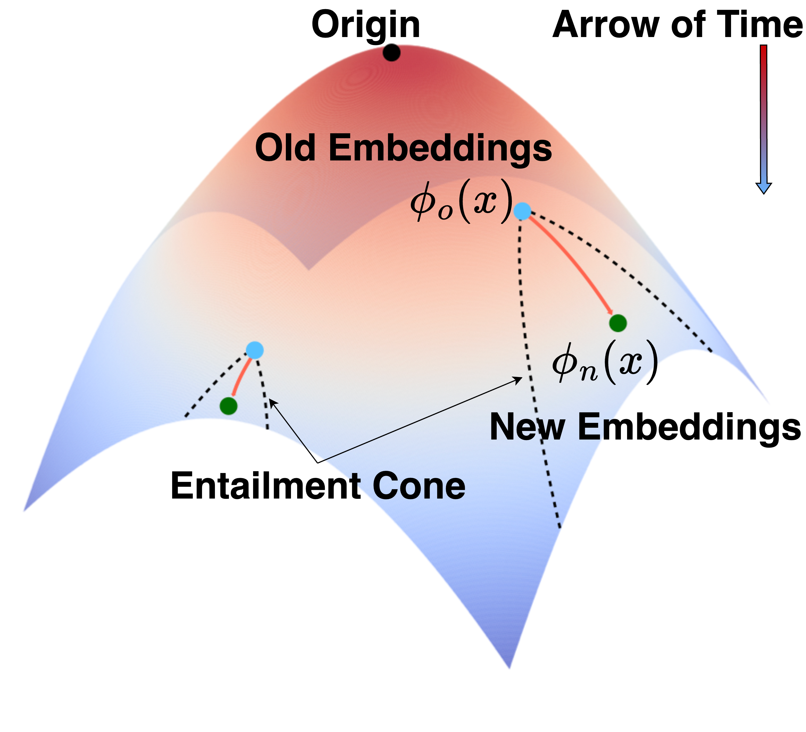

import { Authors, Badges } from '@/components/utils'

# Learning Along the Arrow of Time: Hyperbolic Geometry for Backward-Compatible Representation Learning

<Authors
  authors="Ngoc Bui, Yale University; Menglin Yang, Yale University; Runjin Chen, The University of Texas at Austin; Leonardo Neves, Snap Inc.; Mingxuan Ju, Snap Inc.; Rex Ying, Yale University; Neil Shah, Snap Inc.; Tong Zhao, Snap Inc."
/>

<Badges
  venue="ICML 2025"
  github="https://github.com/snap-research/hyperbolic_bct"
  arxiv="https://arxiv.org/abs/2506.05826"
  pdf="https://arxiv.org/pdf/2506.05826"
/>

## Introduction

Modern applications like search, recommendation, and retrieval-augmented generation rely heavily on pretrained embedding models. These models map raw data into vector representations, which are often stored in large vector databases for fast retrieval. However, when a model is updated, its embeddings usually change—breaking compatibility with existing systems unless everything is reprocessed. This is costly and risky, especially when reprocessing involves sensitive data.

**Backward-compatible representation learning** solves this by aligning the representation of the updated model to its predecessor. However, existing compatibility methods aim to align old and new representations in Euclidean space, forcing the new model to match outdated representations of the old model, even if they were suboptimal— thus hindering the new model's learning.

## Method

We propose a new perspective: treat time as a natural axis of model evolution, and embed representations in hyperbolic space, which naturally handles uncertainty and structure growth.

We introduce Hyperbolic Backward-Compatible Training (HBCT). The idea is simple:

* Lift old and new embeddings into hyperbolic space.
* Keep new embeddings inside the entailment cone of the old ones (preserving compatibility).
* Use a contrastive alignment loss that adjusts based on how uncertain the old embedding is.

This allows the new model to evolve while being aligned with old representations adaptively according to their quality.

## Experiments

We conduct the experiment on two dataset, CIFAR100 and TinyImageNet, and the following scenarios:

- **Extended class**: The old model is trained on 50% of classes in the training datasets. The new model is trained on the full training dataset. The model is kept the same (Resnet18).
- **New architecture**: We can access full training data for old and new models. The model is updated from ResNet18 to ViT-B-16.

As shown in the table aove, HBCT consistently outperforms Euclidean baselines, achieving significantly higher compatibility scores across most settings. On average, it boosts CMC@1 by 21.4% and mAP by 44.8% over the strongest Euclidean competitor. Importantly, these gains in compatibility come with minimal impact on the performance of the updated model.

