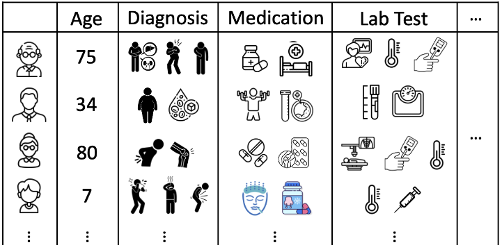
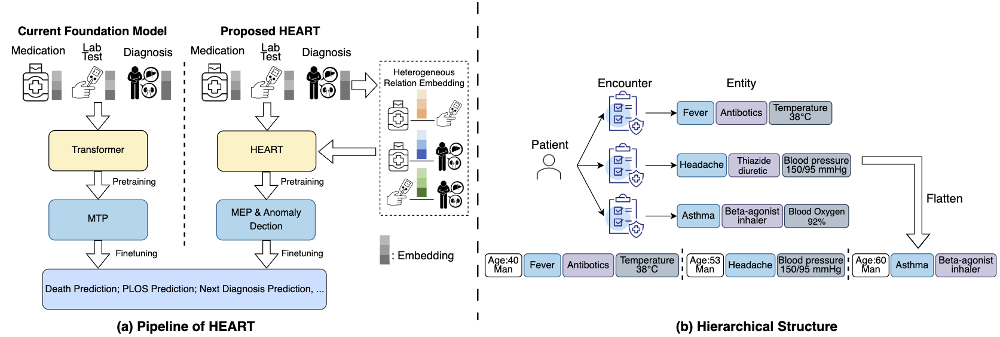
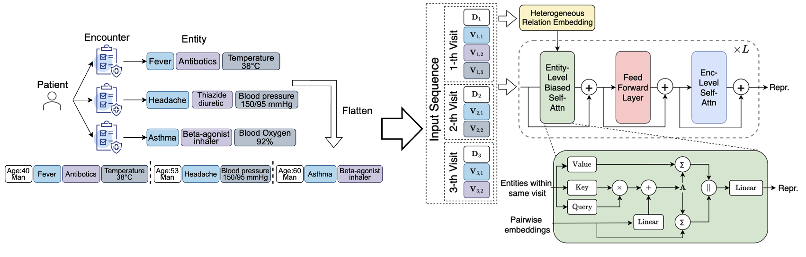
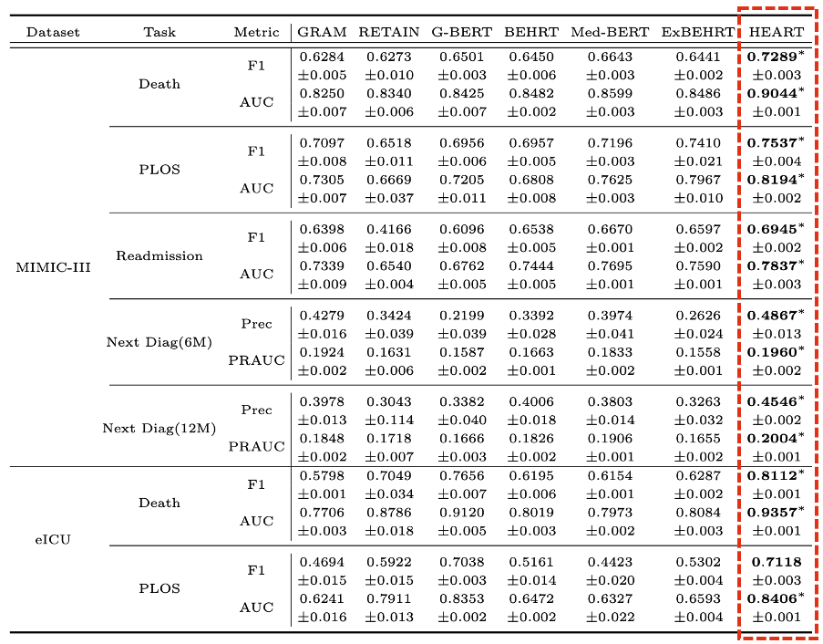

import { Authors, Badges } from '@/components/utils'

# HEART: Learning Better Representation of EHR Data with a Heterogeneous Relation-Aware Transformer

<Authors
  authors="Tinglin Huang, Yale University; Syed Asad Rizvi, Yale University; Rohan Krishna Thakur, Yale University; Vimig Socrates, Yale University; Meili Gupta, Yale University; David van Dijk, Yale University; R. Andrew Taylor, Yale University; Rex Ying, Yale University"
/>

<Badges
  venue="Journal of Biomedical Informatics 159 (2024): 104741"
  github="https://github.com/Graph-and-Geometric-Learning/HEART"
  paper="https://www.sciencedirect.com/science/article/abs/pii/S153204642400159X"
/>

## Introduction
Electronic health records (EHRs) is a tabular data which digitizes the medical information of an encounter, such as demography, diagnosis, medication, lab results, procedures, as shown in Figure 1:

Many researches focus on distilling meaningful clinical information from cohorts with **foundation model**. Specifically, such models treat medical entities in EHRs as tokens and organize the entities included in the encounters as sentences. These “sentences” can then be encoded by a transformer, allowing the entities to be represented in an embedding space, as shown in Figure 2(a):

However, we argue that the heterogeneous correlations between medical entities are critical for representation but have largely been overlooked. For example, understanding the relationship between "Antibiotics" (medication) and both "Fever" (diagnosis) and "Antibody Tests: Positive" (lab test) enables the model to recommend more clinically plausible drugs.

Motivated by this, we propose **HEART**, a Heterogeneous Relation-Aware Transformer for EHR data, which explicitly parameterizes pairwise representations between entities heterogeneously. Additionally, we introduce a multi-level attention mechanism to mitigate the computational cost associated with multiple visits, as demonstrated in Figure 2(b). Finally, two dedicated pretraining objectives are applied to enhance the model during pretraining.

## Method

### Heterogeneous Relation Embedding & Multi-level Attention Scheme

Given a patient, we flatten the corresponding historical visits into several sequences of entities:
$$
[[D_1, V_{1,1},\cdots,V_{1,N_1}],\cdots,[D_S, V_{S,1},\cdots,V_{S,N_S}]]
$$
where $S$ is the number of visits, $N_i$ is the number of entities in the $i$-th visit, and $D_i$ represents the demography token for the patient in the $i$-th visit. A learnable embedding will be assigned to each entity. Besides the entity embeddings, we explicitly encode the pairwise representation for each entity pair. Specifically, for an entity pair in the same visit $(V_n,V_m)$, we calculate the pairwise embedding $\textbf{R}_{n\leftarrow m}$ as follow: 
$$
\textbf{R}_{n}=\text{Linear}_{\tau(V_n)}(\textbf{V}_{n}), \textbf{R}_{m}=\text{Linear}_{\tau(V_m)}(\textbf{V}_{m});\\
\textbf{R}_{n\leftarrow m}=\text{Linear}(\textbf{R}_{n}||\textbf{R}_{m})
$$
where $\text{Linear}_{\tau(\cdot)}$ denotes a type-specific linear transformation. This encoding will operate on each pair of entities in the same visit.

Computation cost will be the one of the biggest challenge to encode these heterogeneous representations. To alleviate this, we implemented a hierarchical encoding scheme to
combine the encounter-level and entity-level attentions, as shown in Figure 3:

Specifically, as for entity-level context, we conduct attention among the entities within the same visit:
$$
[\mathbf{D}',\mathbf{V}_1',\cdots,\mathbf{V}_N']=\text{Entity-Attn}([\mathbf{D}',\mathbf{V}_1',\cdots,\mathbf{V}_N'])
$$
Besides, the heterogeneous relation will be introduced as a bias term to refine the attention map and the context to update the entity embeddings. As for the encounter-level context, we limit the attention to demography tokens across all historical encounters:
$$
[\mathbf{D}_1',\cdots,\mathbf{D}_S']=\text{Enc-Attn}([\mathbf{D}_1,\cdots,\mathbf{D}_S])
$$

### Pretrained Objective

Most previous approaches adopt masked token prediction (MTP) for pretraining, which replaces actual tokens with [MASK] and performs single-label classification at each masked position. However, MTP is position-dependent and thus not suitable for EHR due to the unordered nature of medical entities. In light of this, we adapt MTP to the missing entity prediction (MEP) task, which is position-agnostic and heterogeneity-aware.  The main idea is to let the model perform multi-label classification based on one [MASK] for each entity type, as shown in Figure 4.

Besides, we also incorporate anomaly detection as an additional pretraining task to encourage the model to identify unrelated entities given a context and to learn more robust representations. Specifically, we replace some of the entities with random entities with the same type to synthesize anomaly data. A binary classifier is applied to predict whether it is an anomaly. 

## Downstream tasks

We evaluate HEART across 5 downstream tasks on 2 EHR datasets:
* Dataset: [MIMIC-III](https://mimic.mit.edu/docs/iii/) and [eICU](https://eicu-crd.mit.edu/about/eicu/).
* Downstream task: death prediction, prolonged length of stay (PLOS) prediction, readmission prediction, and next diagnosis prediction in 6/12 months.

