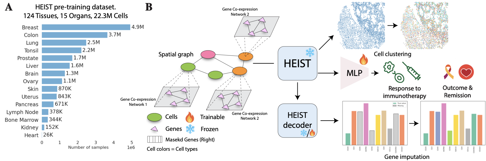
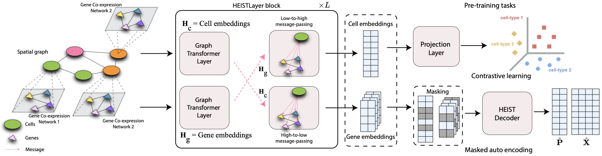
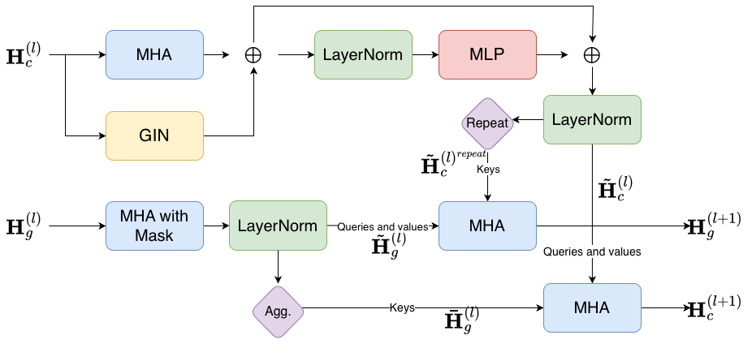
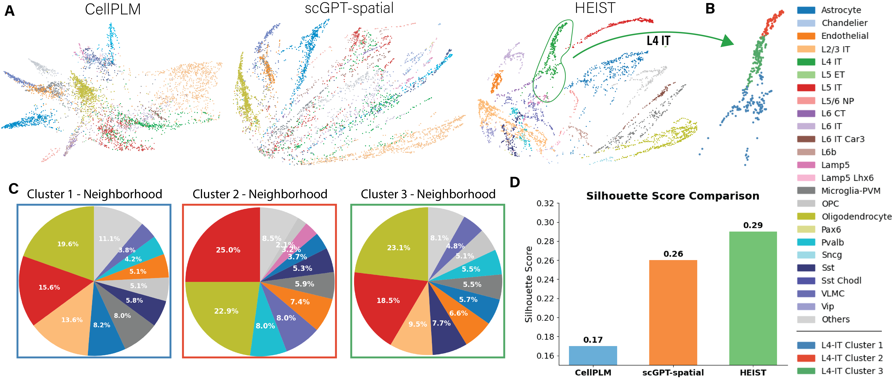

import { Authors, Badges } from '@/components/utils'

# HEIST: A Graph Foundation Model for Spatial Transcriptomics and Proteomics Data

<Authors
  authors="Hiren Madhu, Yale University; João Felipe Rocha, Yale University; Tinglin Huang, Yale University; Siddharth Viswanath, Yale University; Smita Krishnaswamy*, Yale University; Rex Ying*, Yale University"
/>

<Badges
  venue="ICLR 2026"
  github="https://github.com/Graph-and-Geometric-Learning/HEIST"
  arxiv="https://arxiv.org/abs/2506.11152"
  pdf="https://arxiv.org/pdf/2506.11152"
/>

## TL;DR

HEIST is a hierarchical graph transformer foundation model that jointly captures **spatial tissue organization** and **gene co-expression networks** for spatial transcriptomics and proteomics. Unlike prior foundation models that rely on fixed gene vocabularies, HEIST computes gene embeddings dynamically from co-expression structure, enabling zero-retraining generalization to proteomics. Pretrained on **22.3 million cells** from 124 tissues across 15 organs, HEIST achieves state-of-the-art performance on clinical outcome prediction, cell-type annotation, gene imputation, and cell clustering — while being **8× faster** than scGPT-spatial and **48× faster** than scFoundation.

---

## Motivation

Single-cell spatial transcriptomics technologies like MERFISH and Xenium have unlocked the ability to study gene expression *in situ* — preserving the spatial coordinates of each cell within its tissue. This spatial context is critical: it governs cell-cell communication, tissue organization, and microenvironment-driven phenotypes that dissociated sequencing (scRNA-seq) cannot capture.

Yet existing foundation models fall short in two key ways:

- **Models like scGPT and scFoundation** treat gene expression profiles as flat sequences, ignoring spatial relationships between cells entirely.
- **Spatial methods like STAGATE and GraphST** capture local neighborhoods but remain task-specific — they require retraining per dataset and cannot transfer across tissues or technologies.
- **All existing foundation models** use fixed gene vocabularies, which means they fundamentally cannot generalize to spatial proteomics platforms (CODEX, MIBI, Imaging CyTOF) that measure proteins instead of transcripts.

HEIST addresses all three limitations through a single unified framework.

---

## Key Ideas

### 1. Tissues as Hierarchical Graphs

HEIST represents each tissue as a two-level hierarchy. The **upper level** is a spatial cell graph, where cells are connected based on Voronoi adjacency from their physical coordinates. The **lower level** consists of gene co-expression networks — one per cell type — where gene pairs are connected if their mutual information exceeds an adaptive, data-driven threshold. Each cell is linked to the co-expression network of its cell type, forming a biologically grounded hierarchical graph.



**Overview of the HEIST framework.** (A) HEIST is pretrained on a large-scale spatial transcriptomics corpus spanning 124 tissues and 15 organs (22.3M cells). (B) HEIST encodes both gene co-expression networks and spatial cell graphs and supports downstream tasks including cell clustering, gene imputation, and clinical outcome prediction.

### 2. Cross-Level Message Passing

Within each layer, HEIST first performs **intra-level** message passing — graph transformer updates within the spatial cell graph and within each gene co-expression network independently. It then performs **cross-level** message passing: gene embeddings are updated by attending to their parent cell's spatial embedding, while cell embeddings are refined by aggregating over their constituent gene embeddings. This bidirectional flow ensures that gene representations are shaped by spatial microenvironment, and cell representations reflect internal transcriptional states.



**HEIST Architecture.** Intra-level graph transformers operate within the cell graph and gene co-expression networks independently. Cross-level message passing then integrates information between levels at every layer.

### 3. Vocabulary-Free Gene Embeddings

Prior models (scGPT, CellPLM) assign each gene a fixed learned embedding from a predefined vocabulary. This means they can only process genes seen during pretraining — and critically, they cannot handle protein markers at all. HEIST takes a fundamentally different approach: gene (or protein) representations are initialized with rank-based sinusoidal positional encodings and then dynamically updated through message passing over co-expression graphs. Because the embeddings are derived from co-expression structure rather than a lookup table, HEIST generalizes to **any set of molecular features** — including proteomics — without retraining.

---

## Architecture

HEIST takes as input a spatial cell graph $\mathcal{G}_c(\mathcal{C}, \mathcal{E}, \mathbf{P}, \mathcal{T})$ and a set of gene co-expression networks $\{\mathcal{G}_g^{t_k}(\mathcal{V}, \mathcal{E}_{t_k}, \mathbf{X}_k)\}_{k=1}^{|\mathcal{C}|}$. Cell and gene embeddings are initialized via 2D sinusoidal spatial encodings and rank-based sinusoidal encodings, respectively.

The core computation alternates between two operations over $L$ layers:

**Intra-level message passing** updates cell and gene representations independently via graph transformers:

$$
\tilde{\mathbf{H}}_c^{(l)} = \texttt{CellGraphTransformer}(\mathbf{H}_c^{(l-1)}, \mathcal{E}), \quad \tilde{\mathbf{H}}_g^{(l)} = \texttt{GeneGraphTransformer}(\mathbf{H}_g^{(l-1)}, \{\mathcal{E}_{t_k}\})
$$

**Cross-level message passing** uses a directional attention mechanism to exchange information between levels. Gene embeddings attend to their parent cell; cell embeddings attend to a pooled summary of their genes:

$$
\texttt{CrossMP}(\mathbf{H}_{\text{to}}, \mathbf{H}_{\text{from}}) = \left(\frac{\langle \mathbf{H}_{\text{to}} \mathbf{W}_q,\; \mathbf{H}_{\text{from}} \mathbf{W}_k \rangle}{\sqrt{d}}\right) \cdot (\mathbf{H}_{\text{to}} \mathbf{W}_v)
$$

where $\mathbf{W}_q, \mathbf{W}_k, \mathbf{W}_v \in \mathbb{R}^{d \times d}$ are learned projections, and $\langle \cdot, \cdot \rangle$ is the row-wise inner product. This is a *directional* mechanism: the value projection operates on the target representation $\mathbf{H}_{\text{to}}$, meaning the source modulates the target's own features via attention gating rather than injecting its raw content.

**Decoder.** A 3-layer GIN network reconstructs spatial coordinates $\hat{\mathbf{P}}$ and gene expression values $\{\hat{\mathbf{X}}_k\}$ from the final embeddings.



**HEIST Layer.** Each layer performs intra-level graph transformer updates followed by bidirectional cross-level message passing between cell and gene representations.

---

## Pretraining

### Data

HEIST is pretrained on **22.3 million cells** from **124 tissue slices** across **15 organs**, collected using MERFISH and Xenium technologies:

| Source | Cells | Technology |
|---|---|---|
| 10x Genomics | 13.3M | Xenium |
| Vizgen | 8.7M | MERFISH |
| Seattle Alzheimer's Brain Atlas | 360K | MERFISH |

### Objectives

HEIST is trained with three complementary objectives:

**Spatially-aware contrastive learning** brings cells of the same type within a spatial radius closer in embedding space while pushing apart cells of different types. This operates at three levels — cell↔cell, gene↔gene, and cell↔gene — ensuring cross-level alignment:

$$
\mathcal{L}_{\text{contrastive}} = \sum_{i,j \in \mathcal{P}} \left(\ell_{c \leftrightarrow c} + \ell_{c \leftrightarrow g}\right) + \sum_{(p,q) \in \mathcal{V}^2} \ell_{g \leftrightarrow g}
$$

**Masked autoencoding** randomly masks subsets of cell and gene nodes, then reconstructs spatial coordinates and gene expression from the remaining context:

$$
\mathcal{L}_{\text{mae}} = \text{MSE}(\hat{\mathbf{P}} \odot m_c, \mathbf{P} \odot m_c) + \frac{1}{|\mathcal{C}|}\sum_{k} \text{MSE}(\hat{\mathbf{X}}_k \odot m_g^k, \mathbf{X}_k \odot m_g^k)
$$

**Orthogonal regularization** decorrelates embedding dimensions to prevent representational collapse.

The final loss balances contrastive and MAE terms via a learnable scalar $\gamma$ passed through a sigmoid:

$$
\mathcal{L} = \sigma(\gamma) \cdot \mathcal{L}_{\text{contrastive}} + (1 - \sigma(\gamma)) \cdot \mathcal{L}_{\text{mae}} + \lambda \left(\|\mathbf{I}_d - \mathbf{Z}_c^\top \mathbf{Z}_c\|_F^2 + \|\mathbf{I}_d - \mathbf{Z}_g^\top \mathbf{Z}_g\|_F^2\right)
$$

### Hyperparameters

| Parameter | Value |
|---|---|
| Hidden / output dimension | 128 |
| HEIST layers | 10 |
| Attention heads | 8 |
| Batch size | 256 cells |
| Optimizer | AdamW (lr=0.001, wd=0.003) |
| Max epochs | 20 (early stopping ~5–6) |
| Hardware | 4× NVIDIA L40s (40GB) |

---

## Results

HEIST is evaluated across **four downstream tasks**, **five organs**, and **four spatial technologies** (MERFISH, Xenium, MIBI, CODEX), covering both transcriptomics and proteomics.

### Clinical Outcome Prediction

HEIST classifies tissue-level outcomes — cancer prognosis, treatment response, remission, and placental conditions — using frozen cell embeddings with an MLP head. Results are reported in AUC-ROC.

| Dataset | Organ | Task | Best Baseline | HEIST | Δ |
|---|---|---|---|---|---|
| Placenta | Placenta | Condition | 0.682 (CellPLM) | **0.769** | +12.7% |
| Charville | Colon | Outcome | 0.834 (scGPT-sp.) | **0.861** | +3.2% |
| Charville | Colon | Recurrence | 0.854 (scGPT-sp.) | **0.887** | +3.5% |
| UPMC | Neck | Recurrence | 0.883 (Space-GM) | **0.929** | +5.2% |
| DFCI | Neck | Outcome | 0.875 (scGPT-sp.) | **0.937** | +7.1% |
| Melanoma | Skin | Response | 0.600 (scGPT-sp.) | **0.866** | +44.3% |

The **melanoma immunotherapy response** result is particularly striking: a 44.3% improvement over the best baseline. On the proteomics datasets (Charville, UPMC, DFCI), baselines like scGPT-spatial and CellPLM can only process 6 of 28 available protein markers due to their fixed vocabularies, while HEIST uses all of them by constructing co-expression networks directly from observed proteins.

### Cell-Type Annotation

Using frozen embeddings and an MLP classifier, evaluated by F1 score:

| Dataset | Organ | Best Baseline | HEIST | Δ |
|---|---|---|---|---|
| SEA-AD | Brain | 0.670 (CellPLM) | **0.995** | +48.5% |
| Charville | Colon | 0.476 (CellPLM) | **0.534** | +12.2% |
| UPMC | Neck | 0.220 (scGPT-sp.) | **0.283** | +28.7% |
| DFCI | Neck | 0.095 (scGPT-sp.) | **0.112** | +17.9% |

### Gene Imputation

Predicting masked gene expression values, reported as Pearson correlation:

| Dataset | Best Baseline | HEIST (Fine-tuned) | Δ |
|---|---|---|---|
| Placenta | 0.801 (CellPLM) | **0.821** | +2.5% |
| Skin | 0.740 (scGPT-sp.) | **0.807** | +9.1% |

---

## Biological Insights

### Spatially-Informed Subpopulations

A key strength of HEIST is its ability to discover cellular subpopulations driven by spatial microenvironment. On the SEA-AD brain dataset, spectral clustering of HEIST embeddings reveals three subclusters within L4-IT neurons that correspond to distinct spatial neighborhoods — each subcluster has a different distribution of neighboring cell types. Prior models (CellPLM, scGPT-spatial) collapse this substructure entirely, producing embeddings where L4-IT neurons are indistinguishable regardless of their local context.



**HEIST captures tissue microenvironments.** (A) PHATE visualizations of cell embeddings from the SEA-AD brain dataset. HEIST achieves superior separation. (B) Spectral clustering reveals three spatially-informed subclusters within L4-IT neurons. (C) Each subcluster's neighborhood composition confirms that HEIST differentiates cells by their local spatial context.

### Braak Stage Progression in Alzheimer's Disease

Visualizing the highest-attended edges in HEIST's attention blocks across Braak stages reveals a progression pattern consistent with known disease biology. In early stages (Braak 0), attention highlights small, isolated neuronal clusters. By Braak IV–V, these expand to involve broader cell types. In Braak VI, attention niches become dense and spatially extended — reflecting the increasing microenvironmental complexity of late-stage neurodegeneration.


**HEIST attention reveals disease-stage-specific microenvironments.** Highly attended edges progress from sparse, isolated neuronal clusters (Braak 0) to dense, mixed-cell-type hubs (Braak VI), mirroring the increasing tissue disorganization of Alzheimer's progression.

### Ligand-Receptor Pair Prediction

A linear probe trained on concatenated cell-pair embeddings to predict ligand-receptor interactions achieves an AUC-ROC of **0.995** — substantially outperforming all baselines. This confirms that HEIST's spatial embeddings encode the communication signatures of interacting cell pairs, providing a foundation for downstream cell-cell communication analysis.

---

## Citation

```bibtex
@inproceedings{madhu2026heist,
  title={HEIST: A Graph Foundation Model for Spatial Transcriptomics and Proteomics Data},
  author={Madhu, Hiren and Rocha, Jo{\~a}o Felipe and Huang, Tinglin and Viswanath, Siddharth and Krishnaswamy, Smita and Ying, Rex},
  booktitle={International Conference on Learning Representations (ICLR)},
  year={2026}
}
```