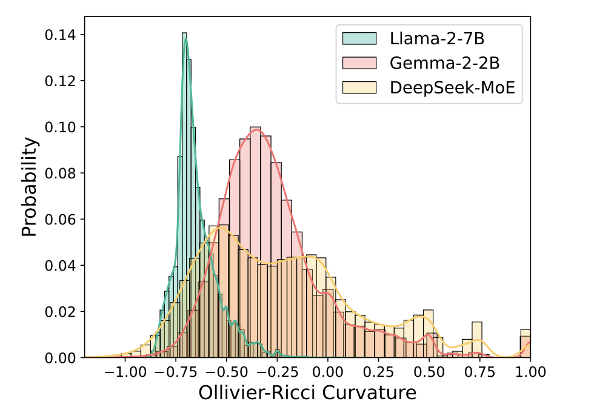
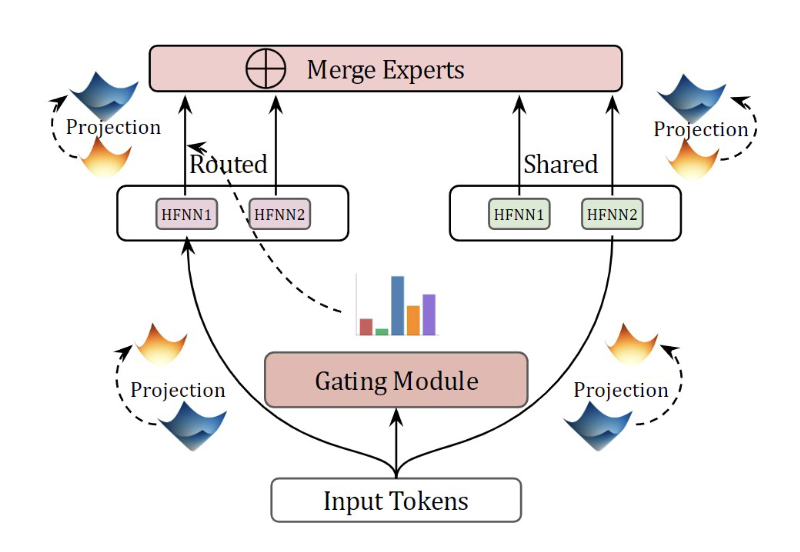
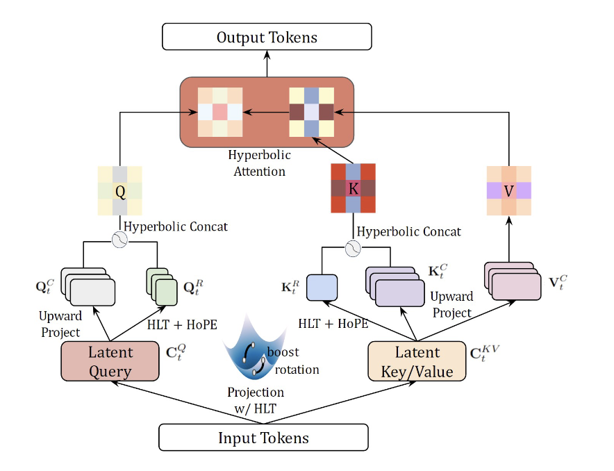
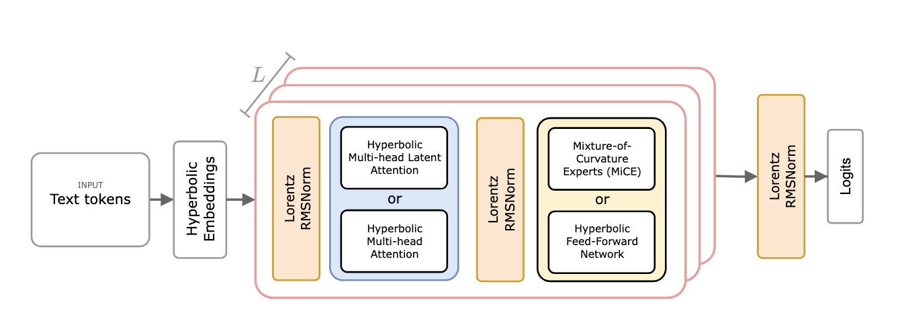
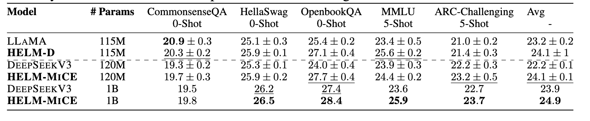
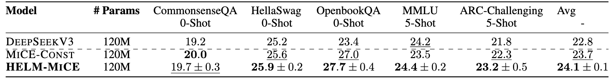
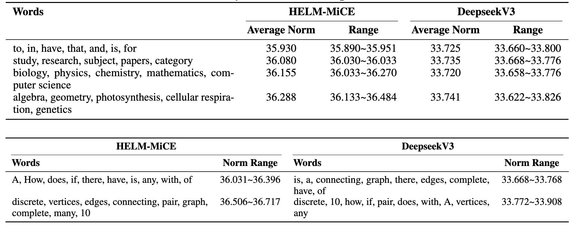

import { Authors, Badges } from '@/components/utils'

# HELM: Hyperbolic Large Language Models via Mixture-of-Curvature Experts

<Authors
  authors="Neil He⋆, Yale University; Rishabh Anand⋆, Yale University; Hiren Madhu, Yale University; Ali Maatouk, Yale University; Smita Krishnaswamy, Yale University; Leandros Tassiulas, Yale University; Menglin Yang, Yale University; Rex Ying, Yale University"
/>

<Badges
  venue="NeurIPS 2025"
  github="https://github.com/Graph-and-Geometric-Learning/helm"
  arxiv="https://arxiv.org/abs/2505.24722"
  pdf="https://arxiv.org/pdf/2505.24722"
/>

## 1. Introduction
---
Large language models (LLMs) have shown great success in text modeling tasks across domains. However, natural language exhibits inherent semantic hierarchies and nuanced geometric structure, which current LLMs do not capture completely owing to their reliance on Euclidean operations. Recent studies have also shown that not respecting the geometry of token embeddings leads to training instabilities and degradation of generative capabilities. These findings suggest that shifting to non-Euclidean geometries can better align language models with the underlying geometry of text. We thus propose to operate fully in Hyperbolic space, known for its expansive, scale-free, and low-distortion properties. We thus introduce HELM, a family of HypErbolic Large Language Models, offering a geometric rethinking of the Transformer-based LLM that addresses the representational inflexibility, missing set of necessary operations, and poor scalability of existing hyperbolic LMs. We additionally introduce a Mixture-of-Curvature Experts model, HELM-MICE, where each expert operates in a distinct curvature space to encode more fine-grained geometric structure from text, as well as a dense model, HELM-D. For HELM-MICE, we further develop hyperbolic Multi-Head Latent Attention (HMLA) for efficient, reduced-KV-cache training and inference. For both models, we develop essential hyperbolic equivalents of rotary positional encodings and RMS normalization. We are the first to train fully hyperbolic LLMs at billion-parameter scale, and evaluate them on well-known benchmarks such as MMLU and ARC, spanning STEM problem-solving, general knowledge, and commonsense reasoning. Our results show consistent gains from our HELM architectures -- up to 4% -- over popular Euclidean architectures used in LLaMA and DeepSeek, highlighting the efficacy and enhanced reasoning afforded by hyperbolic geometry in large-scale LM pretraining.

### 1.1. Motivation: non-Euclidean Structures in Token Distributions

Recent works have spurred the discussion of presence of non-Euclidean structures in text data and token inputs to large language models. In particular, certains general tokens could appear in an abundance of varying contexts. However, there are a small number of such tokens and there are exponentially many more specific tokens that could only appear in very limited scenarios. Such semantic hierarchy results in a scale-free distribution of tokens that cannot be faithfully captured by Euclidean geometry. Furthermore, each token has highly localized structure, as shown below, that is difficult to model using a single geometric space.

In the figure above, we show the distribution of Ricci curvature of token embeddings from decoder-only LLMs depict substantial variation of negative curvature, implying highly localized hyperbolicity.

## 2. Method

We proposes several modules that work together to build the first hyperbolic large language model:
1. We introduce Mixture-of-Curvature Experts (MiCE), a hyperbolic MoE module in which each expert operates in a distinct curvature space to model fine-grained geometric structures in the token distributions. 
2. We proposed Hyperbolic Rotary Positional Encoding (HoPE) and proves nemurous associated theoretical guarantees.
3. We propose Hyperbolic Multi-Head Latent Attention (HMLA), which reduces the memory complexity of the model at inference time.

---

### 2.1 Mixture-of-Curvature Experts (MiCE)

Let $\mathbf{x}_t\in\mathbb{L}^{K_1,n}$ be the $t$-th token input, then $\mathrm{MiCE}^{N_s}_{N_r}:\mathbf{x}_t\in\mathbb{L}^{K,n}\to \mathbf{x}_t\in\mathbb{L}^{K,n}$, where $N_r$ is the number of routed experts and $N_s$ is the number of shared experts. First, we pass $\mathbf{x}_t$ through a gating module to obtain the gating scores for each routed expert, denoted as $g_{t,i}$ for $1\leq N_r$, given as, 
$$
\begin{equation}
    \begin{split}
        g_{t,i} = \frac{g'_{t,i}}{\sum_{j=1}^{N_r}g_{t,j}};\,s_{t,j}=\mathrm{act}((\mathbf{x}_t)_s^\top \mathbf{y}_j);\,g'_{t,j} = \begin{cases}
        s_{t,j}, \,s_{t,j}\in\mathrm{Topk}(\{s_{t,k}\}_{k\leq N_r}, K_r)\\
        0\,\,\,\,\,\,\,\,\text{otherwise}
    \end{cases}
    \end{split}.
\end{equation}
$$

Here, $s_{t,j}$ is the token-expert affinity with activation function $\mathrm{act}$, $\mathbf{y}_j$ is the centroid vector of the $i$-th routed expert, $\mathrm{Topk}(S, A)$ picks the top $A$ values from set $S$, and $K_r$ is the number of activated experts. Then, the token is passed through each shared and routed expert. Let $\mathrm{HFFN}_{r,i}:\mathbb{L}^{K_{r,i}, m}\to \mathbb{L}^{K_{r,i}, m}$ be the routed experts and $\mathrm{HFFN}_{s,i}:\mathbb{L}^{K_{s,i}, m}\to \mathbb{L}^{K_{s,i}, m}$ be the shared experts, defined through hyperbolic feedforward networks. Here, the value of $K_{r,i}$ and $K_{s,i}$ can vary for each expert, i.e., $\textbf{each expert lives on a distinct manifold}$. To align the input's manifold and the experts' manifolds, first we project the tokens to the expert manifolds via $\mathbf{s}_{t,i} = \sqrt{K/K_{s,i}}\mathbf{x}_t$ and $\mathbf{r}_{t,i} = \sqrt{K/K_{r,i}}\mathbf{x}_t$. The projected token is passed through each expert and projected back to the input manifold, where we obtain $\mathbf{y}_{t,i} = \sqrt{K_{s,i}/K}\mathrm{HFFN}_{r,i}\left(\mathbf{s}_{t,i}\right)$ and $\mathbf{z}_{t,i} = \sqrt{K_{r,i}/K}\mathrm{HFFN}_{r,i}\left(\mathbf{r}_{t,i}\right)$. The output of $\mathrm{MiCE}^{N_s}_{N_r}$ is given by, 
$$
\begin{equation}
\begin{split}
    \mathrm{MiCE}^{N_s}_{N_r}(\mathbf{x}_t)= \mathbf{x}_t\oplus_\mathcal{L}&\left(\frac{\sum_{i=1}^{N_s}\mathbf{y}_{t,i} +\sum_{i=1}^{N_r} \mathbf{z}_{t,i}}{\sqrt{-K}|\|\sum_{i=1}^{N_s}\mathbf{y}_{t,i} +\sum_{i=1}^{N_r} \mathbf{z}_{t,i}\||_\mathcal{L}} \right)
\end{split}.
\end{equation}
$$
The constants $\sqrt{K_{s,i}/K}, \sqrt{K_{r,i}/K}$ project from the experts' manifolds to the input manifold, ensuring that the output of each shared and routed expert lives on the same manifold.

### 2.2 Hyperbolic Rotary Positional Encoding

Given $T$ tokens $\mathbf{X}$, where $\mathbf{x}_i\in \mathbb{L}^{K,d}$ ($d$ even), let $\mathbf{Q}, \mathbf{K}$ be the hyperbolic queries and keys. The hyperbolic rotary positional encoding applied to the $i$-th token is, 
$$
\begin{equation}
    \mathrm{HoPE}({\mathbf{z}_i}) = \begin{bmatrix}
        \sqrt{\|\mathbf{R}_{i,\Theta}({\mathbf{z}_i})_s\|^2-1/K}\\  \mathbf{R}_{i,\Theta}({\mathbf{z}_i})_s
    \end{bmatrix}; \mathbf{R}_{i, \Theta}=\begin{pmatrix}
       \mathbf{R}_{i,\theta_1} & 0 & 0 & \ldots & 0\\
        0 & \mathbf R_{i,\theta_2} & 0 & \ldots & 0\\
        \vdots & \vdots & \ddots & \ldots & 0\\
        0 & 0 &\ldots &\ldots & \mathbf R_{i, \theta_{d/2}}
    \end{pmatrix},
\end{equation}
$$
where $\mathbf{R}_{i,\theta_l}$ is the 2D rotation matrix parameterized by angle $i\theta_l$ and $\mathbf{z}$ can be a query $\mathbf{q}_i$ or key $\mathbf{k}_j$.

#### 2.2.1 Theoretical Guarantees
HoPE comes with a slew of theoretical guarantees that matches the Euclidean counterpart, including long range decay, robustness to arbitrary token distances, and the ability to learn both diagonal and off diagonal attention patterns.

### 2.3 Hyperbolic Multi-Head Latent Attention

Roughly, HMLA first maps the token and keys to latent vector before upward-projecting back into the original dimension for hyperbolic attention score computation. During inference, HMLA only requires caching the latent key-value pairs. As a result, the memory footprint for HMLA is $O((n_{kv} + n_r)L)$, where $L$ is the number of layers and $n_r, n_{kv}$ are latent dimensions. In contrast, the hyperbolic self-attention used in previous hyperbolic Transformers requires storing the full-sized keys and values, resulting in a memory complexity of $O(2nn_hL)$, where $n$ is the number of heads and $n_h$ is the dimension per head. By choosing $n_{kv}, n_r\ll nn_h$, we have $(n_{kv}+n_r)\ll 2nn_h$, resulting in a $\textbf{significantly smaller memory footprint}$ while maintaining the same time complexity of $O((nn_h)^2)$. Additionally, the latent query projection also results in smaller active footprint during training. This collective mechanism enables far greater scalability.

---

## 3. HELM Model Architecture
---

We introduce two variants of the HELM family of hyperbolic large language models: HELM-D the dense model, and HELM-MiCE, a hyperbolic MoE LLM usings out MiCE module. The overall architecture is as follows: tokenized text is first mapped to learned hyperbolic word embeddings, which are then passed through a series of hyperbolic decoder blocks, each consisting of two components: 1) the attention component, where the embeddings are normalized by a hyperbolic RMSNorm layer, then processed by an attention block such as HMLA or self-attention, and finally added to the embeddings through Lorentzian residual connection; and 2) the HFFN component, where the processed embeddings are again normalized by hyperbolic RMSNorm before being passed through a HFFN block and residually added to the output of the attention block. For HELM-MiCE, the HFFN block can either be a dense block or a MiCE block. The output of the final decoder block is then normalized once again before projected to logits for next-token prediction. 

---

## 4. Experiments

### 4.1 Multi-QA benchmarks
---

We test the performance of HELM on Multi-QA benchmarks against popular Euclidean LLM architectures, namely LLaMA and DeepSeekV3, for 100M and 1B scales where all models are trained on the Euclidean Wikipedia dataset. HELM models consistently outperform Euclidean counterparts for up to 4%. 

### 4.2 Ablation: MiCE v.s. Constant Curvature spaces
---

We test the effectiveness of MiCE against a variant of HELM-MiCE where all experts are kept at the same curvature value, names -1, denoted as MiCE-Const. HELM-MiCE consistently outperforms MiCE-Const on Multi-QA benchmarks.

### 4.3 Qualitative Study: Semantic Hierarchy Modeling
---

we provide case studies for HELM-MiCE 1B and DeepseekV3 1B, where we show embedding norm in the final layers for words of varying levels of specificity (top table) and for a sample question taken from the MMLU benchmark (bottom table). For HELM-MiCE, more generic words (e.g., subject) are clustered closer to the origin than more specific words (e.g., biology), which has a smaller norm than even more specific words (e.g., photosynthesis). However, this does not necessarily hold for the DeepseekV3 1B model, demonstrating how HELM-MiCE better handles semantic hierarchies.