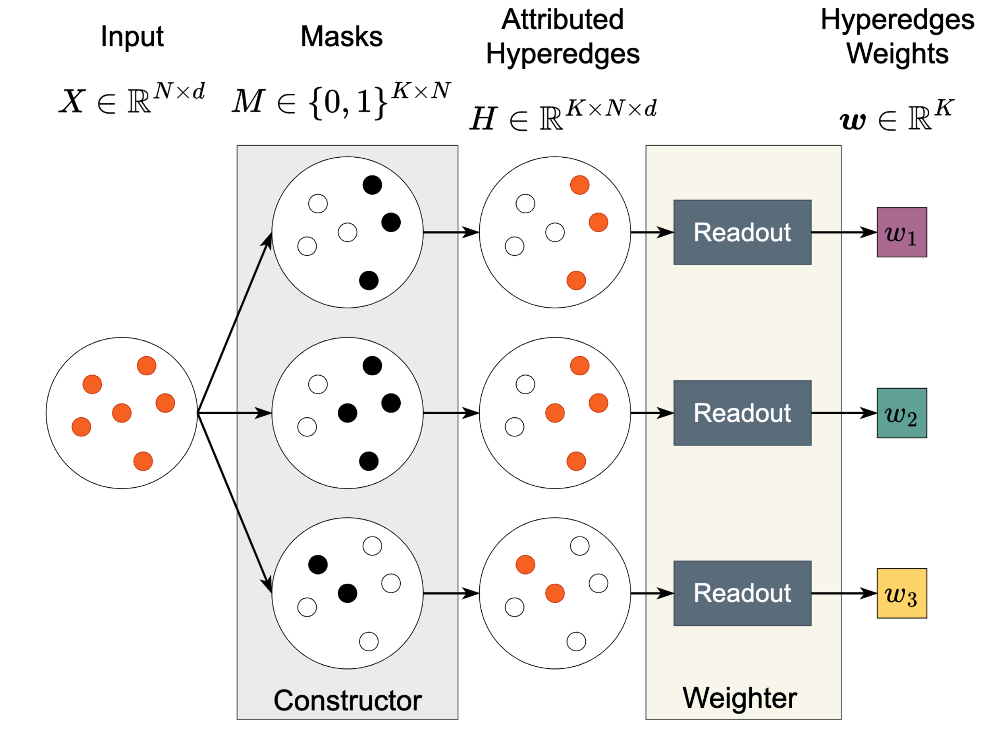
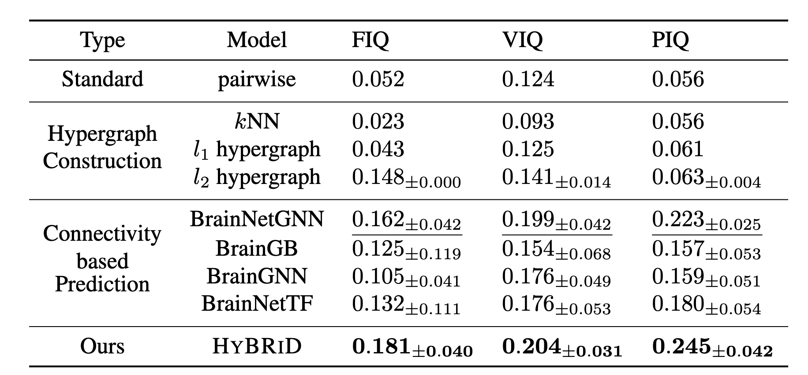
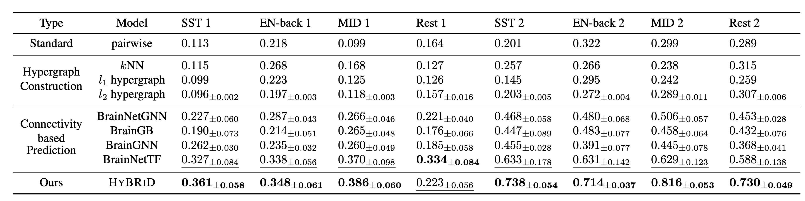
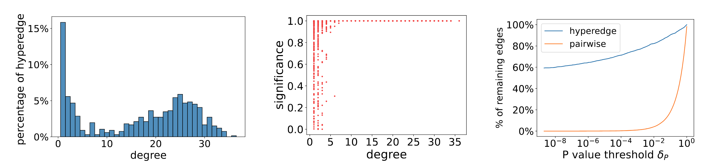

import { AuthorList } from '@/components/utils'
import { BadgeContainer, GithubBadge, ArxivBadge } from '@/components/badges'

# Learning High-Order Relationships of Brain Regions

<AuthorList 
  authors={[
    { name: "Weikang Qiu", affiliation: "Yale University" },
    { name: "Huangrui Chu", affiliation: "Yale University" },
    { name: "Selena Wang", affiliation: "Yale University" },
    { name: "Haolan Zuo", affiliation: "Yale University" },
    { name: "Xiaoxiao Li", affiliation: "University of British Columbia" },
    { name: "Rex Ying", affiliation: "Yale University" }
  ]}
/>

<BadgeContainer>
<GithubBadge link="https://github.com/Graph-and-Geometric-Learning/HyBRiD" />
<ArxivBadge link="https://arxiv.org/abs/2312.02203" />
</BadgeContainer>

## Introduction
Discovering reliable and informative relationships among brain regions from functional magnetic resonance imaging (fMRI) signals is essential in phenotypic predictions. Most of the current methods fail to accurately characterize those interactions because they only focus on pairwise connections and overlook the high-order relationships of brain regions. We propose that these high-order relationships should be maximally informative and minimally redundant (MIMR). However, identifying such high-order relationships is challenging and under-explored due to the exponential search space and the absence of a tractable objective. In response to this gap, we propose a novel method named **HyBRiD** which aims to extract MIMR high-order relationships from fMRI data. **HyBRiD** employs a **CONSTRUCTOR** to identify hyperedge structures, and a **WEIGHTER** to compute a weight for each hyperedge, which avoids searching in exponential space. **HyBRiD** achieves the MIMR objective through an innovative information bottleneck framework named multi-head drop-bottleneck with theoretical guarantees. Our comprehensive experiments demonstrate the effectiveness of our model. Our model outperforms the state-of-the-art predictive model by an average of $11.2\%$, regarding the quality of hyperedges measured by CPM, a standard protocol for studying brain connections. 

## Method
We propose to use information bottleneck to learn the high-order relationships.
$$
\arg \max I(H ; Y)-\beta I(H ; X)
$$
where $H$ is the high-order relationships, $X$ is the input fMRI data, and $Y$ is the phenotypic outcome (e.g. IQ score). The first term ensures that the learned high-order relationships are informative towards the outcome, while the second term ensures that the learned structure is succinct and non-redundant.

However, existing tractable approximations of information bottleneck do not apply to high-order relationships. In response of this, we propose *multi-head drop-bottleneck*, which takes the following form:

$$
\mathbb{H}[Y]+\mathbb{E}_{p(Y, H)}\left[\log q_\phi(Y \mid H)\right] - \sum_{k=1}^K \sum_{i=1}^N \mathbb{H}\left[X_i\right]\left(1-p_{\theta, i}^k\right)
$$

To instantiate the theoretical framework, we propose the following architecture

The model consists of two main components: the **CONSTRUCTOR** and the **WEIGHTER** when the number of nodes $N = 6$ and the number of hyperedges $K = 3$. At a high level, the **CONSTRUCTOR** learns the hyperedge structure by masking nodes. The **WEIGHTER** computes the weight of each hyperedge based on the hyperedge's member nodes and their features.

## Experiments
### Predictive Performance of Learned High-Order Relationships
We evaluate the predictive performance of learned high-order relationships on two datasets: Autism Brain Imaging Data Exchange (ABIDE) and Adolescent Brain Cognitive Development (ABCD). We use the $r$ value from the CPM protocol as the evaluation metric.

### Further Analysis

- (a) We find there are two distinct clusters in the figure. The first cluster is hyperedges with degree ≤ 5. 1-degree and 2-degree hyperedges are special cases of our method: 1-degree hyperedges are individual nodes, which imply the contribution of individual regions to the cognition. 2-degree hyperedges reveal the importance of traditional pairwise connectivity. The other cluster concentrates around degree 25, which implies the importance of relationships of multiple regions.
- (b) We find a strong positive correlation between a hyperedge's degree and its significance, which indicates that interactions of multiple brain regions play more important roles in cognition than pairwise or individual ones. It is also worth mentioning that there is a turning point around degree 5, which corresponds to the valley around 5 in (a).
- (c) We find out that the learned hyperedges are much more significant than traditional pairwise ones. 