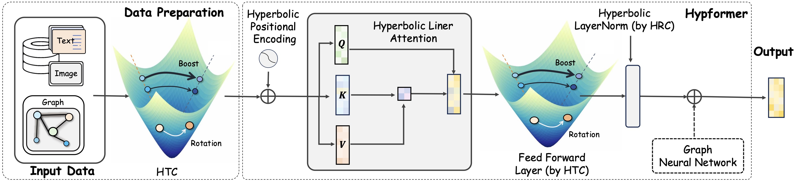
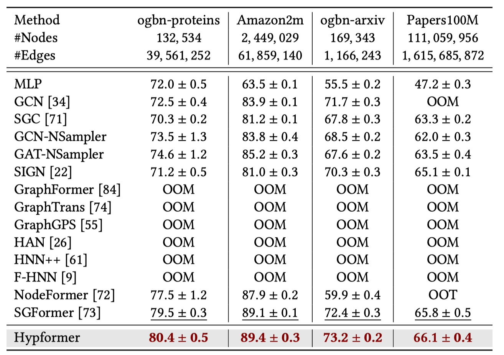
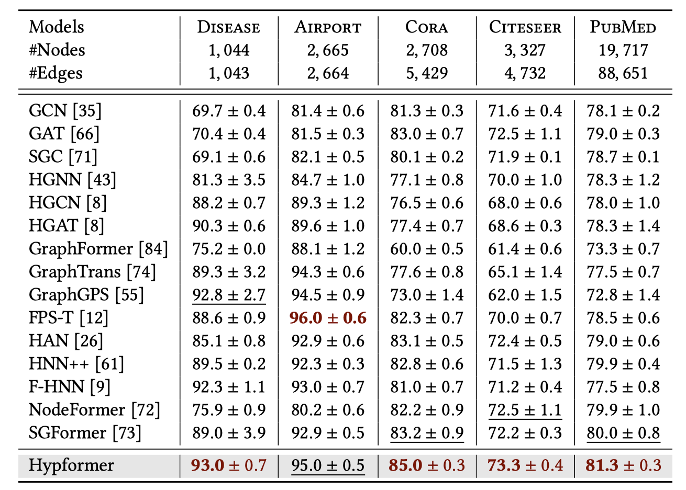
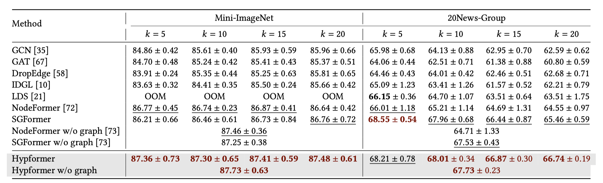
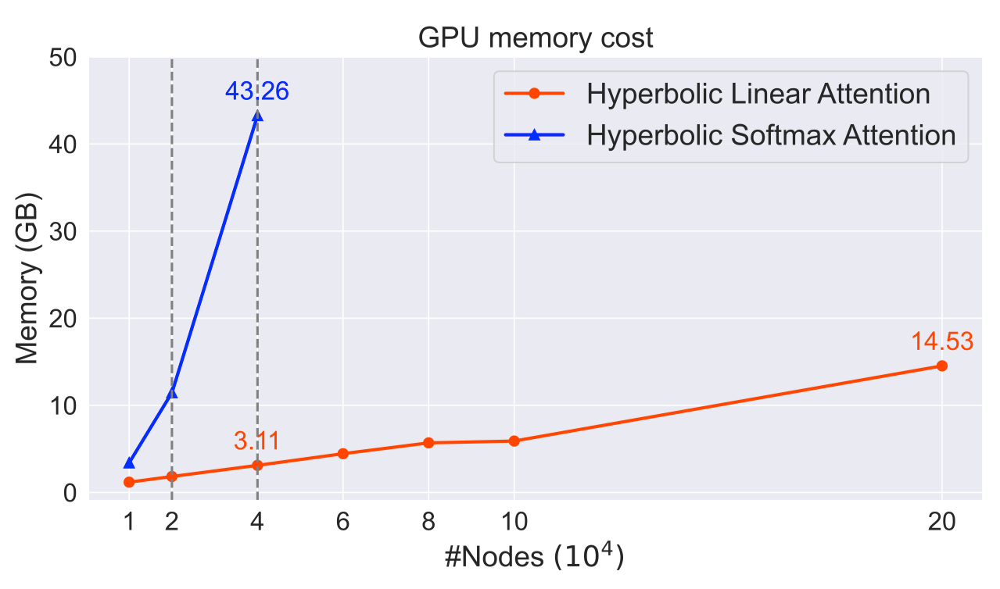

import { Authors, Badges } from '@/components/utils'

# Hypformer: Exploring Efficient Transformer Fully in Hyperbolic Space

<Authors
  authors="Menglin Yang, Yale University; Harshit Verma, Birla Institute of Technology and Science; Delvin Ce Zhang, Yale University; Jiahong Liu, The Chinese University of Hong Kong; Irwin King, The Chinese University of Hong Kong; Rex Ying, Yale University"
/>

<Badges
  venue="SIGKDD 2024"
  github="https://github.com/Graph-and-Geometric-Learning/hyperbolic-transformer"
  arxiv="https://arxiv.org/abs/2407.01290"
  pdf="https://arxiv.org/pdf/2407.01290"
/>

## 1. Introduction
Hyperbolic geometry have shown significant potential in modeling complex structured data, particularly those with underlying tree-like and hierarchical structures. Despite the impressive performance of various hyperbolic neural networks across numerous domains, research on adapting the Transformer to hyperbolic space remains limited. Previous attempts have mainly focused on modifying self-attention modules in the Transformer. However, these efforts have fallen short of developing a complete hyperbolic Transformer. This stems primarily from: (i) the absence of well-defined modules in hyperbolic space, including linear transformation layers, LayerNorm layers, activation functions, dropout operations, etc. (ii) the quadratic time complexity of the existing hyperbolic self-attention module w.r.t the number of input tokens, which hinders its scalability. To address these challenges, we propose, Hypformer, a novel hyperbolic Transformer based on the Lorentz model of hyperbolic geometry. In Hypformer, we introduce two foundational blocks that define the essential modules of the Transformer in hyperbolic space. Furthermore, we develop a linear self-attention mechanism in hyperbolic space, enabling hyperbolic Transformer to process billion-scale graph data and long-sequence inputs for the first time. Our experimental results confirm the effectiveness and efficiency of Hypformer across various datasets, demonstrating its potential as an effective and scalable solution for large-scale data representation and large models.

---

## 2. Method

We propose constructing the fundamental linear transformation blocks entirely in hyperbolic space. In contrast to existing Lorentz-based transformations, our approach brings two key innovations:  
1. Allowing the curvature to be adaptive (i.e., changeable) while still preserving relative ordering, and  
2. Decoupling the normalization term from the transformation itself.

---

### 2.1 Two Basic Blocks

**(1) Hyperbolic Linear Transformation via Pseudo Lorentz Boost with Adaptive Curvature**

To capture linear transformations in hyperbolic space, we introduce:

$$
\operatorname{HTC}(\mathbf{X}; f_t, \mathbf{W},\kappa_1, \kappa_2) :=
\left(
\underbrace{\sqrt{\frac{\kappa_1}{\kappa_2}\| f_t(\mathbf{X}; \mathbf{W}) \|_{2,rw}^2 - \frac{1}{\kappa_2}}}_{\text{time-like dimension}},
\underbrace{\sqrt{\frac{\kappa_1}{\kappa_2}} f_t(\mathbf{X}; \mathbf{W})}_{\text{space-like dimension}}
\right),
$$

Here, $\|\mathbf{A}\|_{2,rw}^2$ denotes the row-wise squared norm, and $f_t$ is a standard linear operation (e.g., $f_t(\mathbf{X};\mathbf{W}) = \mathbf{XW}$). The “time-like dimension” helps maintain consistency with hyperbolic geometry by preserving the Lorentz norm constraint, while the “space-like dimension” carries the actual transformed features.

**(2) Hyperbolic Non-Linear Transformation via Pseudo Lorentz Rotation with Adaptive Curvature**

Many operations in neural networks are non-linear (e.g., ReLU, Dropout, and normalizations). We model these using:

$$
\mathrm{HRC}(\mathbf{x};f_r, \kappa_1, \kappa_2) :=
\left(
\underbrace{\sqrt{\frac{\kappa_1}{\kappa_2} \|f_r(\mathbf{X}_{[1:]})\|_{2,rw}^2 - \frac{1}{\kappa_2}}}_{\text{time-like dimension}},
\underbrace{\sqrt{\frac{\kappa_1}{\kappa_2}} f_r(\mathbf{X}_{[1:]})}_{\text{space-like dimension}}
\right).
$$

Here, $f_r$ indicates a general non-linear function (e.g., Dropout, ReLU, LayerNorm, or BatchNorm). Because non-linear steps often occur within the same hyperbolic space (and do not transform the time-like part), we integrate them directly into the “space-like dimension,” using the Lorentz constraint to maintain geometric consistency.

---

### 2.2 Linear Self-attention

Given $N$ input tokens, each with dimension $d$, we represent the features as $\mathbf{X} \in \mathbb{L}^{N \times d, \kappa_1}$ in the Lorentz model. We then apply transformation matrices $\mathbf{W}^Q, \mathbf{W}^K, \mathbf{W}^V \in \mathbb{R}^{(d+1)\times d'}$ to obtain the query, key, and value:

$$
\begin{aligned}
\mathcal{Q} &= \mathrm{HTC}(\mathbf{X}; f_t, \mathbf{W}^Q, \kappa_1, \kappa_2), \\
\mathcal{K} &= \mathrm{HTC}(\mathbf{X}; f_t, \mathbf{W}^K, \kappa_1, \kappa_2), \\
\mathcal{V} &= \mathrm{HTC}(\mathbf{X}; f_t, \mathbf{W}^V, \kappa_1, \kappa_2).
\end{aligned}
$$

As a result, $\mathcal{Q}$, $\mathcal{K}$, and $\mathcal{V}$ reside in the hyperbolic space $\mathbb{L}^{N\times d', \kappa_2}$.  

Next, we compute pairwise similarities for self-attention. Since the weighted-sum operation itself does not affect the time-like dimension, we adopt the HRC framework for these space-like operations. Specifically, we extract the space-like dimensions:

$$
\mathcal{Q}_s, \mathcal{K}_s, \mathcal{V}_s = \phi(\mathcal{Q}_{[1:]}), \phi(\mathcal{K}_{[1:]}), \phi(\mathcal{V}_{[1:]})
$$

to compute linear self-attention. We switch the multiplication order from $(\mathcal{Q}^T \mathcal{K}) \mathcal{V}$ to $\mathcal{Q} (\mathcal{K}^T \mathcal{V})$, thus achieving linear time complexity in the sequence length. In hyperbolic space, we adjust the time-like dimension after the weighted sum:

$$
\mathcal{Z}_{s} = \frac{\mathcal{Q}_s(\mathcal{K}_s^T \mathcal{V}_s)}{\mathcal{Q}_s(\mathcal{K}_s^T \mathbf{1})}.
$$

Finally, we map the result back via an HRC operation to satisfy the Lorentz constraint:

$$
\mathcal{\tilde{Z}}_{s} = \mathrm{HRC}((\mathbf{0}, \mathcal{\tilde{Z}}_{s})).
$$

---

### 2.3 LayerNorm, Dropout, Activation, and Concatenation

Fundamental operations such as LayerNorm, Dropout, Activation, and Concatenation are crucial in Transformers. Since these tasks are also performed in the same hyperbolic reference system and do not require modifying the time-like dimension, we use HRC:

$$
\begin{aligned}
    \mathrm{HypLayerNorm}(\mathbf{X}) &= \mathrm{HRC}(\mathbf{X}, f_{LayerNorm}), \\
    \mathrm{HypBatchNorm}(\mathbf{X}) &= \mathrm{HRC}(\mathbf{X}, f_{BatchNorm}), \\
    \mathrm{HypDropout}(\mathbf{X}) &= \mathrm{HRC}(\mathbf{X}, f_{Dropout}), \\
    \mathrm{HypActivation}(\mathbf{X}) &= \mathrm{HRC}(\mathbf{X}, f_{\sigma}), \\
    \mathrm{HypConcatenation}(\mathbf{X}) &= \mathrm{HRC}((\mathbf{X}_i, \mathbf{X}_j), f_{concatenation}), \\
\end{aligned}
$$

where $f_{Dropout}$, $f_{LayerNorm}$, $f_{BatchNorm}$, $f_{\sigma}$, and $f_{concatenation}$ correspond to their Euclidean counterparts (Dropout, LayerNorm, BatchNorm, Activation, and Concatenation, respectively), repurposed to operate in hyperbolic space.

By defining these operations through HRC (and HTC for linear transformations), we maintain the geometric constraints crucial for hyperbolic representations, allowing curvature-aware processing at each stage of the network.

---

### 2.4 Framework

Framework of Hypformer. Input data (text, images, graphs) are projected onto the Lorentz model, then transformed via HTC. The result passes through the hyperbolic linear attention block with positional encoding, followed by a Feedforward layer (built by HTC) and LayerNorm (built by HRC). This serves as an encoder which can optionally incorporate a GNN.
For classification tasks in this study, the decoder is the fully connected layer. Dropout, activation, and residual connections are omitted for brevity.

## 3. Experiments
### 3.1 Experiments on Large-scale Graphs

We first evaluate Hypformer on diverse large-scale graphs for node classification, with node counts ranging from millions to billions, including ogbn-arxiv, ogbn-protein, and Papers100M.

 Hypformer consistently outperforms other models across various large-scale graph datasets, demonstrating substantial improvements. It is worth noting that models, such as GraphFormer, GraphTrans, and GraphGPS, HAN, HNN++ and F-HNN, have difficulty operating effectively on large-scale graph data. 
In addition, our method significantly outperforms the recent approaches such as, SGFormer and NodeFormer across all tested scenarios, highlighting its superior effectiveness. Importantly, Hypformer exhibits robust scalability, maintaining its performance advantage even on the largest dataset, ogbn-papers100M, where previous Transformer-based models have encountered limitations.

### 3.2 Experiments on Medium/Small-scale Graphs
To complement our large-scale evaluations, we assessed Hypformer on small- and medium-scale graph datasets. This additional testing allows for a more comprehensive comparison against current state-of-the-art models, including GNNs, graph transformers, and hyperbolic approaches that may not scale effectively to larger datasets. By expanding our evaluation scope, we aim to isolate Hypformer's effectiveness in graph learning from its scalability advantages.

Our findings suggest that the proposed method significantly surpasses both standard GNNs and hyperbolic GNN models by a substantial margin. 
Importantly, the method exhibits effectiveness not only in scenarios with hyperbolic datasets (like Disease, Airport) but also in situations with non-hyperbolic dataset (like Cora, CiteSeer and PubMed). 

### 3.3 Comparisons on Text and Vision Datasets
Additionally, we apply our model to semi-supervised image and text classification tasks on the Mini-ImageNet and 20News-Groups datasets. We also construct a graph using k-NN (based on input node features) to utilize graph model. These experiments are conducted closely in Nodeformer.

Hypformer outperforms in seven out of eight cases. In contrast, the performance of competing baselines models varying significantly with different k values, while our method demonstrates greater stability.

### 3.4 Further Analysis

**Scalability**
We conducted additional tests on the model’s scalability regarding the number of nodes in a single batch. The Amazon2M dataset was used, and we randomly selected a subset of nodes, with the number of nodes varying from 10K to 200K. We made a comparison between softmax attention defined by Equation (3) and linear attention, keeping all other parameters the same. As depicted in Figure 5, the memory usage of the proposed method exhibits a linear increase with the size of the graph. When the node count exceeds 40K, the softmax attention experiences an out-of-memory (OOM) issue. However, the proposed method continues to function effectively, resulting in a 10X reduction in GPU cost.

## 4. Conclusion

In this work, we introduce a efficient hyperbolic Transformer, Hypformer. This method operates directly and fully on hyperbolic representations and employs a linear attention mechanism, enabling it to be both scalable and effective. 
Furthermore, this study introduces two basic blocks, HTC and HRC, which are foundational in constructing hyperbolic models. Nonetheless, the research presented is an initial exploration and numerous challenges warrant further investigation. These include the initial determination of a curvature that better reflects the data geometry, the setting of curvature at different levels for Hypformer, and the design of effective decoders for different downstream tasks. We plan to address these issues in our future work.
