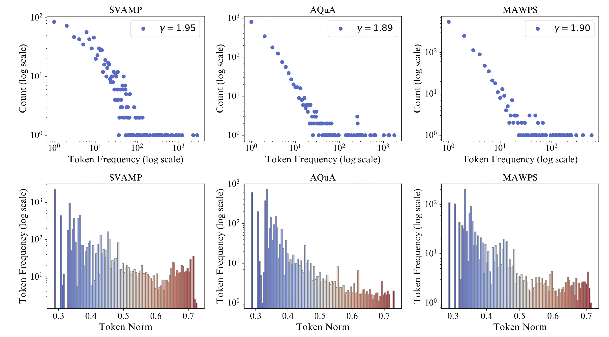
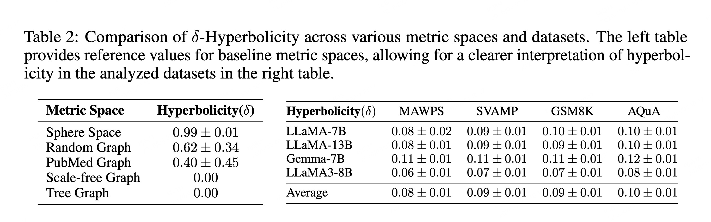
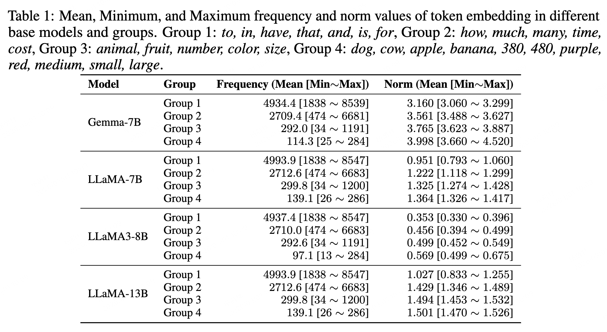

import { Authors, Badges } from '@/components/utils'

# HypLoRA: Hyperbolic Fine Tuning for Large Language Models

<Authors
  authors="Menglin Yang, HKUST(GZ) & HKUST; Ram Samarth B B, IISc Bangalore; Aosong Feng, Yale University; Bo Xiong, Stanford University; Jiahong Liu, CUHK; Irwin King, CUHK; Rex Ying, Yale University"
/>

<Badges
  venue="NeurIPS 2025 Spotlight"
  github="https://github.com/marlin-codes/HypLoRA"
  arxiv="https://arxiv.org/abs/2410.04010"
  pdf="https://arxiv.org/pdf/2410.04010"
/>


## Teaser



*Token embeddings exhibit hierarchical geometry: frequent (abstract) tokens cluster near the origin while rare (specific) tokens sit farther away.*

## TL;DR

We discover that LLM token embeddings have strong *hyperbolic* structure. Building on this, we propose **HypLoRA**, a parameter efficient adapter that performs rank reduced adaptation directly on the hyperbolic manifold, consistently improving reasoning performance over standard LoRA.

## Motivation

Most LLM adaptation pipelines operate in Euclidean space by default, yet our empirical analysis reveals a fundamentally different geometric story. We find that token frequencies follow a **power law** distribution, which is a hallmark of hierarchical data, and that frequent abstract tokens consistently sit **closer to the origin** while rare specific tokens are positioned farther away. At the prompt level, token spaces exhibit low **δ-hyperbolicity**, indicating an underlying tree shaped organization rather than a flat Euclidean structure.

These observations motivate a natural question: if the geometry of token embeddings is already hierarchical, should adaptation modules explicitly **preserve and exploit** this structure rather than ignoring it? HypLoRA is our answer to this question.

## Key Information

The two figures below summarize the core empirical signals that motivate manifold based adaptation in HypLoRA.

### Prompt Level Hyperbolicity



Across instruction datasets, prompts exhibit low δ-hyperbolicity, indicating tree shaped geometry. This supports modeling token relationships in a curved space rather than assuming flat Euclidean structure.

### Frequency Norm Statistics



Token frequency follows a power law trend, and frequent abstract tokens appear closer to the origin while rarer specific tokens are farther away. This radial organization aligns with hierarchical encoding in hyperbolic space.

## Method

### Method Overview

HypLoRA augments a standard LoRA update with a **geometry guided branch** designed for hierarchical token structure. The key idea is to keep the base model interface unchanged in Euclidean space while computing an additional rank reduced correction in hyperbolic space, then mapping it back for seamless integration.

Concretely, each adapted layer follows a three step flow:

1. project Euclidean hidden states to the Lorentz manifold  
2. apply a trainable rank reduced transform directly on manifold coordinates (LLR)  
3. map the result back and combine it with the original Euclidean pathway  

This yields an adapter that preserves parameter efficiency while better respecting curved geometry during training.

### Core Idea

Instead of adapting only in Euclidean space, HypLoRA introduces a **hyperbolic branch**. Input tokens are projected onto the Lorentz manifold, adapted via a direct rank reduced transform, and projected back:

$$
z_E = W x_E + \Pi^K_{\log}\!\bigl(\mathrm{LLR}(BA,\;\Pi^K_{\exp}(x_E))\bigr)
$$

*LLR = Lorentz rank reduced transform on manifold representations*

### Why Not Naive Tangent Space Chaining?

A naive sequence of repeated log/exp mappings can *cancel out* geometric effects and collapse toward Euclidean behavior. HypLoRA avoids this by adapting **directly on manifold coordinates** before projecting back.

### Design at a Glance

- **Geometry:** Lorentz Model
- **Adapter:** Direct LLR
- **Parameters:** Rank Reduced A, B
- **Curvature:** Learnable
- **Goal:** Preserve Hierarchy

## Experiments

### Arithmetic Reasoning

Training on **Math10K**, evaluated on GSM8K, AQuA, MAWPS, and SVAMP.

| Base Model | Method | Params % | MAWPS | SVAMP | GSM8K | AQuA | W.Avg |
|---|---:|---:|---:|---:|---:|---:|---:|
| LLaMA3-8B | LoRA | 0.70 | 92.7 | 78.9 | 70.8 | 30.4 | 71.9 |
| LLaMA3-8B | **HypLoRA** | 0.70 | 91.6 | 80.5 | 74.0 | 34.2 | **74.2** |
| Gemma3-4B | LoRA | 1.04 | 90.8 | 77.3 | 72.3 | 50.8 | 73.7 |
| Gemma3-4B | **HypLoRA** | 1.04 | 88.2 | 83.9 | 76.1 | 53.2 | **77.8** |
| Qwen2.5-7B | LoRA | 0.71 | 90.8 | 84.4 | 78.6 | 68.1 | 80.8 |
| Qwen2.5-7B | **HypLoRA** | 0.71 | 91.2 | 92.2 | 87.9 | 71.6 | **88.3** |

### Commonsense Reasoning

Training on **Commonsense170K**, evaluated on 8 benchmarks.

| Base Model | Method | % | BoolQ | PIQA | SIQA | Hella | Wino | ARC-e | ARC-c | OBQA | Avg |
|---|---:|---:|---:|---:|---:|---:|---:|---:|---:|---:|---:|
| LLaMA3-8B | LoRA | 0.70 | 70.8 | 85.2 | 79.9 | 91.7 | 84.3 | 84.2 | 71.2 | 79.0 | 80.8 |
| LLaMA3-8B | **HypLoRA** | 0.70 | 74.1 | 87.6 | 80.6 | 94.5 | 84.7 | 90.4 | 81.2 | 85.2 | **84.8** |
| Gemma3-4B | LoRA | 1.04 | 68.1 | 83.2 | 77.2 | 88.9 | 80.5 | 84.5 | 69.9 | 83.6 | 79.5 |
| Gemma3-4B | **HypLoRA** | 1.04 | 70.0 | 84.3 | 79.2 | 91.5 | 80.3 | 89.1 | 75.9 | 86.4 | **82.5** |
| Qwen2.5-7B | LoRA | 0.71 | 73.4 | 89.5 | 79.5 | 93.6 | 84.1 | 92.8 | 82.0 | 87.0 | 85.2 |
| Qwen2.5-7B | **HypLoRA** | 0.71 | 72.8 | 89.3 | 79.8 | 94.8 | 84.4 | 95.5 | 87.5 | 90.8 | **87.0** |

## Citation

```bibtex
@inproceedings{yang2025hyplora,
  title     = {Hyperbolic Fine-Tuning for Large Language Models},
  author    = {Yang, Menglin and B B, Ram Samarth and Feng, Aosong
               and Xiong, Bo and Liu, Jiahong and King, Irwin and Ying, Rex},
  booktitle = {Advances in Neural Information Processing Systems (NeurIPS)},
  year      = {2025}
}