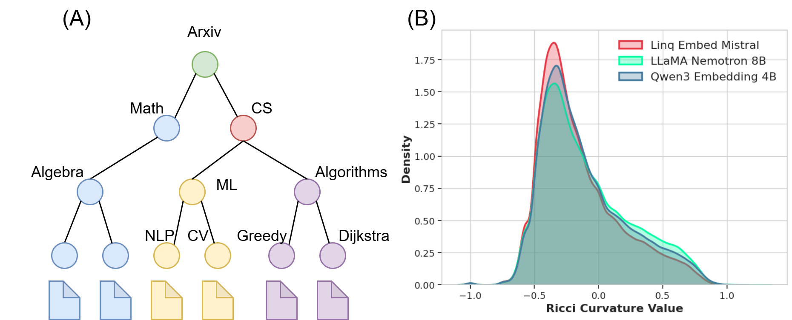
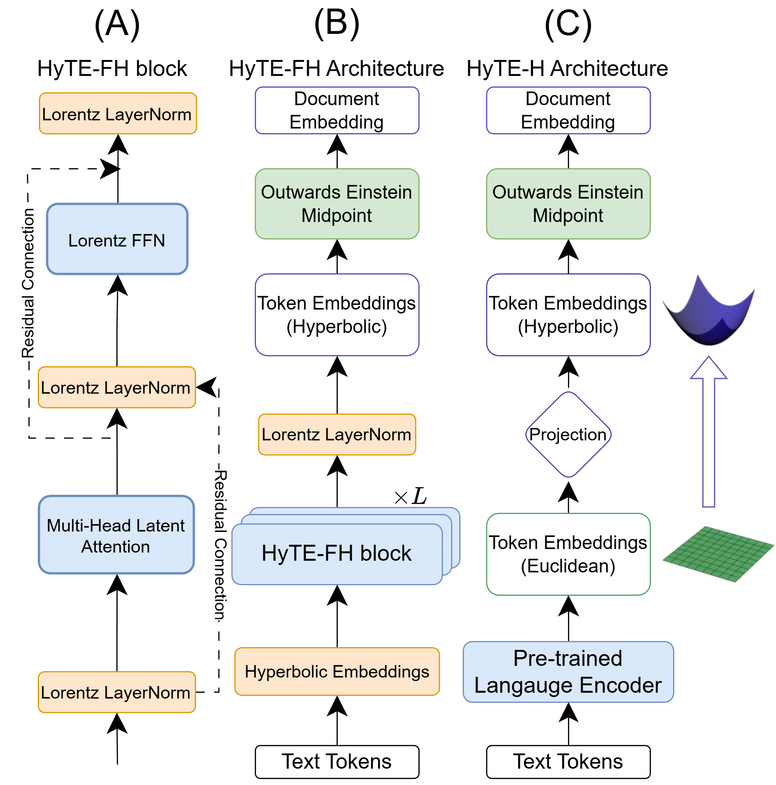
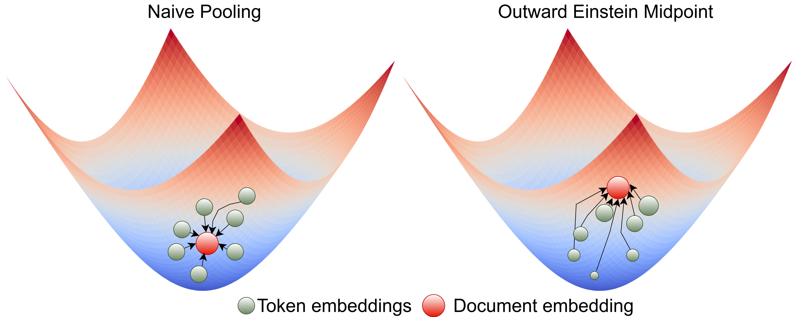
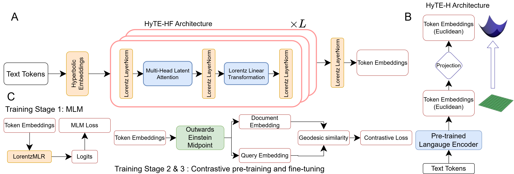

import { Authors, Badges } from '@/components/utils'

# HypRAG: Hyperbolic Dense Retrieval for Retrieval Augmented Generation

<Authors
  authors="Hiren Madhu, Yale University; Ngoc Bui, Yale University; Ali Maatouk, Yale University; Leandros Tassiulas, Yale University; Smita Krishnaswamy, Yale University; Menglin Yang, HKUST(GZ); Sukanta Ganguly, NetApp; Kiran Srinivasan, NetApp; Rex Ying, Yale University"
/>

<Badges
  venue="ICML 2026"
  github="https://github.com/Graph-and-Geometric-Learning/HypRAG"
  pdf="https://icml.cc/virtual/2026/poster/60847"
/>

## Teaser



*Documents naturally organize into branching hierarchies, from general topics to specific entities (A). Euclidean spaces distort these hierarchies through crowding, whereas hyperbolic geometry preserves them via exponential volume growth. Ollivier–Ricci curvature of document-embedding graphs from strong retrievers (Linq Embed Mistral, LLaMA Nemotron 8B, Qwen3 Embedding 4B) is predominantly negative (B) — empirical evidence of intrinsic tree-like structure.*

## TL;DR

Dense retrievers for RAG are almost universally **Euclidean**, yet language is **hierarchical** — and Euclidean geometry cannot represent branching hierarchies without crowding, which makes semantically distant documents look spuriously similar and increases hallucination. We introduce **hyperbolic dense retrieval**, with two encoders in the Lorentz model: **HyTE-FH** (fully hyperbolic transformer) and **HyTE-H** (hybrid, projecting pretrained Euclidean embeddings into hyperbolic space). To stop sequence pooling from collapsing hierarchical structure, we propose the **Outward Einstein Midpoint (OEM)**, a geometry-aware pooling operator that *provably* preserves radial depth. HyTE-FH beats matched Euclidean baselines on MTEB, hyperbolic retrieval delivers **up to 29% gains over Euclidean baselines** in context and answer relevance on RAGBench, HyTE-H stays competitive with SOTA retrievers several times its size, and hyperbolic embeddings encode document specificity through **norm-based separation** (a **+20.2%** radial increase from general to specific concepts) — a property absent in Euclidean embeddings.

---

## Motivation

Retrieval quality is the bottleneck of RAG: if the top-$k$ documents are wrong, generation is ungrounded no matter how strong the LLM. Natural language is strongly **hierarchical** — broad topics branch into increasingly specific subtopics, inducing locally tree-like neighborhoods. Euclidean spaces struggle to represent such branching structure because their volume grows only polynomially, forcing a trade-off between keeping general concepts close and separating fine-grained descendants. The result is *neighborhood crowding*: a query about a specific subtopic retrieves sibling or parent documents that are similar but lack the required specificity.

This is not just theory. Building $k$-NN graphs on MS MARCO document embeddings and measuring **Ollivier–Ricci curvature** — where negative values indicate tree-like branching — reveals predominantly negative curvature across several strong retrievers (Linq Embed Mistral, LLaMA Nemotron 8B, Qwen3 Embedding 4B). Retrieval-relevant embeddings already carry intrinsic hyperbolic structure, motivating hyperbolic geometry as a natural inductive bias for dense retrieval.

Prior hyperbolic work does not close this gap. HELM operates entirely in hyperbolic space but targets *generation*, not retrieval. HyperbolicRAG projects embeddings into the Poincaré ball to encode hierarchy in a static knowledge graph — but relies on Euclidean encoders for the initial embeddings, leaving the geometric mismatch in place. Critically, **aggregating tokens into document embeddings** is itself an unsolved problem in hyperbolic space: naive averaging collapses representations toward the origin, destroying the very hierarchy that is meant to be preserved.

---

## Key Ideas

### 1. Hyperbolic dense retrieval, two ways

We frame embedding geometry as a *design choice* for grounding and study two complementary instantiations:

- **HyTE-FH** (Hyperbolic Text Encoder, Fully Hyperbolic) — operates entirely in the Lorentz model, enabling end-to-end representation learning where semantic abstraction and specificity are encoded along the radial axis.
- **HyTE-H** (Hybrid) — projects embeddings from off-the-shelf Euclidean encoders into hyperbolic space, leveraging strong pretrained initializations. Its intrinsic geometry enables **parameter-efficient scaling**: HyTE-H outperforms Euclidean baselines several times its size.

### 2. The Outward Einstein Midpoint (OEM)

Both variants need to pool variable-length token sequences into a fixed document vector. We prove standard strategies fail, and introduce a pooling operator that **provably preserves hierarchical structure** by amplifying tokens farther from the origin.

### 3. Drop-in with existing retrieval stacks

Hyperbolic nearest-neighbor search in the Lorentz model reduces exactly to **maximum inner product search (MIPS)** via a simple sign-flip of the time coordinate — so HyTE runs unmodified through FAISS `IndexFlatIP` and HNSW, making it a drop-in replacement for Euclidean encoders.

---

## Method

### Lorentz model preliminaries

All embeddings live in $d$-dimensional hyperbolic space $\mathbb{H}^d_K$ with constant negative curvature $K < 0$, realized as the upper sheet of a hyperboloid in $\mathbb{R}^{d+1}$:

$$
\mathbb{H}^d_K = \left\{ \mathbf{x} \in \mathbb{R}^{d+1} \;\middle|\; \langle \mathbf{x}, \mathbf{x} \rangle_L = \tfrac{1}{K},\; x_0 > 0 \right\}, \qquad \langle \mathbf{x}, \mathbf{y} \rangle_L = -x_0 y_0 + \sum_{i=1}^d x_i y_i
$$

The geodesic distance is a monotone function of the Lorentzian inner product:

$$
d_K(\mathbf{x}, \mathbf{y}) = \frac{1}{\sqrt{-K}} \operatorname{arccosh}\!\left(K \langle \mathbf{x}, \mathbf{y} \rangle_L\right)
$$

HyTE-FH replaces every transformer operation with its Lorentzian counterpart — the **Lorentz linear layer**, **hyperbolic layer normalization**, **Lorentz residual connection**, and **hyperbolic self-attention** (where attention weights use squared geodesic distances and values are aggregated via a Lorentzian weighted midpoint). All operations keep representations on the manifold, preserving the radial structure induced by negative curvature.

### Architecture



**HyTE architecture.** (A) The HyTE-FH block — multi-head latent attention and a Lorentz FFN, each wrapped in Lorentz LayerNorm and Lorentz residual connections. (B) HyTE-FH stacks $L$ such blocks over hyperbolic token embeddings, then pools with OEM into a document embedding. (C) HyTE-H feeds text through a pretrained Euclidean encoder, projects the token embeddings into hyperbolic space, and pools with OEM.

### Why naive hyperbolic pooling fails

Standard practice maps to tangent space, averages in Euclidean space, then maps back — but this **systematically contracts representations toward the origin**, erasing the radial separation that encodes specificity. We define the **radial depth** of $\mathbf{x} \in \mathbb{H}^d_K$ as $r(\mathbf{x}) = x_0$ (equivalent to ordering by hyperbolic distance from the origin), and formalize the failure:

> **Proposition (Euclidean mean contracts).** For $\{\mathbf{x}_i\}_{i=1}^n \subset \mathbb{H}^d_K$ with $n \geq 2$, the projected Euclidean mean $\mathbf{m}^{\mathrm{Euc}} = \Pi_K(\bar{\mathbf{x}})$ satisfies $r(\mathbf{m}^{\mathrm{Euc}}) \leq \tfrac{1}{n}\sum_i r(\mathbf{x}_i)$, with equality iff all $\mathbf{x}_i$ are identical.

The standard **Einstein midpoint** weights points by the Lorentz factor $\lambda_i = x_{i,0}$, but this is still not enough:

> **Proposition (implicit radial weighting is insufficient).** The Lorentz factor grows as $\exp(\sqrt{-K}\,\rho)$ while hyperbolic volume grows as $\exp((d-1)\sqrt{-K}\,\rho)$, so Einstein weighting undercompensates by a factor of $\exp((d-2)\sqrt{-K}\,\rho)$ for $d \geq 3$.

A correct pooling operator must be **outward-biased**: $r(\mathcal{P}(\{\mathbf{x}_i\})) \geq \bar{r}$, the (weighted) mean radius.

### Outward Einstein Midpoint pooling



**Outward Einstein Midpoint.** Naive pooling drags the document embedding (red) toward the origin; OEM up-weights tokens at larger radius so the aggregate is pushed outward, preserving specificity. Marker size reflects each token's contribution.

OEM introduces a radius-dependent weighting $\phi_p(\mathbf{x}_i) = x_{i,0}^{\,p}$ ($p > 0$) on top of attention weights $w_i$ and Lorentz factors $\lambda_i$:

$$
\mathbf{m}^{\mathrm{OEM}}_{K,p} = \frac{\sum_{i=1}^n \left(w_i\, \phi_p(\mathbf{x}_i)\right)\lambda_i\, \mathbf{x}_i}{\sum_{i=1}^n \left(w_i\, \phi_p(\mathbf{x}_i)\right)\lambda_i}, \qquad \phi_p(\mathbf{x}_i) = x_{i,0}^{\,p}
$$

followed by reprojection onto $\mathbb{H}^d_K$. We prove OEM corrects the contraction:

> **Theorem (OEM pre-projection bound).** For $p \geq 0$, the OEM weighted average has time component $\tilde{v}_0 = \frac{\sum_i w_i x_{i,0}^{p+2}}{\sum_i w_i x_{i,0}^{p+1}} \geq \bar{r}_w$ (proved via Chebyshev's sum inequality on the co-monotonic sequences $x_{i,0}^{p+1}$ and $x_{i,0}$).

> **Theorem (OEM outward bias).** For all $p \geq 1$, $r(\mathbf{m}^{\mathrm{OEM}}_{K,p}) \geq r(\mathbf{m}^{\mathrm{Ein}}_K)$ — OEM provably dominates the standard Einstein midpoint in preserving radial structure.

### Training



**Training pipeline.** Stage 1 initializes the encoder with hyperbolic masked language modeling using a Lorentzian MLR head. Stages 2 and 3 add the OEM pooler and train contrastively with geodesic similarity.

We follow a three-stage recipe (after nomic-embed), with all objectives operating directly on the manifold via geodesic similarity:

1. **Hyperbolic Masked Language Modeling** — BERT-style MLM in hyperbolic space with a Lorentzian multinomial logistic regression (LorentzMLR) head. Only HyTE-FH is trained here; HyTE-H starts from a pretrained Euclidean MLM base.
2. **Contrastive pre-training** — InfoNCE over ~235M general-domain query–document pairs with a large batch size (16,384), using negative geodesic distance as similarity.
3. **Contrastive fine-tuning** — refinement on curated query–document data with mined hard negatives:

$$
\mathcal{L}_{\mathrm{ctr}} = -\sum_{i \in \mathcal{B}} \log \frac{\exp\!\left(s(\mathbf{q}_i, \mathbf{d}_i)/\tau\right)}{\sum_{j \in \mathcal{B} \cup \mathcal{H}_i}\exp\!\left(s(\mathbf{q}_i, \mathbf{d}_j)/\tau\right)}, \qquad s(\mathbf{q}, \mathbf{d}) = -\,d_K(\mathbf{q}, \mathbf{d})
$$

### Hyperbolic retrieval is just MIPS

Because $d_K$ is monotone in $\langle \mathbf{x}, \mathbf{y}\rangle_L = -x_0 y_0 + \mathbf{x}^\top \mathbf{y}$, **negating each document's time coordinate** ($x_0 \to -x_0$) turns hyperbolic ranking into a standard dot product. Exact retrieval runs through FAISS `IndexFlatIP` unmodified, and HNSW works out of the box — HyTE is a drop-in replacement for Euclidean encoders in any retrieval stack.

---

## Experiments

All three core models — HyTE-FH, HyTE-H, and the Euclidean control **EucBERT** — share the same architecture: **149M parameters, 12 transformer layers, 768-dimensional embeddings**, trained on NVIDIA H100 GPUs with HyperCore. RAG generation and judging use Llama-3.1-8B-Instruct, RAG metrics use RAGAS, and the retrieval context window is fixed at 5 documents unless noted.

### MTEB

HyTE-FH achieves the best mean score across tasks, with both hyperbolic variants beating the Euclidean control.

| Model | Mean (Task) | Mean (TaskType) |
|---|---:|---:|
| EucBERT | 54.11 | 51.31 |
| HyTE-H (Euc) | 54.57 | 53.71 |
| **HyTE-FH** | **56.41** | **53.75** |

### RAGBench — controlled comparison

Against the matched Euclidean control, both hyperbolic variants substantially improve faithfulness (F), context relevance (CR), and answer relevance (AR), averaged across five datasets.

| Model | F | CR | AR |
|---|---:|---:|---:|
| EucBERT | 0.596 | 0.798 | 0.647 |
| HyTE-H (Euc) | 0.706 | 0.814 | 0.739 |
| **HyTE-FH** | **0.732** | **0.848** | **0.765** |

Full per-dataset breakdown:

| Model | CovidQA (F/CR/AR) | Cuad | Emanual | DelucionQA | ExpertQA |
|---|---|---|---|---|---|
| EucBERT | 0.685 / 0.863 / 0.582 | 0.654 / 0.644 / 0.641 | 0.642 / 0.646 / 0.674 | 0.525 / 0.968 / 0.679 | 0.475 / 0.872 / 0.662 |
| HyTE-H (Euc) | 0.708 / 0.868 / 0.668 | 0.787 / 0.652 / 0.710 | 0.679 / 0.835 / 0.814 | 0.737 / 0.857 / 0.773 | 0.623 / 0.859 / 0.728 |
| HyTE-FH | 0.764 / 0.916 / 0.694 | 0.747 / 0.674 / 0.752 | 0.660 / 0.807 / 0.704 | 0.789 / 0.906 / 0.861 | 0.702 / 0.936 / 0.814 |

### RAGBench — vs. state-of-the-art retrievers

HyTE-H, initialized from ModernBERT-base or Qwen-Embedding, is competitive with or beats much larger SOTA retrievers, especially in context and answer relevance.

| Model | F | CR | AR |
|---|---:|---:|---:|
| ModernBERT* | 0.617 | 0.748 | 0.632 |
| GTE | 0.659 | 0.701 | 0.650 |
| Gemma | 0.603 | 0.735 | 0.684 |
| KaLM-mini-v1 | 0.624 | 0.719 | 0.591 |
| Qwen-Embedding | 0.784 | 0.907 | 0.814 |
| HyTE-H (bert) | 0.763 | 0.904 | 0.832 |
| **HyTE-H (Qwen)** | **0.803** | **0.934** | **0.845** |

Full per-dataset breakdown:

| Model | CovidQA (F/CR/AR) | Cuad | Emanual | DelucionQA | ExpertQA |
|---|---|---|---|---|---|
| ModernBERT* | 0.656 / 0.895 / 0.537 | 0.632 / 0.709 / 0.746 | 0.567 / 0.715 / 0.639 | 0.655 / 0.665 / 0.518 | 0.575 / 0.758 / 0.718 |
| GTE | 0.695 / 0.840 / 0.538 | 0.733 / 0.599 / 0.779 | 0.546 / 0.608 / 0.686 | 0.648 / 0.725 / 0.549 | 0.672 / 0.731 / 0.698 |
| Gemma | 0.685 / 0.760 / 0.497 | 0.724 / 0.600 / 0.778 | 0.555 / 0.884 / 0.687 | 0.612 / 0.643 / 0.705 | 0.442 / 0.791 / 0.755 |
| KaLM-mini-v1 | 0.656 / 0.787 / 0.528 | 0.742 / 0.789 / 0.716 | 0.565 / 0.776 / 0.616 | 0.553 / 0.581 / 0.573 | 0.607 / 0.666 / 0.522 |
| Qwen-Embedding | 0.808 / 0.955 / 0.747 | 0.825 / 0.738 / 0.806 | 0.838 / 0.973 / 0.852 | 0.701 / 0.881 / 0.840 | 0.748 / 0.988 / 0.824 |
| HyTE-H (bert) | 0.797 / 0.974 / 0.755 | 0.760 / 0.683 / 0.804 | 0.688 / 0.943 / 0.899 | 0.829 / 0.965 / 0.871 | 0.739 / 0.958 / 0.834 |
| HyTE-H (Qwen) | 0.832 / 1.000 / 0.747 | 0.886 / 0.855 / 0.960 | 0.826 / 0.963 / 0.764 | 0.809 / 0.987 / 0.822 | 0.666 / 0.863 / 0.931 |

### Concept-level hierarchy analysis


**Empirical validation of hierarchical encoding.** Across five levels of increasing specificity (Science → Mathematics → Algebra → Linear Algebra → Linear Transformations), Euclidean models show flat or *decreasing* norms (left), while HyTE-H shows increasing norms that fine-tuning sharpens (middle). HyTE-FH increases monotonically from **2.902 (L1) to 3.488 (L5), a +20.2% total increase** (right). Euclidean baselines instead drop by up to ~30%, reflecting inverted structure.

---

## Additional Results (Appendix)

### Full MTEB breakdown

Per-task-type MTEB scores (all models share 149M parameters, 768 dims, 12 layers). Naming follows the paper; * denotes the Euclidean equivalent of HyTE.

| Model | Mean (Task) | Mean (Type) | Class. | Clust. | Retr. | Rerank. | STS | Pair Class. | Summ. |
|---|---:|---:|---:|---:|---:|---:|---:|---:|---:|
| EucBERT | 54.11 | 51.31 | 69.07 | 35.31 | 37.01 | 35.18 | 75.02 | 80.02 | 27.62 |
| ModernBert-embed* | 58.32 | 55.59 | 69.25 | 40.87 | 43.28 | 44.29 | 78.00 | 83.84 | 28.37 |
| HyTE-H (Euc) | 54.57 | 53.71 | 68.76 | 38.67 | 34.26 | 44.54 | 73.33 | 80.02 | 36.45 |
| HyTE-H (bert) | 56.41 | 53.75 | 68.77 | 41.95 | 40.54 | 42.05 | 74.39 | 79.70 | 28.87 |
| **HyTE-H** | **59.89** | **57.15** | **72.71** | **44.83** | **43.56** | **46.01** | **78.38** | 83.82 | 30.87 |

### MeSH hierarchy-sensitive retrieval

A zero-shot diagnostic built from the **MeSH taxonomy** with PubMed abstracts: each query must be matched to an abstract at a specific depth against parent, grandparent, sibling, and unrelated distractors. *SpecHR* (Specificity Hit Rate) is the fraction of queries where the correct-depth target outranks every ancestor-level document.

| Model | SpecHR | R@1 | R@5 | MRR |
|---|---:|---:|---:|---:|
| EucBERT | 0.883 | 0.810 | 0.963 | 0.878 |
| **HyTE-FH** | **0.970** | **0.963** | **0.990** | **0.976** |

Top-1 prediction breakdown by distractor type — HyTE-FH eliminates grandparent confusion entirely and roughly quarters parent/sibling errors:

| Model | Target | Sibling | Parent | Grandparent | Random |
|---|---:|---:|---:|---:|---:|
| EucBERT | 81.0% | 7.0% | 7.0% | 1.0% | 4.0% |
| **HyTE-FH** | **96.3%** | 1.7% | 1.7% | 0.0% | 0.3% |

### ANN retrieval on MS MARCO

Indexing HyTE-FH and EucBERT on MS MARCO (100k passages, 6,980 dev queries) with FAISS `IndexHNSWFlat`, applying the sign-flip reduction to HyTE-FH. It achieves higher recall at every $k$ **and 3× lower latency** (0.09 ms vs. 0.29 ms; identical ~10s build time) — OEM's outward bias yields a more tree-like HNSW graph with fewer spurious shortcuts.

| $k$ | HyTE-FH (Recall@$k$) | EucBERT (Recall@$k$) |
|---:|---:|---:|
| 1 | **0.917** | 0.913 |
| 10 | **0.906** | 0.891 |
| 50 | **0.859** | 0.795 |
| 100 | **0.750** | 0.707 |

### Pooling ablation

OEM outperforms every alternative by a wide margin; naive mean pooling is worst (consistent with the contraction result), and the standard Einstein midpoint lags well behind OEM — confirming the outward bias is essential.

| Pooling Strategy | Mean (Task) | Mean (TaskType) |
|---|---:|---:|
| Naive Pooling | 47.07 | 45.61 |
| CLS Token | 49.33 | 48.90 |
| Einstein Midpoint | 50.33 | 47.19 |
| **OEM** | **56.41** | **53.75** |

### OEM sensitivity to $p$

Performance peaks at $p = 1.0$ (used throughout) and degrades gracefully on both sides: $p = 0$ recovers the standard Einstein midpoint, while large $p$ over-amplifies peripheral tokens.

| $p$ | Mean (Task) | Mean (TaskType) |
|---:|---:|---:|
| 0.0 | 50.33 | 47.19 |
| **1.0** | **56.41** | **53.75** |
| 2.0 | 53.76 | 51.13 |

### Similarity function

Geodesic distance in the contrastive objective outperforms the Lorentz inner product, indicating better alignment of representations on the manifold.

| Loss Function | Mean (Task) | Mean (TaskType) |
|---|---:|---:|
| Lorentz Inner Product | 52.59 | 51.60 |
| **Geodesic Distance** | **56.41** | **53.75** |

### Robustness to retrieval budget

Hyperbolic models stay strong with a small context window; the Euclidean baseline (Gemma) needs a larger window and still falls short.

| Model | F ($\lvert\mathcal{C}\rvert=5$) | CR | AR | F ($\lvert\mathcal{C}\rvert=10$) | CR | AR |
|---|---:|---:|---:|---:|---:|---:|
| Gemma | 0.603 | 0.735 | 0.684 | 0.756 | 0.846 | 0.836 |
| HyTE-FH | 0.732 | 0.848 | 0.765 | 0.770 | 0.912 | 0.784 |
| **HyTE-H** | **0.763** | **0.904** | **0.832** | **0.787** | **0.913** | **0.847** |

### Hubness

A well-known pathology of dense retrieval is **hubness** — a few documents dominate nearest-neighbor lists while most of the corpus is never retrieved. By preserving radial spread, OEM **reduces skewness ~4× over Euclidean mean pooling** and retrieves far more of the corpus.

| Model | Pooling | $S_N$ ($k{=}10$) | % Corpus Never Retrieved |
|---|---|---:|---:|
| HyTE-FH | CLS | 141.4 | 97.45% |
| EucBERT | Mean | 71.3 | 74.30% |
| **HyTE-FH** | **OEM** | **17.0** | **61.60%** |

### Runtime

End-to-end latency (encoding + retrieval) for 32 queries over 100k documents on a single H100. HyTE-H adds negligible overhead; HyTE-FH's larger gap is entirely in encoding and reflects the current absence of optimized hyperbolic CUDA kernels rather than asymptotic complexity — encoding and retrieval share the same $\mathcal{O}(L(n^2 d + n d^2))$ and $\mathcal{O}(|\mathcal{D}|\,d)$ complexity as a Euclidean transformer.

| Model | Latency (ms, 32 queries) |
|---|---:|
| EucBERT | 15.21 |
| HyTE-H (Euc) | 17.30 |
| HyTE-FH | 22.48 |

### Case study: geometry decides answer quality

On the query *"What is the feature of Bixby guide?"* (Emanual), only the hyperbolic model retrieves the correct passage and produces a faithful answer. Euclidean retrievers either collapse to generic "hub" documents (honest refusal) or drift to tangential content that triggers a **confident hallucination** — high answer relevance masking low faithfulness.

| Model | CR | F | AR | Failure Mode |
|---|---:|---:|---:|---|
| **HyTE-H** | **1.0** | **1.0** | **1.0** | None (success) |
| GTE | 0.5 | 1.0 | 0.0 | Honest refusal |
| Gemma | 1.0 | 0.25 | 0.94 | Ungrounded extrapolation |

---

## Citation

```bibtex
@inproceedings{madhu2026hyprag,
  title={HypRAG: Hyperbolic Dense Retrieval for Retrieval Augmented Generation},
  author={Madhu, Hiren and Bui, Ngoc and Maatouk, Ali and Tassiulas, Leandros and Krishnaswamy, Smita and Yang, Menglin and Ganguly, Sukanta and Srinivasan, Kiran and Ying, Rex},
  booktitle={International Conference on Machine Learning (ICML)},
  year={2026}
}
```
