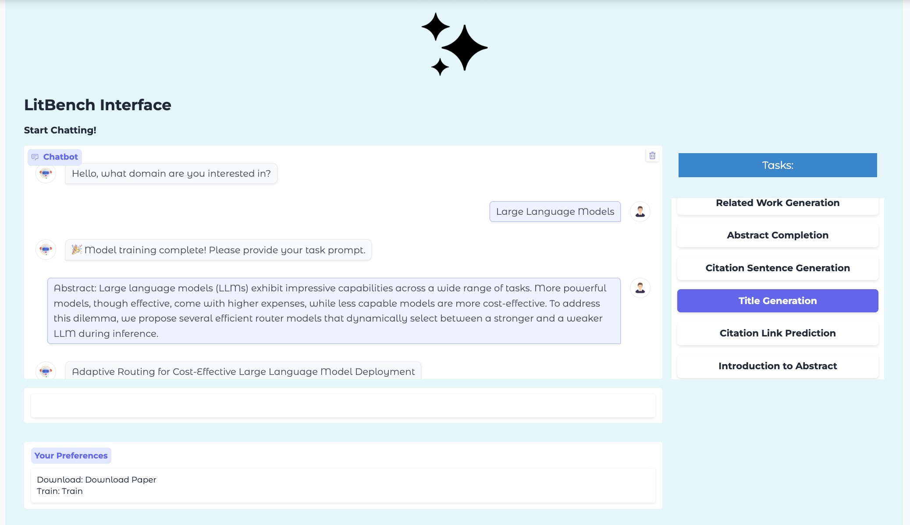
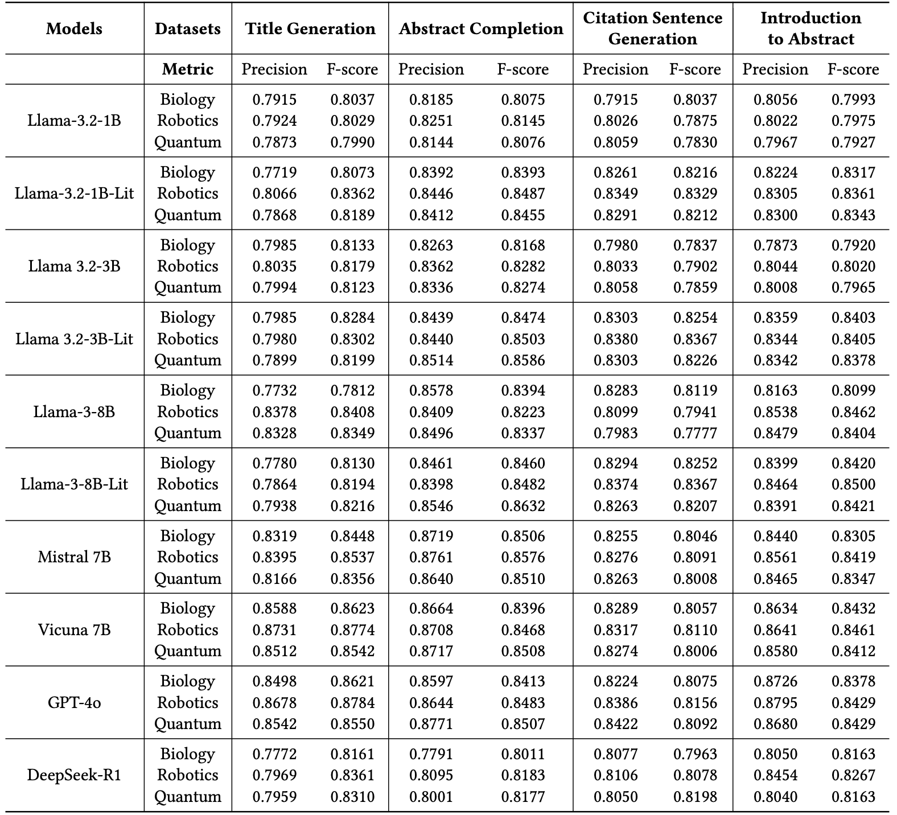
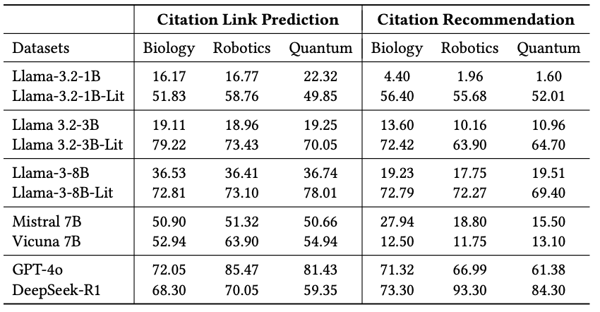

import { Authors, Badges } from '@/components/utils'

# LitBench: A Graph-Centric Large Language Model Benchmarking Tool For Literature Tasks

<Authors
  authors="Andreas Varvarigos, Yale University; Ali Maatouk, Yale University; Jiasheng Zhang, Yale University; Ngoc Bui, Yale University; Jialin Chen, Yale University; Leandros Tassiulas, Yale University; Rex Ying, Yale University"
/>

<Badges
  venue="SIGKDD 2026"
  github="https://github.com/varvarigos/LitBench"
  arxiv="https://cdn.jsdelivr.net/npm/simple-icons@v9/icons/arxiv.svg"
  pdf="https://cdn.jsdelivr.net/npm/simple-icons@v9/icons/arxiv.svg"
/>

## 1. Introduction

Large Language Models (LLMs) have become the de facto framework for literature-related tasks such as summarization, citation recommendation, and question answering. However, general-purpose LLMs struggle to act as **domain-specific literature agents**, as they fail to reason over structured relationships between papers, concepts, and citations.

Existing benchmarks either lack rich textual structure (e.g., citation sentences, related work, introductions) or ignore the **graph structure** that naturally connects scientific knowledge.

**LitBench** introduces a **graph-centric benchmarking framework** that enables automated curation of domain-specific literature subgraphs and rigorous evaluation across a comprehensive suite of literature tasks.

---

## 2. Overall Pipeline

LitBench follows an end-to-end, automated pipeline for constructing domain-specific literature benchmarks and training specialized LLMs.

The framework begins with **arXiv-sourced metadata**, from which we crawl the corresponding LaTeX sources and extract structured textual content using a **custom LaTeX parser**. This step recovers rich section-level information, including titles, abstracts, introductions, related work sections, and aligned citation sentences.

Each paper is then annotated with a **hierarchical set of natural-language topics** at multiple levels of abstraction using a large language model. These topic annotations are embedded and stored in a database.

Given a **user-specified domain query** (e.g., *Quantum Physics*), a topic-based retriever matches the query against the topic embeddings to identify the most relevant papers. The retrieved papers are used to construct a **domain-specific citation sub-network**, where nodes represent papers with rich textual attributes and edges represent citations with associated citation sentences.

Finally, the resulting citation graph is transformed into **instruction-tuning and benchmarking datasets**, covering both node-level and edge-level literature tasks. These datasets enable LLMs to be **trained and evaluated** as domain-specific literature agents across a comprehensive suite of literature-related tasks.

---

## 3. Method Overview

LitBench treats **literature understanding as a graph learning problem**.

The framework consists of four key stages:

- **Concept Curation:** Each paper is annotated with nine natural-language concepts spanning three abstraction levels.
- **Concept-Based Retrieval:** User queries are matched against concept embeddings rather than titles or abstracts.
- **Graph Construction:** Nodes contain rich textual attributes, while edges contain aligned citation sentences.
- **Multi-Instruction Internalization:** The graph is converted into instruction-tuning and benchmarking datasets.

---

## 4. LitBench Interface

LitBench provides an interactive GUI that allows users to:

- specify arbitrary research domains,
- automatically construct domain-specific citation graphs,
- train domain-specific LLMs,
- evaluate models across multiple literature tasks.

---

## 5. Experiments

We evaluate LitBench across three domains:

- Quantitative Biology  
- Robotics  
- Quantum Physics  

and across models ranging from **1B to 8B parameters**, including comparisons with **GPT-4o** and **DeepSeek-R1**.

### 5.1: Generative Tasks

### 5.2: Predictive Tasks

---

## 6. Conclusion

- Domain-specific LLMs fine-tuned on LitBench outperform larger general-purpose models on most literature tasks.
- Performance gains are strongest for **graph-intensive tasks** such as citation prediction and related work generation.
- Only a small subgraph (~1k papers) is sufficient to internalize domain-specific knowledge.
- Strong performance is achieved **without continual pretraining**.
