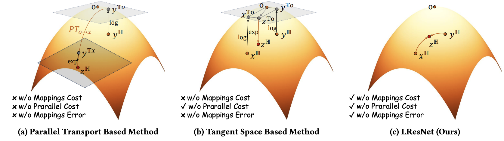
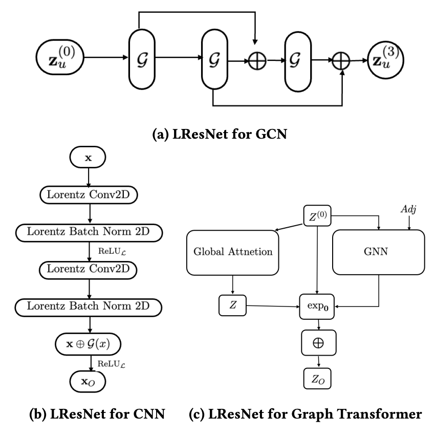
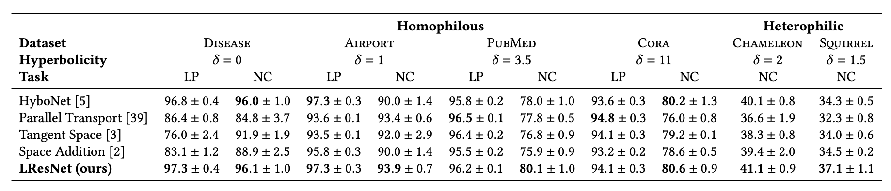
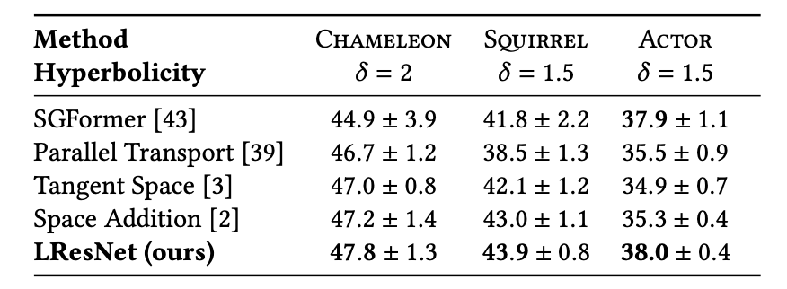
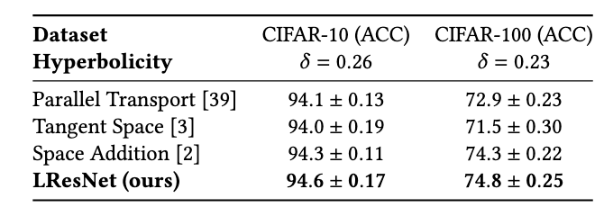
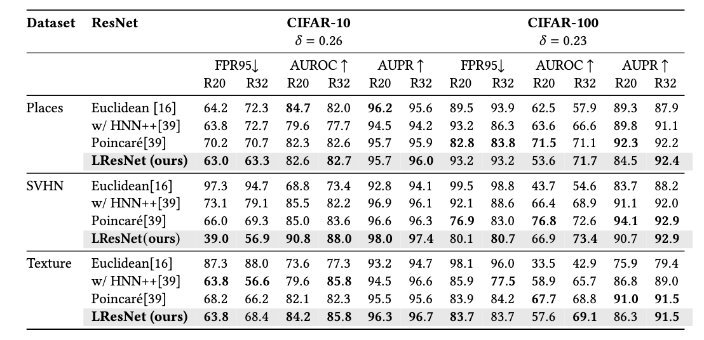
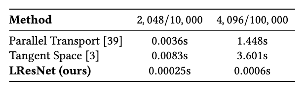

import { Authors, Badges } from '@/components/utils'

# Lorentzian Residual Neural Networks

<Authors
  authors="Neil He, Yale University; Menglin Yang, Yale University; Rex Ying, Yale University"
/>

<Badges
  venue="SIGKDD 2025"
  github="https://github.com/Graph-and-Geometric-Learning/LResNet"
  arxiv="https://arxiv.org/abs/2412.14695"
  pdf="https://arxiv.org/pdf/2412.14695"
/>

## 1. Introduction
Hyperbolic neural networks have emerged as a powerful tool for modeling hierarchical data structures prevalent in real-world datasets. Notably, residual connections, which facilitate the direct flow of information across layers, have been instrumental in the success of deep neural networks. However, current methods for constructing hyperbolic residual networks suffer from limitations such as increased model complexity, numerical instability, and errors due to multiple mappings to and from the tangent space. To address these limitations, we introduce LResNet, a novel Lorentzian residual neural network based on the *weighted Lorentzian centroid in the Lorentz model of hyperbolic geometry*. Our method enables the efficient integration of residual connections in Lorentz hyperbolic neural networks while preserving their hierarchical representation capabilities. We demonstrate that our method can theoretically derive previous methods while offering improved stability, efficiency, and effectiveness. Extensive experiments on both graph and vision tasks showcase the superior performance and robustness of our method compared to state-of-the-art Euclidean and hyperbolic alternatives. Our findings highlight the potential of LResNet for building more expressive neural networks in hyperbolic embedding space as a generally applicable method to multiple architectures, including CNNs, GNNs, and graph Transformers.

---

## 2. Method

The difficulty in designing a hyperbolic residual connection lies in the fact that the simple weighted sum used in the Euclidean case violates the geometric constraints of the manifold. Nevertheless, inspired by the simplicity in the Euclidean case, we propose performing the hyperbolic residual connection as a weighted sum of hyperbolic vectors with weights designed to ensure the output still lives on the manifold. Our construction ensures that:
1. The mathematical computation is simple and efficient.
2. The method is proved to have guaranteed numerical stability.
3. The method provably generalizes previous methods.

---

### 2.1 LResNet Formulation
Let $\mathbb{L}^{K,n}$ be the $n$-dimensional Loretnz hyperboloid with negative curvature $K<0$. Given Lorentzian hyperbolic vectors $\mathbf{x}, f(\mathbf{x})\in \mathbb{L}^{K,n}$, we propose the Lorentzian residual connection between them to be:

$$
\begin{equation}
\mathbf{x}\oplus_\mathcal{L} f(\mathbf{x}) := \frac{w_x\mathbf{x} + w_y f(\mathbf{x})}{\sqrt{-K} |\| w_x\mathbf{x} + w_y f(\mathbf{x}) \|_{\mathcal{L}}|}
\end{equation}
$$

where $|\|\cdot\||_{\mathcal{L}}=\sqrt{|\langle\cdot\rangle_\mathcal{L}|}$ is the Lorentzian norm and $w_x,w_y>0$ are weights that can be learned or fixed. This formulation projects the Euclidean weighted sum directly onto $\mathbb{L}^{K,n}$ using the normalizing denominator to ensure it lies in the Lorentz hyperboloid.

Following the general form of the residual connection in the Euclidean case, we can reformulate Equation (1) as as a weighted sum of Lorentzian hyperbolic vector, given by 
$$
\begin{equation}
    \mathbf{x}\oplus_\mathcal{L} f(\mathbf{x}) := \alpha_{w_x,w_y} \mathbf{x} + \beta_{w_x,w_y} f(\mathbf{x}),
\end{equation}
$$
where 
$$
\begin{equation*}
\alpha_{w_x,w_y} = {w_x}/{\sqrt{-K} |\| w_x\mathbf{x} + w_y f(\mathbf{x}) \|_{\mathcal{L}}|}
\end{equation*}
$$

$$
\begin{equation*}
\beta_{w_x,w_y} = {w_y}/{\sqrt{-K} |\| w_x\mathbf{x} + w_y f(\mathbf{x}) \|_{\mathcal{L}}|}
\end{equation*}
$$

are normalized weights.

We can optionally scale the output of LResNet to control its norm for more expressiveness. The scaling is performed as:

$$
\begin{equation}
    \begin{bmatrix}
        \sqrt{||\gamma\cdot\mathbf{\mathbf{x}\oplus_\mathcal{L} f(\mathbf{x})}_s||^2 - \frac{1}{K}}\\ \gamma \cdot \mathbf{\mathbf{x}\oplus_\mathcal{L} f(\mathbf{x})}_s
    \end{bmatrix},
\end{equation}
$$

where $\gamma\in\mathbb{R}^+$ is a positive scaling constant that can be fixed or learned and $\mathbf{z}_s$ denotes the time-like dimension of a Lorentzian vector $\mathbf{z}\in\mathbb{L}^{K,n}$.

---

### 2.2 Comparisons to Previous methods
Since the Euclidean weighted sum violates manifold constraints, previous methods proposed goemetric operations that typically involve multiple mappings to and from the tangent space (or in some cases, lack clear geometric motivation). This significantly increases the complexity of the operation and introduces mapping errors for points far away from the origin. A visual comparison is shown below:

## 3. Experiments
We apply LResNet to hyperbolic formulations of CNNs, GNNs, and graph Transformers to demonstrate its effectiveness and applicability. A visualization of the models utilize in the experiments is shown below:

In all experiments, Parallel Transport, Tangent Space, and Space Addition indicate previous methods of hyperbolic residual connection methods, where we apply them instead of LResNet.

### 3.1 Adaptation to GNNs
We apply LResNet to hyperbolic skip-connected GNNs for link prediction (LP) and node classification (NC) on homophilous and heterophilic graph datasets, where we can see that LResNet improves upon the base HyboNet without residual connection and the previous methods.

### 3.2 Adaptation to graph Transformers
We consider a hyperbolic adaptation of a recent SOTA Euclidean graph Transformer, SGFormer, and apply LResNet as the residual connection. We test the effectiveness for node classification on heterophilic graph datasets, where we find LResNet significantly outperforms the Euclidean SGFormer and when using previous methods as residaul connections.

### 3.3 Adaptation to Vision Models
We also consider the application of LResNet to hyperbolic residual networks on image tasks. First, we test its effectiveness on image classification tasks, where again LResNet outperforms the baselines.

Next, we test LResNet's robustness in detecting out-of-distribution (OOD) samples after the model is trained. We find LResNet to be more robust than previous hyperbolic and Euclidean ResNets.

Here up arrow means higher values indicate better performance and down arrows mean lower values indicate better performance.

### 3.4 Further Analysis
We compare the runtime between LResNet and previous methods by conducting 100 additions on randomly generated hyperbolic vectors (on the manifold with curvature $K = -1$) with dimensions of 2048 and sizes of 10,000, and dimensions of 4096 and sizes of 100,000, using a single RTX 3070 GPU. We record the average runtime and find that our method demonstrates significant speedup over the baselines and offers better scalability as the size and dimension increase, for over $2000$ times speedup. 

