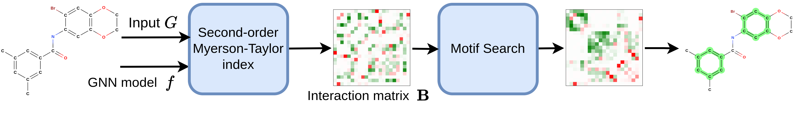
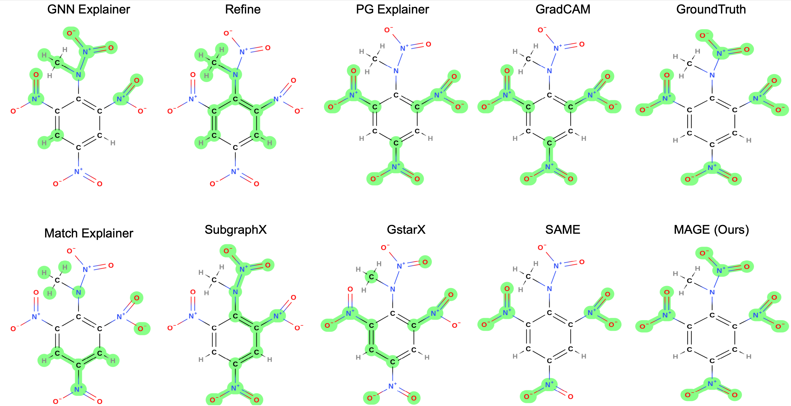
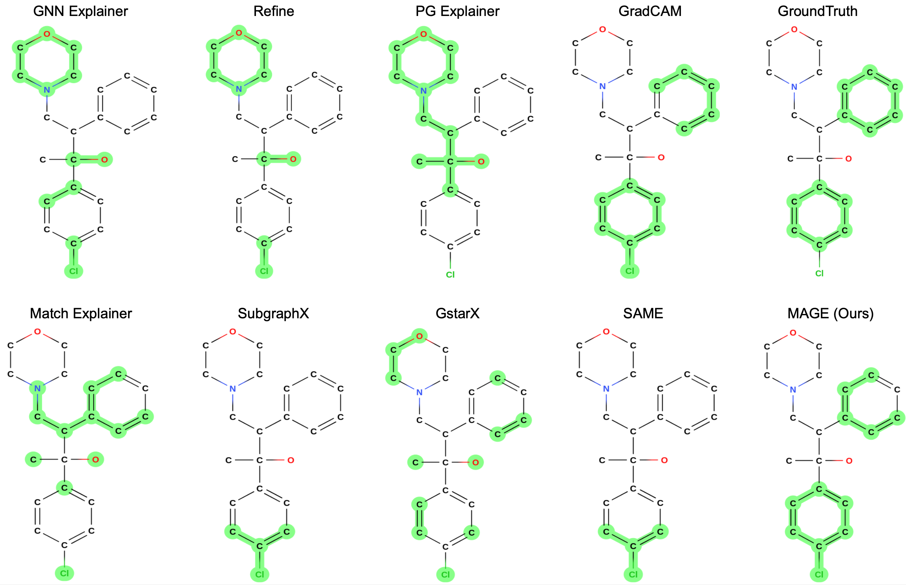
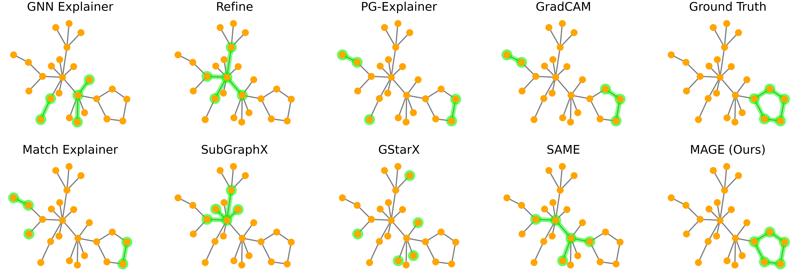
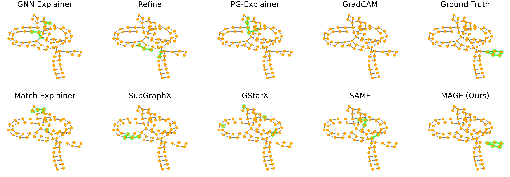

import { Authors, Badges } from '@/components/utils'

# Explaining Graph Neural Networks via Structure-aware Interaction Index

<Authors
  authors="Ngoc Bui, Yale University; Hieu Trung Nguyen, VinAI Research; Viet Anh Nguyen, The Chinese University of Hong Kong; Rex Ying, Yale University"
/>

<Badges
  venue="ICML 2024"
  github="https://github.com/ngocbh/MAGE"
  arxiv="https://arxiv.org/abs/2405.14352"
  pdf="https://arxiv.org/pdf/2405.14352"
/>

In this project, we aim to explore graph-theoretic-based attribution scores for explaining graph neural networks (GNNs). Prior work (GStarX, SubgraphX, SAME) has successfully applied solutions such as Shapley values and HN values to explain GNNs. However, several limitations remain:

1. Existing graph explainers based on game theory either use node-wise attribution scores (GraphSVX, GStarX) or subgraph-level attribution scores (SubgraphX, SAME). Node-level attribution scores are faster but ignore interactions among nodes during the motif search stage. Subgraph-level attribution scores can capture these interactions but are more computationally expensive to perform.
2. Common Shapley-based values evaluate GNN models on pathologically perturbed graphs, which the models do not observe during training. These evaluations may introduce biases into the estimation of attribution scores.

To address the first issue, we aim to leverage high-order interactions during the motif search phase in a way that is computationally efficient. We hypothesize that a second-order interaction index may provide a good approximation for subgraph-level attribution scores by summing pairwise interactions among nodes in a subgraph, leveraging the efficiency axiom. This approach could lead to a more tractable motif search problem, as finding a subgraph with the highest attribution scores can be formulated as a quadratic multiple knapsack problem. Although this remains NP-hard, we can leverage off-the-shelf solvers to solve it more efficiently.

To address the second issue, we introduce the Myerson-Taylor interaction index, which internalizes the graph structure into node values and interaction values among nodes using a predefined connectivity criterion. This new interaction index generalizes the Shapley-Taylor interaction index and the Myerson value, preserving the theoretical advantages of both, particularly the component efficiency axiom, which ensures that the prediction score is fully and fairly distributed across interactions (up to order $k$) within a connected component. In special cases, the Myerson-Taylor interaction index encompasses both the Shapley-Taylor interaction index and the Myerson value.

We therefore propose a new graph explainer, the Myerson-Taylor Structure-Aware Graph Explainer (MAGE), which uses the second-order Myerson-Taylor interaction index to identify the most influential motifs on model predictions, both positively and negatively. This approach balances the effectiveness and efficiency between node-level and subgraph-level attribution scores, leading to better explanations for GNNs across different modalities.

The following is some examples of explanations provided by MAGE.

