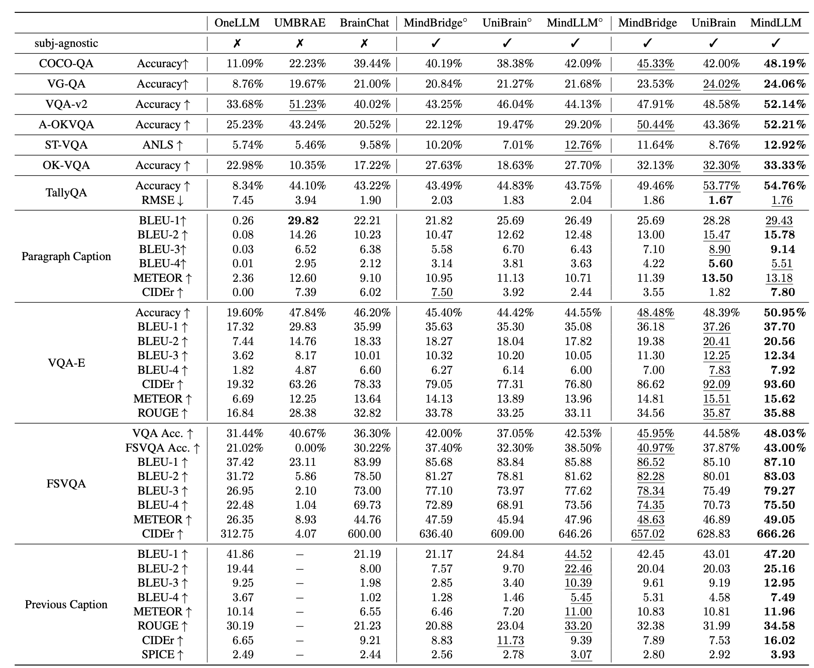

import { Authors, Badges } from '@/components/utils'

# MindLLM: A Subject-Agnostic and Versatile Model for fMRI-to-Text Decoding 

<Authors
  authors="Weikang Qiu, Yale University; Zheng Huang, Dartmouth College; Haoyu Hu, University of Cambridge; Aosong Feng, Yale University; Yujun Yan, Dartmouth College; Rex Ying, Yale University"
/>

<Badges
  venue="ICML 2025"
  github="https://github.com/Graph-and-Geometric-Learning/MindLLM"
  arxiv="https://arxiv.org/abs/2502.15786"
  pdf="https://arxiv.org/pdf/2502.15786"
/>

## Introduction
Decoding functional magnetic resonance imaging (fMRI) signals into text has been a key challenge in the neuroscience community, with the potential to advance brain-computer interfaces and uncover deeper insights into brain mechanisms. However, existing approaches often struggle with suboptimal predictive performance, limited task variety, and poor generalization across subjects. Two challenges are positted:
1. **Subject-Agnostic Decoding**: Existing fMRI-to-text decoding models often require extensive subject-specific training data, which limits their generalization to new subjects, preventing the out-of-the-box application, which is crucial for real-world applications.
2. **Versatile Decoding**: Most existing models are designed for specific tasks, which restricts their applicability to a narrow range of tasks and limits their ability to capture the rich semantic information encoded in fMRI signals.

In response to this, we propose MindLLM, a model designed for subject-agnostic and versatile fMRIto-text decoding. MindLLM consists of an fMRI encoder and an off-the-shelf LLM. The fMRI encoder employs a neuroscience-informed attention mechanism, which is capable of accommodating subjects with varying input shapes and thus achieves high-performance subject-agnostic decoding. Moreover, we introduce Brain Instruction Tuning (BIT), a novel approach that enhances the model's ability to capture diverse semantic representations from fMRI signals, enabling more versatile decoding.

## Method
### fMRI Encoder
The fMRI encoder consists of a neuroscience-informed attention layer and an MLP. The attention layer is designed to handle varying input shapes across subjects, which is crucial for subject-agnostic decoding. The MLP processes the output of the attention layer to generate fMRI tokens aligned with LLM's input spaces.

There are three design choices that differentiate the neuroscience-informed attention layer from the standard attention mechanism:
1. Exclude fMRI values from keys. This is motivated by the intuition: different from images or text, which are usually considered translation-invariant, the positions of voxels carry specific brain functional information, as voxels in different
areas are associated with distinct brain functions. Consequently, a voxel's position alone can theoretically serve as
effective keys for attention weight computation.
2. Incorporate brain parcellation information. While positional encoding alone improves performance, it lacks inherent neuroscientific grounding, potentially making it challenging for the model to efficiently learn representations aligned with established principles of brain function. To overcome this, we incorporate existing brain region information into the keys of the attention.
3. Combine multiple parcellation schemes. Different parcellation schemes capture different aspects of brain function, and combining them can provide a more comprehensive representation of the brain's functional organization.

### Brain Instruction Tuning (BIT)
To enable versatile fMRI-to-text decoding, an appropriate BIT dataset is required, yet no such dataset currently exists. To bridge this gap, we construct one based on images the subject currently see and previously saw. The BIT dataset consists of 980,610 conversations and includes the following 4 aspects that are crucial for caputring important semantics in fMRI signals:
- **Perception & Scene Understanding**. This aspect captures the subject's basic perception and understanding of the current scene.
- **Memory & Knowledge Retrieval**. This aspect captures the subject's memory and knowledge. It is also relevant to *signifying chain* in Lacan's theory, which closely related to human cognition.
- **Language & Symbolic Processing**. This aspect captures the subject's language and symbolic processing, which is achieved by including tasks related to text recognition and numerical reasoning.
- **Complex Reasoning**. This aspect tries to emulate the reasoning process happening in human brains.

## Experiments
### Brain Captioning
MindLLM outperforms the state-of-the-art model by an average of 12.0%.

### Versatile Decoding
MindLLM outperforms the state-of-the-art model by an average of 28.0%, demonstrating its ability to handle a wide range of tasks.

### Unseen Subject Generalization
MindLLM outperforms the state-of-the-art model by an average of 24.5%, demonstrating its out-of-the-box generalization ability.

### Adapting to New Tasks
MindLLM outperforms the state-of-the-art model by an average of 25.0%. Therefore, it is convincing that one can always repurpose MindLLM to new tasks of own interest without the need for extensive retraining.

### Visualizations and Interpretations
By visualizing the attention maps, we can observe that MindLLM is capable of capturing the spatial focus of the subject's attention. Some queries are more focused on specific brain regions, while others communicate regions of different functions.

