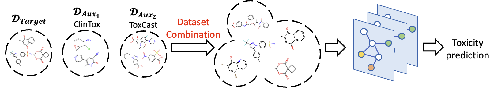
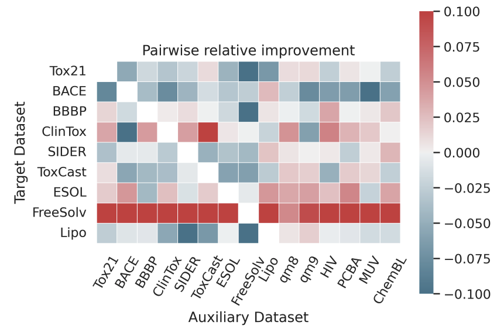
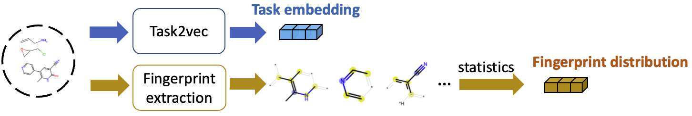
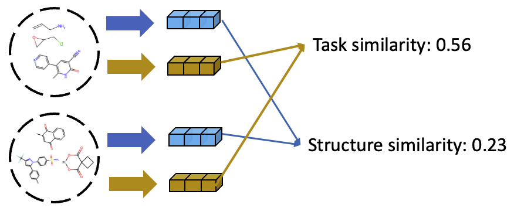
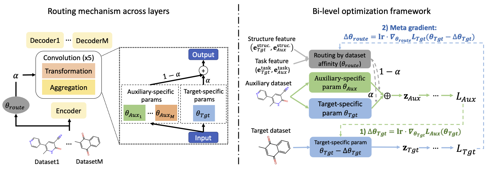
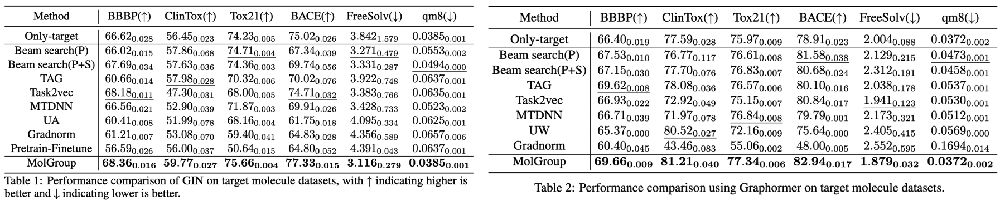
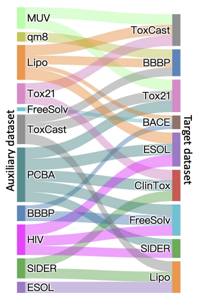

import { Authors, Badges } from '@/components/utils'

# Learning to Group Auxiliary Datasets for Molecule

<Authors
  authors="Tinglin Huang, Yale University; Ziniu Hu, University of California, Los Angeles; Rex Ying, Yale University"
/>

<Badges
  venue="NeurIPS 2023"
  github="https://github.com/Graph-and-Geometric-Learning/MolGroup"
  arxiv="https://arxiv.org/abs/2307.04052"
  pdf="https://arxiv.org/pdf/2307.04052"
/>

## Introduction

Machine learning has been serving as a powerful tool in the molecular property prediction, such as estimating the toxicity of new clinical drugs and characterizing the binding results for the inhibitors. However, labeling molecules requires expensive real-world clinical trials and expert knowledge, resulting in limited dataset size. For example, ClinTox which predicts clinical toxicity of new drugs only includes 1,000 labeled instances and FreeSolv which estimates the hydration free energy of molecule in water only contains 400 labeled instances. 

In this paper, we explore a strategy that is to collaborate with **auxiliary datasets**. Specifically, as shown in the Figure 1, we augment the target dataset with the other auxiliary datasets, which are collected from different sources and have different properties. Our assumption is that introducing out-of-distribution knowledge can help the model to learn more robust and generalizable representations.

The key challenge is that having more data doesn't always guarantee improvements: negative transfer can occur! We first do an emperical study which combines all the possible pairs of datasets and evaluate the performance improvement on the target dataset. As shown in the Figure 2, the results show that the performance varies significantly across different pairs, which demonstrates the affinity distribution among different datasets.

In this paper, we focus on designing a dataset grouping method for molecules and propose MolGroup, a routing-based molecule grouping method. MolGroup involves calculating the affinity scores of each auxiliary dataset based on the graph structure and task information, and selecting the auxiliary datasets with high affinity.

## Emperical Study

To have a deeper understanding of the dataset affinity, we analyze the relationship between datasets by dividing them into two dimensions:
* Structural characteristics: **Fingerprint features**
* Associated predictive task: **Task embedding** extracted by Task2vec

For each pair of dataset, we can measure the similarity in terms of structure and task by using asymmetric KL divergence as similarity metric.

Based on this, we plot the regression curve and calculate the Pearson correlation between relative improvement and structural/task similarity over all the combination pairs in Figure 5(a). Additionally, we compute the structural and task similarity between each target dataset and the other 14 datasets individually. We then calculate the Pearson correlation between the similarity scores and the corresponding relative improvement for each target dataset, as presented in Figure 5(b) and (c). 

We can have three findings:
* Combination of task and structure leads to stronger correlation.
* Both similar and dissimilar structures and tasks can benefit target dataset 
* Structure and task are compensatory

## Method

### Routing Mechanism

We apply routing mechanism to quantify the affinity between datasets. The inituition is that parameters of a positively transferred pair should be more “shared” while parameters of a negatively transferred pair should be more “specific”. Based on this, the routing function $g(\cdot)$ is introduced in each layer as follows:
$$
\mathbf{z}_m^{(l+1)}=\alpha_m f_{\theta_T}^{(l)}(\mathbf{z}_m^{(l)})+(1-\alpha_m)f_{\theta_m}^{(l)}(\mathbf{z}_m^{(l)}),\\
\text{with } \alpha_m=g_m(\mathcal{B}_T,\mathcal{B}_m)
$$
where $T$ denotes the target dataset, $m$ denotes the $m$-th auxiliary dataset, $\mathbf{z}_m^{(l)}$ is the output of the $l$-th layer of the $m$-th dataset, $\mathcal{B}_T$ and $\mathcal{B}_m$ are the batch of target dataset and auxiliary dataset, respectively. $f_{\theta_T}^{(l)}$ and $f_{\theta_m}^{(l)}$ are the neural networks with parameters $\theta_T$ and $\theta_m$.

Inspired by the emperical study, we calculate the gating score by combining the structural and task similarity:
* For task affinity, we assign learnable embeddings for each dataset $e^{\text{task}}_T,e^{\text{task}}_m$
* For structure affinity, we embeded the fingerprint features of each molecule and apply Set2Set to obtain $e^{\text{task}}_T,e^{\text{task}}_m$ 
Finally, the gating score is computed as:
$$
\alpha_m=g_m(\mathcal{B}_T,\mathcal{B}_m)=\sigma(\lambda e^{\text{task}}_T\cdot e^{\text{task}}_m+(1-\lambda)e^{\text{struc}}_T\cdot e^{\text{struc}}_m)
$$

### Bi-level Optimization Framework

What is the desired objective for auxiliary dataset grouping? We hope that it can optimize the routing mechanism toward minimizing target dataset’s loss. Besides, the auxiliary dataset with great benefit should be assigned a larger gating score. At each learning step, we explicitly represent target parameter optimized by $m$-th auxiliary dataset as $\theta_T(\alpha_m)$. Then, to achieve the above goal, let’s break the optimization into two steps to meet the objective:
* Lower level: Optimize the target parameter $\theta_T$ with $\mathcal{B}_m$ and obtain $\theta_T(\alpha_m)$
  * $\theta_T(\alpha_m)=\argmin_{\theta_T}L_m(\mathcal{B}_T;\theta_T,\theta_m,\alpha_m)$
* Higher level: Optimize $g(\cdot)$ based on the loss of $\theta_T(\alpha_m)$ on $\mathcal{B}_T$
  * $\min_{\alpha_m}L_T(\mathcal{B}_T;\theta_T(\alpha_m))$

### Overall pipeline

* Step1: initialize and train the model with routing function on all the datasets
  1) Update target parameters through routing mechanism with auxiliary dataset
  2) Optimize routing mechanism with updated target parameters
* Step2: filter out the datasets that contains gate scores above $\beta$
* Step3: go to step4 if iteration number == $n$ or go back to step1 
* Step4: pick the auxiliary datasets with topk affinity

## Results

We evaluate the model using 15 molecule datasets and consider 11 small datasets as the target datasets. We report the performance of the the model with the selected auxiliary datasets using GIN and pretrained Graphormer as the backbone. The results are shown in Figure 6. We can see that MolGroup outperforms the baseline methods, which demonstrates the effectiveness of MolGroup in selecting auxiliary datasets.

Figure 7 visulizes the selected auxiliary datasets for each target dataset, where each edge from auxiliary dataset to target dataset represents a selection. We can have following observations:
* PCBA is the most “famous” one, which can generally benefit most of the target datasets
* Tox21 can benefit ClinTox and ToxCast which are all related to toxicity prediction
* Some datasets belong to distinct domains but still can benefit the other dataset
    * Qm8 for BBBP
    * ESOL for Lipo

