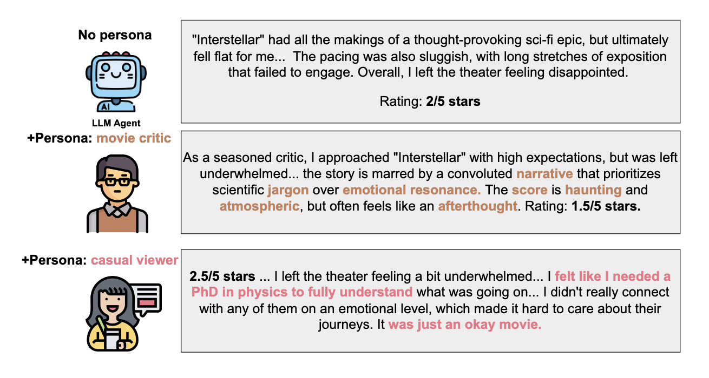
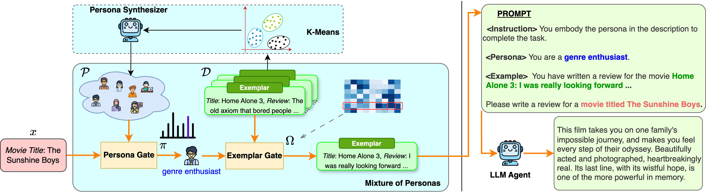
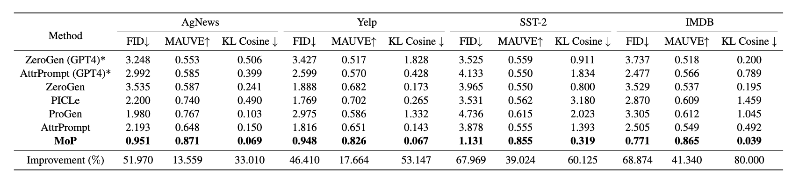
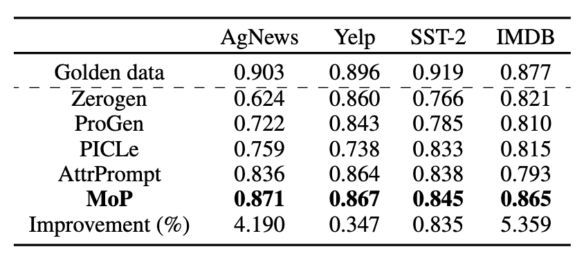

import { Authors, Badges } from '@/components/utils'

# Mixture-of-Personas Language Models for Population Simulation

<Authors
  authors="Ngoc Bui, Yale University; Hieu Trung Nguyen, The Chinese University of Hong Kong; Shantanu Kumar, Yale University; Julian Theodore, Yale University; Weikang Qiu, Yale University; Viet Anh Nguyen, The Chinese University of Hong Kong; Rex Ying, Yale University"
/>

<Badges
  venue="ACL Findings, 2025"
  github="https://github.com/ngocbh/MoP"
  arxiv="https://arxiv.org/abs/2504.05019"
  pdf="https://arxiv.org/pdf/2504.05019"
/>

## Introduction

Large Language Models (LLMs) have shown impressive capabilities in generating human-like text and are increasingly used to simulate human behavior in social science, economics, and machine learning. But pretrained LLMs often produce generic and repetitive responses, failing to reflect the diversity of real-world populations shaped by age, culture, or demographics.

Typical methods use “persona prompting” to steer LLM behavior—crafting prompts to mimic specific groups. However, even with persona prompts, responses still lack diversity and exhibit bias. Fine-tuning models with personal data could help, but it's costly, raises privacy concerns, and limits flexibility.

## Our Solution: Mixture of Personas (MoP)

We introduce Mixture of Personas (MoP) — a probabilistic prompting framework that aligns LLM responses with the target population while preserving diversity. Instead of using one static persona, MoP treats simulation as a contextual mixture model, where each component is a language model agent defined by:

- A persona (a group-level identity or behavior pattern)
- An exemplar (an in-context example from the population)

During generation, both persona and exemplar are sampled probabilistically based on learned weights, allowing LLMs to produce more tailored and varied responses. 

The generation pipeline for the Exemplar-based Mixture of Personas (MoP) operates as follows: Given a movie review $x$, MoP first samples a persona based on the learnable mixing weight $\pi$. Next, MoP selects an exemplar randomly from the observation pool according to the mixing weight $\Omega$. The selected persona and exemplar are then concatenated with the input context to create a personalized prompt used to sample from a base LLM agent. The dashed block indicates the process of persona synthesis.

## Experiments

To show the effectiveness of MoP, we use MoP to simulate movie and restaurant reviews from Yelp, SST2, IMDB and Agnews datasets. Table below shows that MoP can significantly outperform other baseline prompting methods. Specifically, our method can outperform the best baseline by 58.8\% in terms of FID and by 27.9\% in terms of MAUVE, averaged over all datasets. This result demonstrates that MoP can effectively steer LLM's outputs to the target responses of the target population. Besides the improvement in alignment scores, KL Cosine metrics also indicate that our responses are more diverse than other baselines. 

We train a DistilBERT model using 5,000 synthesized samples and evaluate its performance on the golden dataset, reporting the F1-score. Results show that the synthetic dataset generated by Llama3 with MoP prompting achieves up to a 2.68\% improvement over the AttrPrompt baseline.

To further investigate the advantage of MoP prompting, we plot the embedding space. The figure shows that our method matches the diversity of the golden datasets better than other baselines. Meanwhile, simulated responses of other baselines often collapse or cannot cover the diversity of the true responses.

