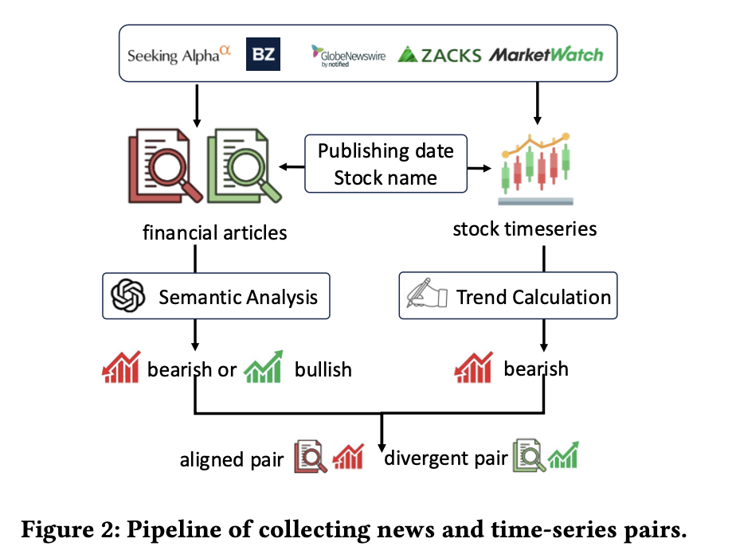
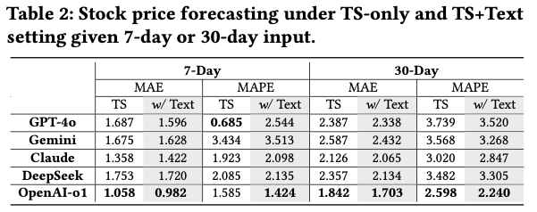
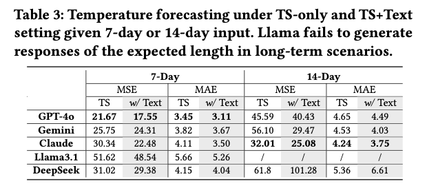
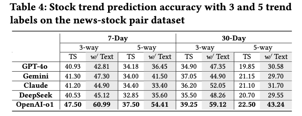
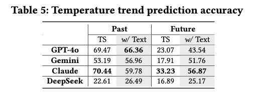
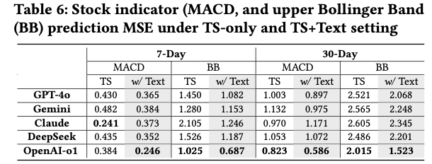
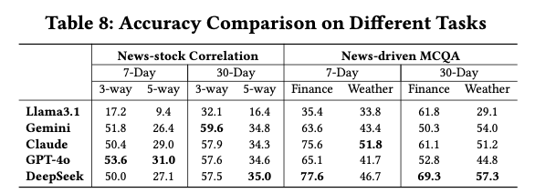
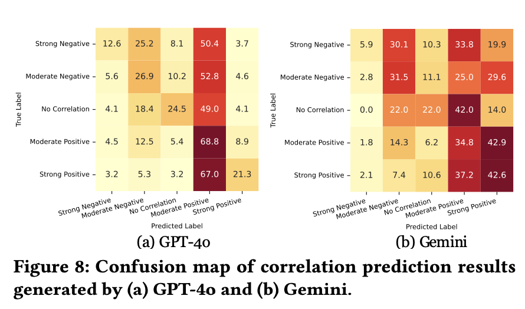

import { Authors, Badges } from '@/components/utils'

# MTBench: A Multimodal Time Series Benchmark for Temporal Reasoning and Question Answering

<Authors
  authors="Jialin Chen, Yale University; Aosong Feng, Yale University; Ziyu Zhao, McGill University; Juan Garza, University of Texas Rio Grande Valley; Gaukhar Nurbek, University of Texas Rio Grande Valley, Cheng Qin, Yale University; Ali Maatouk, Yale University; Leandros Tassiulas, Yale University; Yifeng Gao, University of Texas Rio Grande Valley; Rex Ying, Yale University"
/>

<Badges
  venue="KDD 2025"
  github="https://github.com/Graph-and-Geometric-Learning/MTBench"
  arxiv=""
  pdf=""
/>

## Introduction
Understanding the relationship between textual news and time-series evolution is a critical yet under-explored challenge in applied data science. While multimodal learning has gained traction, existing multimodal time-series datasets fall short in evaluating cross-modal reasoning and complex question answering, which are essential for capturing complex interactions between narrative information and temporal patterns. To bridge this gap, we introduce **M**ultimodal **T**ime Series **Bench**mark **MTBench**, a large-scale benchmark designed to evaluate large language models (LLMs) on time series and text understanding across financial and weather domains. MTBench comprises of paired time-series and textual data, including financial news with corresponding stock price movements and weather reports aligned with historical temperature records. Unlike existing benchmarks that focus on isolated modalities, MTBench provides a comprehensive testbed for models to jointly reason over structured numerical trends and unstructured textual narratives. The richness of MTBench enables formulation of diverse tasks that require a deep understanding of both text and time-series data, including time-series forecasting, semantic and technical trend analysis, and news-driven question answering (QA). These tasks target the model’s ability to capture temporal dependencies, extract key insights from textual context, and integrate cross-modal information. We evaluate state-of-the-art LLMs on MTBench, analyzing their effectiveness in modeling the complex relationships between news narratives and temporal patterns. Our findings reveal significant challenges in current models, including difficulties in capturing long-term dependencies, interpreting causality in financial and weather trends, and effectively fusing multimodal information. 

## Dataset Overview

### Finance Dataset 

The pipeline of finance dataset collection is shown in Figure 2. To construct a diverse stock news and time-series dataset, we collected over 200,000 financial news article URLs from professional financial websites, including GlobeNews, Market-Watch, SeekingAlpha, Zacks, Invezz, Quartz (QZ), PennyStocks, and Benzinga, covering the period from May 2021 to September 2023. We then scraped and parsed the corresponding textual content, titles, stock names, and publishing dates from these URLs. From this collection, we derived a 20,000-news subset while ensuring a balanced distribution of article lengths. To enrich the dataset with structured metadata, we employed GPT-4o to annotate each article with news content type, temporal effect range, and sentiment. 
**Stock Time-Series Collection.** For each financial news article, we identified the corresponding stock time-series data by utilizing the extracted sentiment and stock name. The historical stock price data
was retrieved with open prices sampled at varying granularities. To ensure data quality, we discarded samples where stock price
data was missing for more than 70% of the time period due to market closures (e.g., holidays, weekends). To construct aligned input-output time-series pairs, we assumed that each news article happens at the 0.9 percentile of its input time-series window. We curated two forecasting settings:
**Short-Term Prediction**: Use 7 days of stock prices at a 5-minute granularity to predict the next 1-day price movements.
**Long-Term Prediction**: Use 30 days of stock prices at a 1-hour granularity to predict the next 7 days’ stock movements.

### Weather Dataset
We selected 50 airports in the United States as data sources, using the Global Historical Climatology Network Hourly (GHCN-H) dataset. The data spans from 2003 to 2020 and is collected hourly. Each weather station records multiple attributes, including geographical location, temperature, humidity, wind speed, wind direction, visibility, pressure, and precipitation. Airports were chosen due to the higher reliability and accuracy of their weather data compared to other stations. In this study, we focus on single-channel data, specifically temperature, as it is the most critical parameter for weather forecasting. Meanwhile, within our raw data creation pipeline, additional channels are available, allowing for future expansion to multi-channel weather analysis. 
Unlike stock price datasets, systematically collecting weather-related news is challenging, as routine weather reports may not provide sufficient context for complex reasoning. To address this, we use the Storm Events Database, which documents storm occurrences in the United States from 1950 to 2020. This dataset includes details such as storm type, location, fatalities, and injuries, covering a range of severe weather conditions, such as hail, tornadoes, thunderstorms, floods, hurricanes, and typhoons. 
Each entry contains an <em>event ID<em> and an <em>episode ID<em>, where the event ID uniquely identifies an occurrence, and the <em>episode ID<em> links related events. For example, a hurricane may trigger multiple tornadoes, hailstorms, and thunderstorms, all grouped under the same <em>episode ID<em>. Each event also includes a textual description, providing valuable contextual information.

## Experiments

### Time-series Forecasting

### Semantic Trend Prediction

### Technical Indicator Calculation

### News-driven Question Answering

