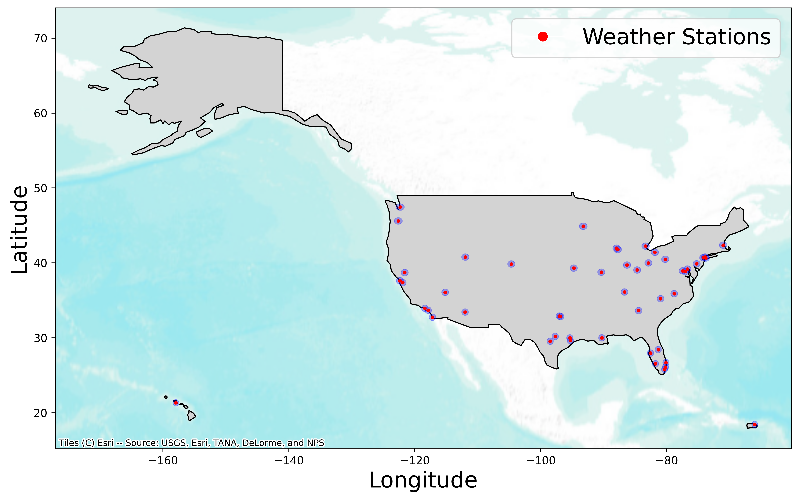
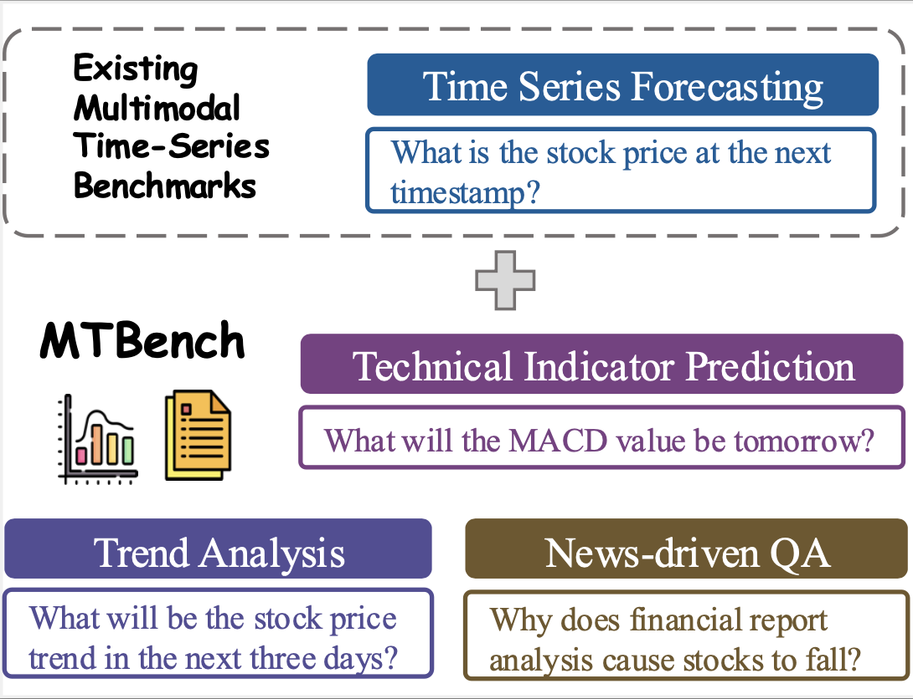
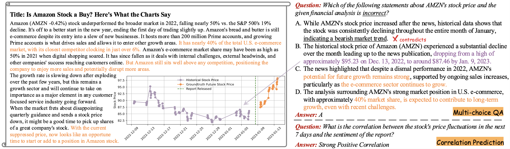

import { Authors, Badges} from '@/components/utils'
import { Table, Table1, Table2, Table3, Table4}from '@/components/table'

# MTBench: A Multimodal Time Series Benchmark for Temporal Reasoning and Question Answering

<Authors
  authors="Jialin Chen, Yale University; Aosong Feng, Yale University; Ziyu Zhao, McGill University; Juan Garza, University of Texas Rio Grande Valley; Gaukhar Nurbek, University of Texas Rio Grande Valley, Cheng Qin, Yale University; Ali Maatouk, Yale University; Leandros Tassiulas, Yale University; Yifeng Gao, University of Texas Rio Grande Valley; Rex Ying, Yale University"
/>

<Badges
  venue=""
  github="https://github.com/Graph-and-Geometric-Learning/MTBench"
  arxiv="https://arxiv.org/abs/2503.16858"
  pdf="https://arxiv.org/pdf/2503.16858"
/>

## Introduction

News influences the world around us—from stock markets reacting to financial reports to temperature trends following extreme weather events. However, understanding this impact is not straightforward. While AI models are improving at handling both text and numbers, most datasets fail to test how well they connect these different types of data.

To address this, we introduce  **MTBench** (**M**ultimodal **T**ime Series **Bench**mark), a dataset designed to evaluate how well AI models understand the relationship between text and time-series data. MTBench pairs financial news with stock market movements and weather reports with historical temperature changes. Unlike existing benchmarks that focus on text or numbers separately, MTBench challenges models to analyze both together, helping to assess their ability to detect trends, interpret news, and make predictions.

- **Finance**: Two datasets, each with 20K news articles paired with stock time-series data.
- **Weather**: 2K news and time-series pairs from 50 weather stations across the U.S. (see Figure 1).

As shown in Figure 2, MTBench enables a range of complex reasoning tasks beyond simple forecasting, including semantic trend analysis, technical indicator prediction, and news-driven Q&A. These tasks challenge LLMs to integrate numerical patterns with contextual information.

The news-driven QA task includes two sub-tasks: correlation prediction and multi-choice QA. As shown in Figure 3, this task requires models to analyze both text and time-series data, understanding the news content while predicting its potential impact on future trends based on historical time-series.

Various state-of-the-art large language models (LLMs) were evaluated on MTBench to measure their ability to link news with time-series trends (see **Leaderboard**). The results reveal key challenges—models struggle with long-term pattern recognition, cause-and-effect relationships, and seamlessly combining insights from text and numbers.

## Leaderboard

<Table/>

Leaderboard for Time-Series Forecasting

<Table1/>

Leaderboard Trend Prediction

<Table2/>

Leaderboard for Technical Indicator Calculation

<Table3/>

Leaderboard for News-driven Question Answering

<Table4/>

