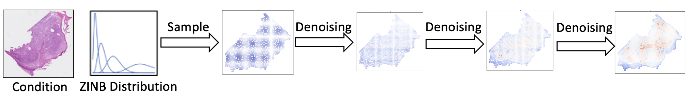
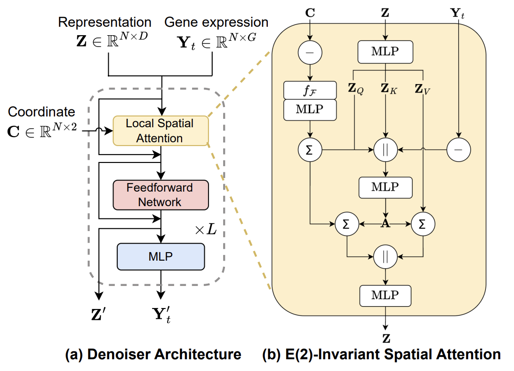
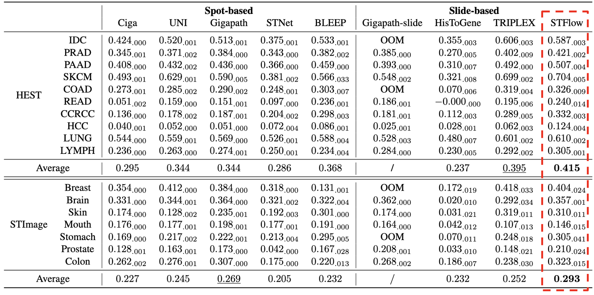
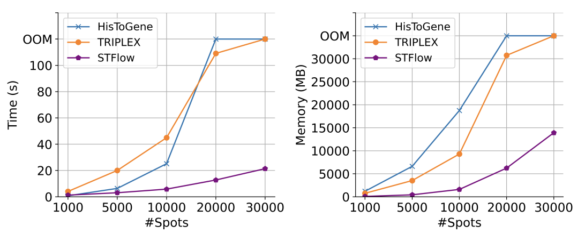

import { Authors, Badges } from '@/components/utils'

# Scalable Generation of Spatial Transcriptomics from Histology Images via Whole-Slide Flow Matching

<Authors
  authors="Tinglin Huang, Yale University; Tianyu Liu, Yale University; Mehrtash Babadi, Broad Institute of MIT and Harvard; Wengong Jin, Northeastern University; Rex Ying, Yale University"
/>

<Badges
  venue="ICML 2025 (Spotlight)"
  github="https://github.com/Graph-and-Geometric-Learning/STFlow"
  arxiv="https://arxiv.org/abs/2506.05361"
  pdf="https://arxiv.org/pdf/2506.05361"
/>

## Introduction

.|scale=0.5](./fig/overview.png)

Understanding cell morphology in tissues is key to studying biological processes and diseases. Traditionally, this is done using histology images stained with dyes like H&E. However, these images are often gigapixel and require expert interpretation. Spatial transcriptomics (ST) is a new technology that measures gene expression at specific locations in tissue, adding valuable molecular information to the tissue structure. As shown in Figure 1, it complements histology well. But ST is costly and time-consuming, which limits its use. To overcome this, we propose STFlow, a method that uses flow matching to generate ST-like data directly from histology images.

The input is a set of segmented spots from the histology image, associated with the corresponding coordinates and histology features. The output is a set of spatially-resolved gene expression profiles, which can be used for downstream analysis. Gene expression profiles can be considered as a matrix, where each row corresponds to a spot and each column corresponds to a gene. The value is a count number representing the expression level of the gene in that spot.

## Method

### Gene Expression Prediction as Generative Task

One naive approach to predict gene expression profiles is to treat it as a single-step regression task, where the input is the histology features and the output is the gene expression profiles. However, this approach overlooks cell-cell interaction, i.e., certain genes regulating the expression of genes in other cells.

In light of this, we propose to treat gene expression prediction as a generative task. Instead of performing onestep regression, we model the joint distribution over the whole-slide gene expression through an iterative refinement process, as shown in Figure 2. Each refinement step is guided by the flow matching framework, where the predicted gene expression serves as context for the subsequent step. This enables explicit modeling of cell-cell interactions, leading to more biologically meaningful predictions.

As for the denoiser architecture, we design an efficient and spatially-aware Transformer architecture, as shown in Figure 3. The main idea is to model the local neighbors of each spot, and incorporate the spatial information with frame averaging operation to bias the attention mechanism.

### Results

We employ two public collections of spatial transcriptomics data paired with H&E-stained WSIs, HEST-1k and STImage-1K4M. Performance is evaluated using the Pearson correlation between the predicted and measured gene expressions for the top 50 highly variable genes after log1p normalization. As shown in Figure 4, STFlow outperforms all baselines on both benchmarks, demonstrating the effectiveness of leveraging spatial context and gene interaction.

Besides, to evaluate the efficiency of STFlow, we compare the total inference time and GPU memory usage across slide-based models with varying numbers of spots, as shown in Figure 5. Compared to other architectures that rely on complicated attention mechanisms, our proposed architecture achieves higher efficiency
by leveraging spatial attention among local neighbors.

