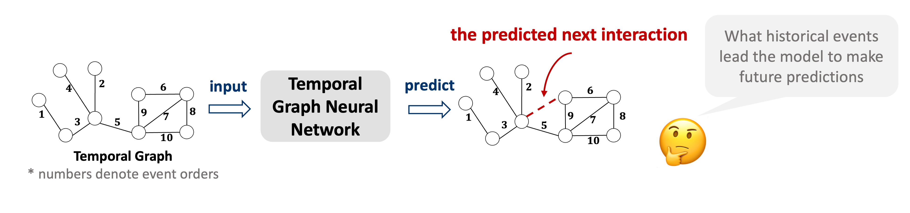
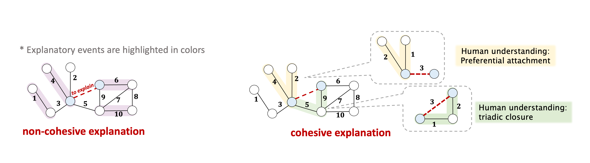
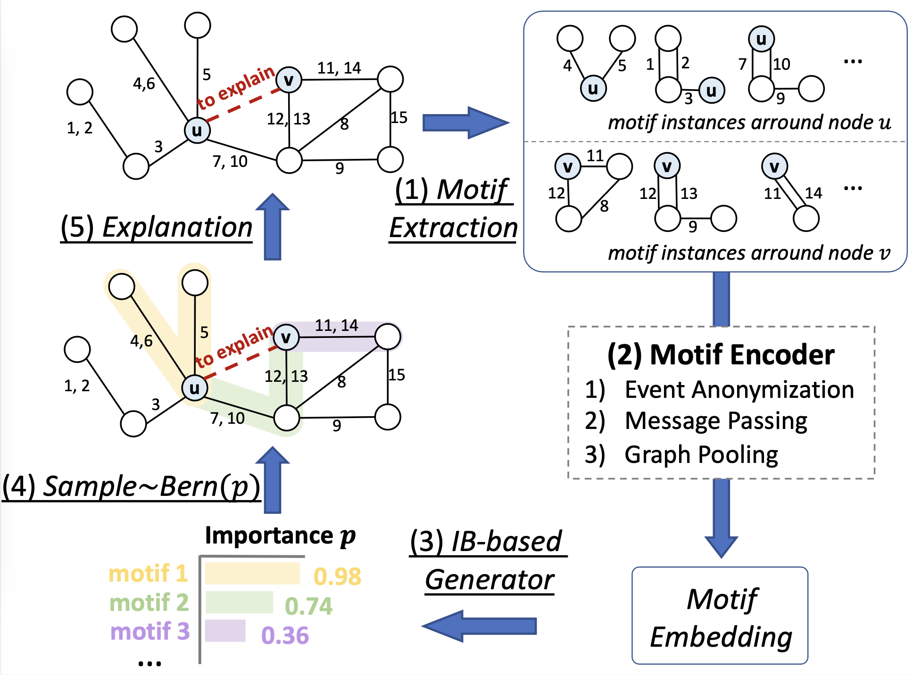
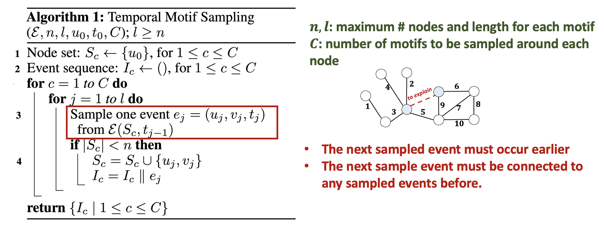
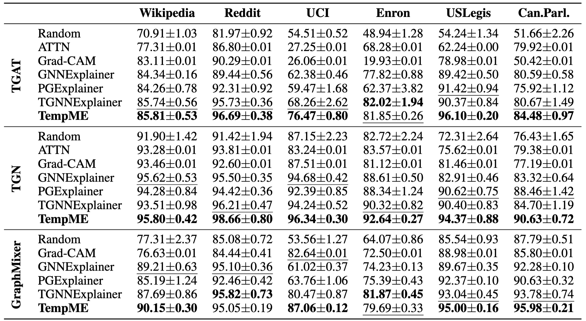
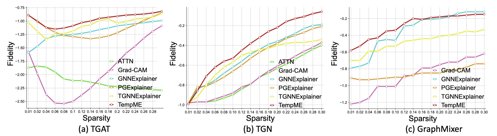
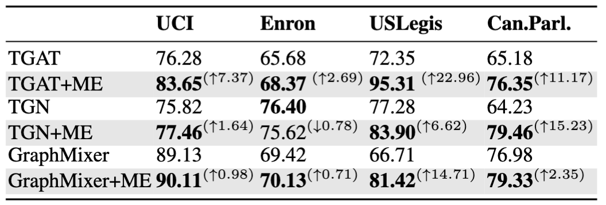
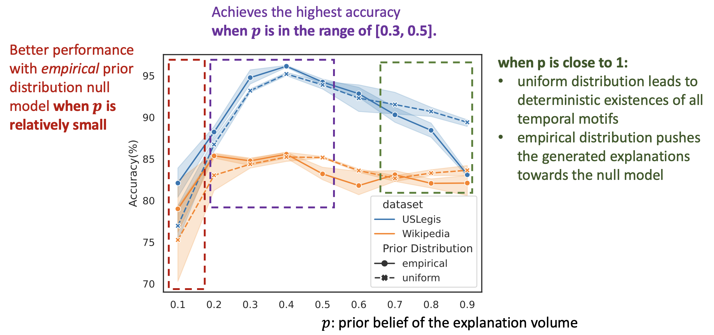

import { Authors, Badges } from '@/components/utils'

# TempME: Towards the Explainability of Temporal Graph Neural Networks via Motif Discovery

<Authors
  authors="Jialin Chen, Yale University; Rex Ying, Yale University"
/>

<Badges
  venue="NeurIPS 2023"
  github="https://github.com/Graph-and-Geometric-Learning/TempME"
  arxiv="https://arxiv.org/abs/2310.19324"
  pdf="https://proceedings.neurips.cc/paper_files/paper/2023/file/5c5bc3553815adb4d1a8a5b8701e41a9-Paper-Conference.pdf"
/>

## Introduction
Temporal graphs are widely used to model dynamic systems with time-varying interactions. Despite the widespread success of Temporal Graph Neural Networks (TGNN), these models often lack transparency and function as black boxes. The goal of explainability is to discover what patterns in data have been recognized that trigger certain predictions from the model.

Important historical events should be temporally proximate and spatially adjacent to construct cohesive explanations, which provide human-intelligible insights and understanding. However, recent attempts at TGNN explainability all face the critical challenge of generating cohesive explanations. 

To address the aforementioned challenges of temporal explanations, we propose to utilize **temporal motifs** in the explanation task. Temporal motifs refer to recurring substructures within the graph. Recent studies demonstrate that these temporal motifs are essential factors that control the generative mechanisms of future events in real-world temporal graphs and dynamic systems. They are plausible and reliable composition units to explain TGNN predictions. Moreover, the intrinsic self-connectivity of temporal motifs guarantees the cohesive property of the generated explanations.

In this work, we propose **TempME**, a novel Temporal Motif-based Explainer to identify the most determinant temporal motifs to explain the reasoning logic of temporal GNNs. TempME leverages historical events to train a generative model that captures the underlying distribution of explanatory motifs. TempME is theoretically grounded by **Information Bottleneck (IB)**, which finds the best tradeoff between explanation accuracy and compression. Different from previous works that only focus on the effect of singular events, **TempME is the first to bring additional knowledge about the effect of each temporal motif**.

## Method
The pipeline of TempME is shown in Figure 3. Given a temporal graph and a future prediction between node $u$ and node $v$ to be explained, TempME first **samples surrounding temporal motif instances**. Then a **Motif Encoder** creates expressive Motif Embedding for each extracted motif instance. Based on **Information-bottleneck (IB)** principle, TempME characterizes the importance scores of these temporal motifs.

### Temporal Motif Sampling
Given a temporal graph with historical events $\mathcal{E}$ and node $u_0$ of interest at time $t_0$, we sample $C$ retrospective temporal motifs with at most $n$ nodes and $l$ events, starting from $u_0$. Following algorithm shows our Temporal Motif Sampling approach, where $\mathcal{E}(S, t)$ denotes the set of historical events that occur to any node in $S$ before time $t$. At each step, we sample one event from the set of historical events and ensure that the sampled subgraph is self-connected.

### Motif Encoder
We sample $C$ surrounding temporal motif instances starting from $u$ and $v$, respectively, denoted as $M_u$ and $M_v$. We design a Motif Encoder to learn motif-level representations for each surrounding motif in $M_u$ and $M_v$. To maintain the inductiveness, we create structural features to anatomize event identities by counting the appearance at certain positions:
$$h(e_i, u, v)[j] =\left | \{I\mid I\in M_u\cup M_v, I[j]=(u_i, v_i, t); \forall t\}\right |, \hbox{for } i \in \{1, 2, \cdots, l\}.$$
$h(e_i, u, v)$ (abbreviated as $h(e_i)$ for simplicity) is a $l$-dimensional structural feature of $e_i$ where the $j$-th element denotes the number of interactions between $u_i$ and $v_i$ at the $j$-th sampling position in $M_u\cup M_v$.
Given a motif instance $I$ with node set $\mathcal{V}_I$ and event set $\mathcal{E}_I$, let $X_p$ denote the associated feature of node $p\in\mathcal{V}_I$. $E_{pq}=(a_{pq}\parallel T(t-t_{pq})\parallel h(e_{pq}))$ denotes the event feature of event $e_{pq}\in \mathcal{E}_I$, where $a_{pq}$ is the associated event attribute and $T(\Delta t)=\sqrt{1/d}[\cos(w_1 \Delta t), \sin(w_1 \Delta t), \cdots, \cos(w_{d} \Delta t), \sin(w_d \Delta t)]$ with learnable parameters $w_1,\cdots, w_d$. We perform message passing to aggregate neighboring information and then apply the Readout function to pool node features.
$$X_p = \text{MessagePassing}(X_p; \{X_q;E_{pq}|q\in \mathcal{N}(p)\})\hbox{ and } m_I = \text{Readout}(\{X_p,p\in \mathcal{V}_I\}).$$
The importance score of the instance is predicted by an MLP module: $p_i=\text{MLP}(m_I)\in[0,1]$. The final explanation can thus be induced by all sampled important motifs according to the importance scores.

### Information-Bottleneck principle
Let $\mathcal{G}_{\texttt{exp}}^e$ and $\mathcal{G}(e)$ denote the explanation and the computational graph of event $e$. The Information-Bottleneck objective maximizes mutual information with the target prediction while minimizing mutual information with the original temporal graph:
$$\min -I(\mathcal{G}_{\texttt{exp}}^e, Y_f[e]) + \beta I(\mathcal{G}_{\texttt{exp}}^e, \mathcal{G}(e)), s.t. |\mathcal{G}_{\texttt{exp}}^e|\leq K, $$
where $Y_f[e]$ refers to the original prediction of event $e$, $\beta$ is the regularization coefficient and $K$ is a constraint on the explanation size. The first term can be estimated with the cross-entropy between the original prediction and the output of base model $f$ given $\mathcal{G}_{\texttt{exp}}^e$. We propose to formulate the second term as the mutual information between the original motif set $\mathcal{M}$ and the selected important motif subset $\mathcal{M}_{\texttt{exp}}$. We utilize a variational approximation $\mathbb{Q}(\mathcal{M}_{\texttt{exp}})$ to replace its marginal distribution $\mathbb{P}(\mathcal{M}_{\texttt{exp}})$ and obtain the upper bound of $I(\mathcal{M}, \mathcal{M}_{\texttt{exp}})$ with Kullback–Leibler divergence:
$$I(\mathcal{M}, \mathcal{M}_{\texttt{exp}}) \leq \mathbb{E}_{\mathcal{M}}D_{\text{KL}}(\mathbb{P}_\phi(\mathcal{M}_{\texttt{exp}}|\mathcal{M}); \mathbb{Q}(\mathcal{M}_{\texttt{exp}}))$$
where $\phi$ denotes all learnable parameters. 

We provide two different prior distributions for $\mathbb{Q}(\mathcal{M}_{\texttt{exp}})$: **uniform** and **empirical**. In the **uniform** setting, $\mathbb{Q}(\mathcal{M}_{\texttt{exp}})$ is the product of Bernoulli distributions with probability $p\in[0,1]$, that is, each motif shares the same probability $p$ being in the explanation. **uniform** setting ignores the effect of the null model, which is essentially a randomized version of the empirical network, generated by shuffling or randomizing certain properties while preserving some structural aspects of the original graph.
In **empirical** setting, let $(U_1,\cdots, U_T)$ denote $T$ equivalence classes of temporal motifs and $(q_1, \cdots, q_T)$ is the sequence of normalized class probabilities occurring in $\mathcal{M}_{\texttt{exp}}$ with $q_i =\sum_{I_j\in U_i}p_{I_j}/\sum_{I_j\in \mathcal{M}}p_{I_j}$, where $p_{I_j}$ is the importance score of the motif instance $I_j$. Correspondingly, we have $(m_1, \cdots, m_T)$ denoting the sequence of normalized class probabilities in the null model. The prior belief about the average probability of a motif being important for prediction is fixed as $p$. The final training objective becomes
$$\min_\phi\mathbb{E}_{e\in\mathcal{E}(t)}\sum_{c=0,1}-\mathbf{1}(Y_f[e]=c)\log (f(\mathcal{G}_{\texttt{exp}}^e)[e])+\beta ((1-s)\log\frac{1-s}{1-p} + s\sum_{i=1}^Tq_i\log\frac{sq_i}{pm_i}),$$
where $s=\sum_{I_j\in\mathcal{M}}p_{I_j}/|\mathcal{M}|$ measures the sparsity of the generated explanation. TempME shares spirits with perturbation-based explanations, where "interpretable components" corresponds to temporal motifs and the "reference" is the null model.

## Experiments
### Datasets and Baselines
We evaluate TempME on temporal graph neural network (TGNN) explainability using diverse datasets, including 
- **Wikipedia, Reddit**: social networks with rich interaction attributes;
- **Enron, UCI**: temporal graphs without interaction attributes;
- **Can.Parl., US Legis**: political networks with single attributes.

We benchmark several base TGNNs (TGAT, TGN, GraphMixer) and compare various explainability baselines: 
- attention-based approach: ATTN;
- gradient-based approach: Grad-CAM;
- static GNN explainers: GNNExplainer, PGExplainer;
- Temporal GNN explainer: TGNNExplainer. 

Key metrics include accuracy, measuring the alignment between explanations and base model predictions, and a fidelity score assessing the impact of generated explanations on edge-specific predictions.

### Explanation Accuracy and fidelity

Table 1 shows the explanation performance of TempME and other baselines w.r.t. ACC-AUC. We have the following observations: 
- The performance of baseline models exhibits considerable variation.
- ATTN and Grad-CAM work well on datasets with rich attributes, while yielding poor performances on unattributed datasets.
- The effectiveness of TempME is consistent across different  datasets and different base models.

From Figure 4, we observe that
- TempME surpasses the baselines in explanation fidelity, especially with a low sparsity level.
- TGAT gives priority to a narrow subset (e.g., 1%) of historical events, while TGN and GraphMixer rely on a wider range of historical events.

### Enhanced Link Prediction Performance

The performance of base models on link prediction with and without Motif Embeddings (ME) is shown in Table 2. Motif Embedding provides augmenting information for link prediction and generally improves the performance of base models. Notably, TGAT achieves a substantial boost, with an Average Precision of $95.31\%$ on USLegis, surpassing the performance of state-of-the-art models on USLegis.

### Uniform V.S. Empirical

Figure 5 shows the comparison between uniform and empirical prior distribution in terms of ACC-AUC over sparsity levels from 0 to 0.3. TempME achieves the highest ACC-AUC when the prior belief of the explanation volume is in the range of $[0.3, 0.5]$. Notably, TempME performs better with empirical prior distribution when $p$ is relatively small, resulting in sparser and more compact explanations. This improvement can be attributed to the incorporation of the null model, which highlights temporal motifs that differ significantly in frequency from the null model. It is worth noting that when $p$ is close to 1, uniform prior distribution leads to deterministic existences of all temporal motifs while empirical prior distribution pushes the generated explanations towards the null model, which forms the reason for the ACC-AUC difference of empirical and uniform as $p$ approaches 1. 