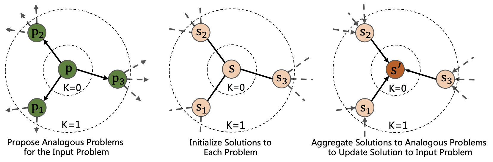
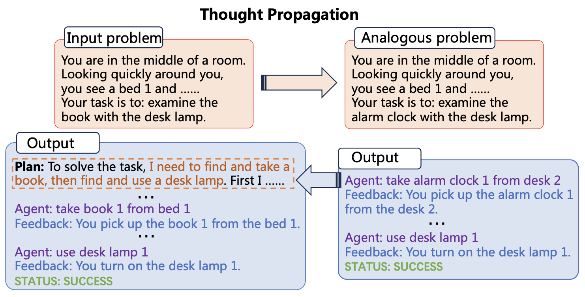
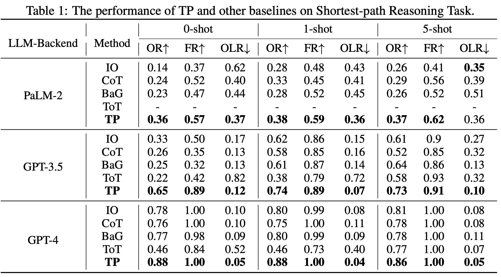
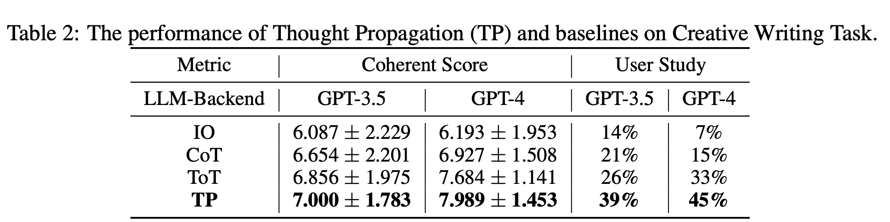
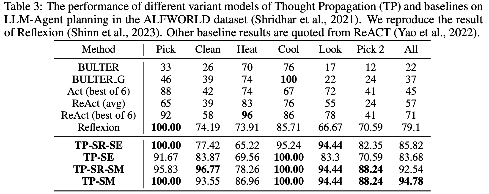

import { Authors, Badges } from '@/components/utils'

# Thought Propagation: An analogical reasoning framework for complex reasoning with large language models

<Authors
  authors="Junchi Yu, Chinese Academy of Sciences; Ran He, Chinese Academy of Sciences; Rex Ying, Yale University"
/>

<Badges
  venue="ICLR 2024"
  github="https://github.com/Samyu0304/thought-propagation"
  arxiv="https://arxiv.org/abs/2310.03965"
  pdf="https://openreview.net/pdf?id=SBoRhRCzM3"
/>

## Introduction
Large Language Models (LLMs) have achieved remarkable success in reasoning tasks with the development of prompting methods. However, existing prompting approaches cannot reuse insights of solving similar problems and suffer from accumulated errors in multi-step reasoning, since they prompt LLMs to reason from scratch. To address these issues, we propose Thought Propagation (TP), which explores the analogous problems and leverages their solutions to enhance the complex reasoning ability of LLMs. These analogous problems are related to the input one, with reusable solutions and problem-solving strategies. Thus, it is promising to propagate insights of solving previous analogous problems to inspire new problem-solving. To achieve this, TP first prompts LLMs to propose and solve a set of analogous problems that are related to the input one. Then, TP reuses the results of analogous problems to directly yield a new solution or derive a knowledge-intensive plan for execution to amend the initial solution obtained from scratch. TP is compatible with existing prompting approaches, allowing plug-and-play generalization and enhancement in a wide range of tasks without much labor in task-specific prompt engineering. Experiments across three challenging tasks demonstrate TP enjoys a substantial improvement over the baselines by an average of 12% absolute increase in finding the optimal solutions in Shortest-path Reasoning, 13% improvement of human preference in Creative Writing, and 15% enhancement in the task completion rate of LLM-Agent Planning. Code is available on https://github.com/Samyu0304/thought-propagation.

## Method
LLMs usually hallucinate, especially on complex reasoning tasks, since they are taught to reason from scratch. Inspired by the cognitive process of humans, we propose Thought Propagation, an analogical reasoning framework that transfer the insights across reasoning problems by uncover the relationship among them. Guided by Thought Propagation, LLMs can self-refine the rough solution to the input reasoning problem using the experience in analogous problems, thus reduce hallucination on complex tasks.

We introduce modular design of Thought Propagation with LLMs:

Given an input problem, LLM Propose first prompts LLMs to propose a set of analogous problems that are related to the input one. Then, LLM Solve solves the input problem with its analogous counterpart using existing prompting approaches such as Chain-of-Thought (CoT). LLM Aggregation further aggregates the solutions from these analogous problems to yield a refined solution to the input problem. 

A illustrative example on LLM Agent Planning Task is given as follow:

## Experiments
We evaluate Thought Propagation on three challenging tasks, such as Shortest-Path Reasoning, Creative Writing, and LLM Agent Planning.

