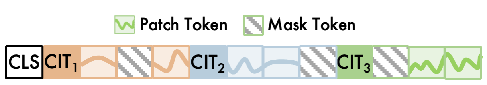
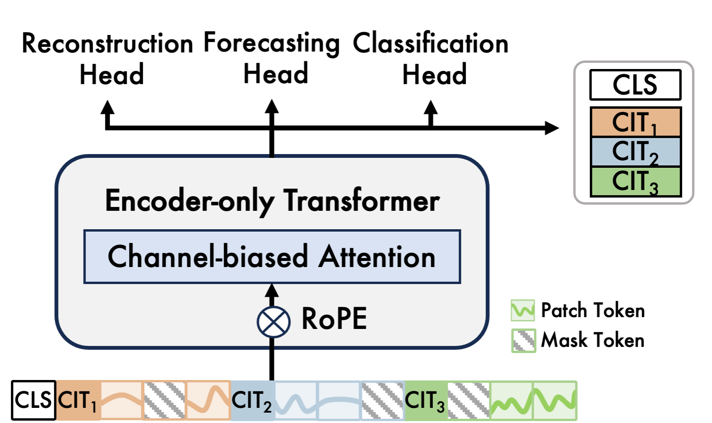
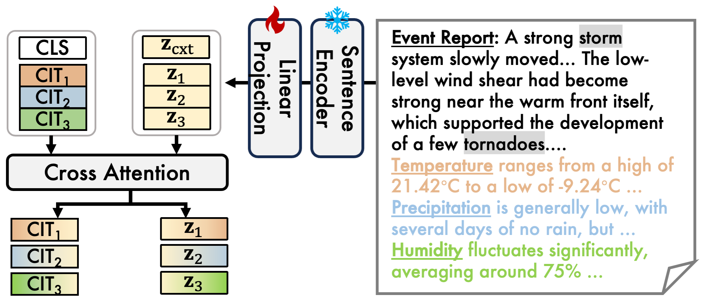
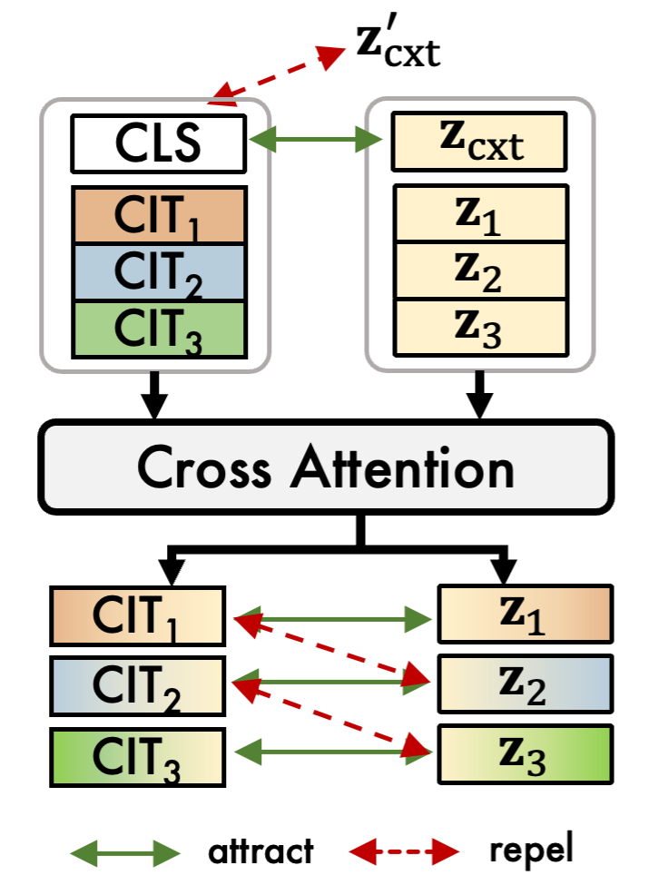

import { Authors, Badges } from '@/components/utils'
import { Table1, Table2, Table3, Table4, Table5 } from './components/tables.tsx'

# TRACE: Grounding Time Series in Context for Multimodal Embedding and Retrieval

<Authors 
    authors="Jialin Chen, Yale University; Ziyu Zhao, McGill University; Gaukhar Nurbek, University of Texas Rio Grande Valley; Aosong Feng, Yale University; Ali Maatouk, Yale University; Leandros Tassiulas, Yale University; Yifeng Gao, University of Texas Rio Grande Valley; Rex Ying, Yale University"
/>

<Badges
  venue="NeurIPS 2025"
  github="https://github.com/Graph-and-Geometric-Learning/TRACE-Multimodal-TSEncoder"
  arxiv="https://arxiv.org/abs/2506.09114"
  pdf="https://arxiv.org/pdf/2506.09114"
/>

## Introduction
Time-series data is central to domains like healthcare, weather, and energy, yet it rarely exists alone. In real-world settings, it is often paired with rich textual context such as clinical notes or weather reports. This combination calls for models that can jointly understand time-series signals and text.
As shown in figure below, a flash flood report describing heavy rainfall and strong winds can help retrieve historical time-series patterns with similar dynamics, supporting tasks like forecasting and disaster alerts. But existing approaches remain limited—they often ignore the textual context and struggle to align time-series and language representations effectively.

## Method
We introduce TRACE — a Time-series Retriever with Aligned Context Embedding. TRACE is the first multimodal retriever that learns semantically grounded time-series embeddings through fine-grained dual-level alignment. It uses a masked autoencoder with Channel Identity Tokens (CITs) to capture channel-specific behaviors and employs hierarchical hard negative mining to align time-series and textual representations effectively.
TRACE serves two purposes:
	1.	As a general-purpose retriever, it enhances foundation models via retrieval-augmented generation (RAG).
	2.	As a standalone encoder, it achieves state-of-the-art performance on forecasting and classification benchmarks.

As shown in the figure below, TRACE first learns robust time-series representations through masked reconstruction with channel-aware attention. It then aligns each time-series channel with its corresponding text using fine-grained contrastive learning. Building on this, TRACE introduces a retrieval-augmented generation strategy that fetches relevant context for downstream tasks. This modular design delivers strong standalone performance while integrating seamlessly with existing time-series foundation models.

### Stage 1: Time Series Encoder Pre-training
In this stage TRACE learns robust time series representations through a masked reconstruction
objective with channel-biased attention.

**Time Series Tokenization**

We divide multivariate time series into non-overlapping patches and project them into patch tokens. Each channel gets a learnable [CIT] token prepended as a channel-level summary, enabling the model to differentiate and aggregate channel patterns. A global [CLS] token is inserted at the beginning, forming the final sequence shown in the figure. This preserves temporal and structural granularity: patches encode local patterns, [CIT] tokens capture channel dynamics, and [CLS] provides a global embedding for downstream tasks.

**Channel-biased Attention and Rotary PE**

To process these tokens effectively, we introduce a Channel-biased Attention (CbA) mechanism combining channel disentanglement with temporal encoding via rotary positional embeddings (RoPE). CbA uses a biased mask where [CIT] tokens only attend to their own channel, while non-[CIT] tokens attend globally. This enforces channel disentanglement while enabling rich token interactions. RoPE is applied independently within each channel to temporal tokens but not to [CIT] tokens. Crucially, RoPE uses relative time differences from the original sequence, preserving true temporal structure despite channel flattening.

TRACE uses an encoder-only Transformer with multi-head channel-biased attention layers. We apply reversible instance normalization to multivariate time series before tokenization and embedding. A fixed proportion of tokens is randomly masked, and the model is pre-trained to reconstruct the missing values from the unmasked context using mean squared error loss. This encourages the model to capture cross-channel dependencies while learning transferable representations for downstream tasks.

### Stage 2: Multimodal Alignment Learning
In this stage, each time series channel is aligned with its textual description via fine-grained contrastive learning. Standard methods use sample-level negatives, but textual descriptions often reference specific variables that cannot be aligned with a single global embedding. We introduce channel-level alignment that explicitly models interactions between individual channels and their textual context, enhancing semantic precision and enabling variable-specific interactions.

**Cross-attention Between Modalities**

After pre-training, we extract the [CLS] token and channel identity token embeddings from the final layer. Textual inputs are encoded via a pre-trained language model and projected into the same embedding space, yielding embeddings for both sample-level and channel-level descriptions. Cross-attention between channel tokens and text embeddings refines the time-series representations using semantically aligned textual information.

**Dual-level Hard Negative Mining**

We develop a dual-level hard negative mining strategy that introduces contrastive pressure at both sample and channel levels, enabling the model to distinguish between unrelated pairs and subtly confusable ones that share temporal similarity but diverge semantically.
Negative candidates are mined based on embedding cosine similarity. Sample-level negatives come from other reports in the batch, while channel-level negatives include both intra-instance distractors (other channels within the same sample) and inter-instance distractors (same-indexed channels across samples).
We compute bidirectional InfoNCE losses at both levels, with a hyperparameter balancing their contributions. This objective is optimized jointly with the time series encoder and projection head, while keeping the language model frozen.

### RAG with Time Series Foundation Models
TRACE enables RAG for time series foundation models. Given a query time series, TRACE computes its [CLS] token embedding and retrieves the top-R most relevant multimodal pairs from a pre-built database based on embedding similarity. Each retrieved pair contains a historical time series and its associated textual context.
The time series and text representations are concatenated, stacked, and mapped through a single trainable projection layer to generate a dense soft token. This token serves as a continuous prompt prepended to the query sequence input, allowing downstream models to incorporate external knowledge without architectural modification.
Importantly, the base foundation model remains frozen during training—only the projection layer and a lightweight task-specific head are updated. This ensures efficiency and model-agnosticism, enabling plug-and-play integration across diverse architectures. TRACE effectively acts as structured external memory, enriching model input with historically grounded and semantically aligned context.

## Results
We evaluate TRACE from three perspectives:
(1) its performance in cross-modal and time-series retrieval compared to strong baselines,
(2) its effectiveness as a retriever in retrieval-augmented forecasting pipelines, and
(3) its generalization as a standalone encoder for forecasting and classification.

### Cross-modal Retrieval
To assess retrieval performance, we replace TRACE’s encoder with several strong time-series foundation models that generate fixed-length embeddings. Each encoder is fine-tuned end-to-end with a lightweight projection layer and a contrastive learning objective for fair comparison.
As shown in Table 1, TRACE achieves state-of-the-art results, with nearly 90% top-1 label matching and 44% top-1 modality matching. Its retrieval accuracy surpasses the classification performance of all models trained from scratch, underscoring the effectiveness of alignment-based supervision. Among baselines, Moment performs best, but TRACE’s fine-grained embeddings enable more precise cross-modal retrieval and semantic matching.

<Table1/>

### Timeseries-to-Timeseries Retrieval
We tested TRACE on a time-series-to-time-series retrieval task, where the goal is finding the most semantically similar series for each query.
Table 2 shows TRACE outperforming all baselines—ED, DTW, SAX-VSM, and CTSR—across key metrics: Precision@1, Precision@5, and Mean Reciprocal Rank (MRR). It also maintained the lowest retrieval latency.
The performance gap highlights a key difference. Methods like SAX-VSM and CTSR struggle to capture deeper temporal and semantic patterns. TRACE's alignment-aware training, by contrast, delivers accurate and efficient retrieval across multivariate signals while remaining scalable.

<Table2/>

### Retrieval-augmented Time Series Forecasting
We used TRACE to find the most relevant time-series and text pairs from our dataset based on embedding similarity.
Table 3 shows that retrieval augmentation improves forecasting performance across all models. The biggest gains came from combining time series with text (TS+Text), especially for decoder-only models like Timer-XL and Time-MoE.
Interestingly, TRACE itself showed minimal improvement between TS-only and TS+Text retrieval. This isn't a weakness—it indicates TRACE's embeddings are already well-aligned across modalities. The model doesn't need much help because its multimodal space is already doing the work.
This makes TRACE effective as a lightweight, general-purpose retriever for RAG pipelines.

<Table3/>

### Standalone Time Series Encoder
We tested TRACE on forecasting and classification tasks, comparing it against traditional models trained from scratch and existing time series foundation models.
The classification results (Table 4) revealed an interesting pattern: fine-tuned foundation models actually performed worse than simpler train-from-scratch models. The likely reason is over-generalization—their embeddings become too broad and lose domain-specific signals needed for accurate classification. TRACE took a different approach. It achieved significantly higher accuracy and F1 scores than baselines, both with and without retrieval-augmented generation (RAG). This suggests TRACE maintains discriminative structure while preserving semantic alignment.

<Table4/>

Table 5 shows TRACE outperforming baselines across datasets, particularly on longer prediction horizons where other models struggle. Traditional approaches show inconsistent performance as the forecasting window extends. TRACE's cross-modal design appears to be the key difference—it provides better semantic understanding and more context-aware predictions.

<Table5/>

### Embedding visualization

Figure above visualizes the joint embedding space using UMAP. Each color represents an event category, with circles for time series and crosses for text descriptions connected by lines.
The visualization shows clear clustering by event type, with paired modalities positioned closely together. Some events like "Flood" and "Debris Flow" show overlapping clusters, reflecting shared underlying dynamics. The tight alignment between paired points validates our dual-level alignment strategy, while modality-mixing within clusters suggests successful fusion of structured and unstructured signals.

### Empirical Case Study
Following figure demonstrates alignment between detailed textual context and corresponding multivariate time series. The retrieval pool excludes the query's paired instance, ensuring retrieved results reflect the model's ability to identify semantically similar yet distinct examples.
TRACE uses both high-level and fine-grained semantic cues to retrieve the most relevant time series. The top-1 retrieved sequence closely reflects key patterns in the query text, serving as a valuable reference for downstream forecasting, scenario simulation, or contextual explanation.

### TS-to-TS Retrieval Case Study
Next figure shows a TS-to-TS retrieval case study. Given a query time series labeled as Flood, TRACE retrieves the top-3 most similar samples based on embedding similarity. Similarity scores appear on the left, with per-channel values annotated below each plot.
All retrieved samples show high overall similarity (approximately 0.79–0.81), reflecting strong semantic alignment. The top-2 retrievals are also labeled as Flood, while the third is Flash Flood—a semantically related event. This demonstrates TRACE's ability to retrieve contextually relevant samples even across closely related labels.
TRACE enables fine-grained channel-level similarity assessment through its Channel Identity Tokens (CIT), which independently embed channel-specific signals. Interestingly, high similarity in individual channels doesn't always guarantee high overall semantic alignment. The first retrieval shows moderate per-channel similarity yet achieves a high overall semantic score.
This highlights TRACE's structured aggregation across channels to capture global semantics and identify the most semantically dominant channels. TRACE retrieves samples sharing latent event signatures rather than merely matching patterns uniformly across all channels.
