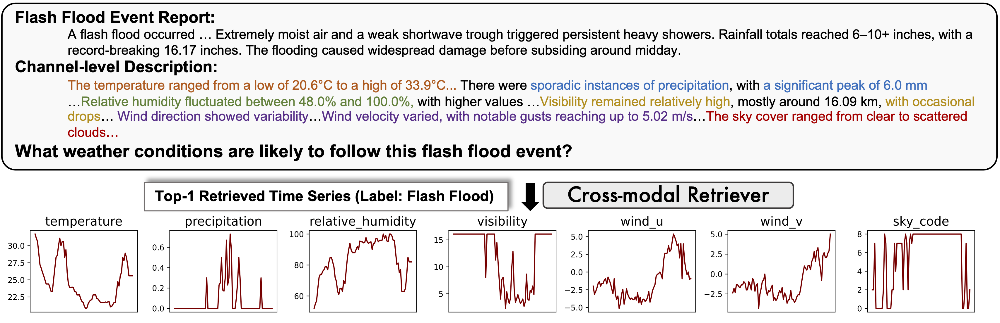
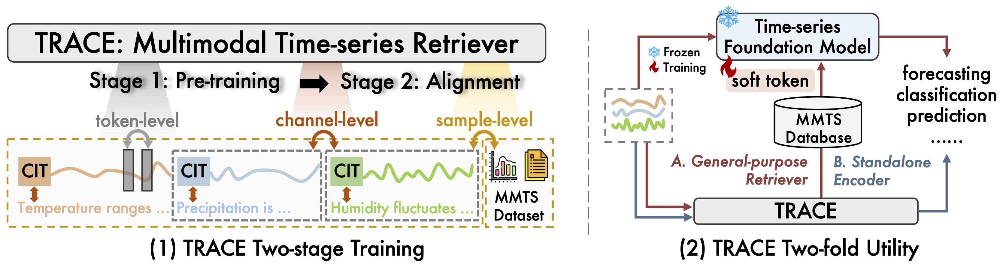
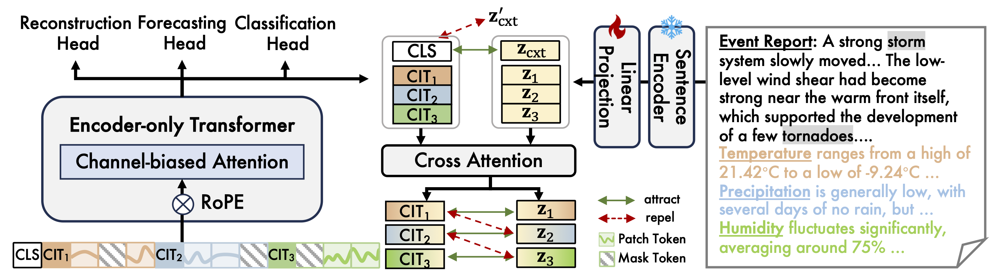
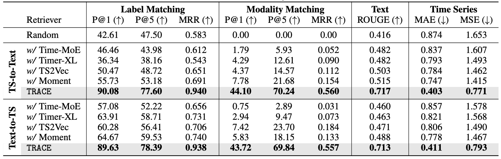
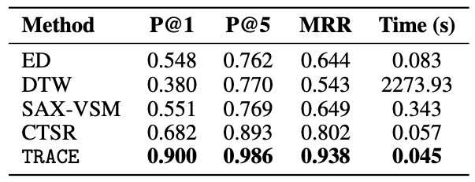
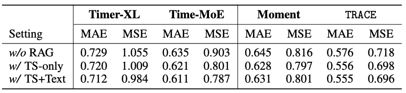
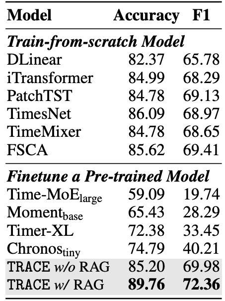
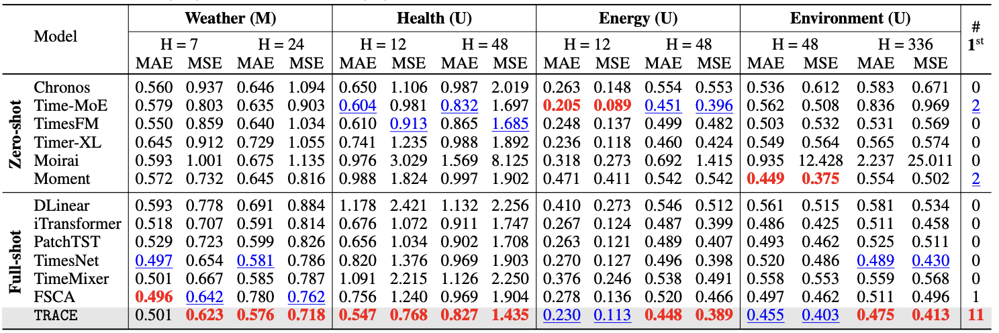

import { Authors, Badges } from '@/components/utils'

# TRACE: Grounding Time Series in Context for Multimodal Embedding and Retrieval

<Authors 
    authors="Jialin Chen, Yale University; Ziyu Zhao, McGill University; Gaukhar Nurbek, University of Texas Rio Grande Valley; Aosong Feng, Yale University; Ali Maatouk, Yale University; Leandros Tassiulas, Yale University; Yifeng Gao, University of Texas Rio Grande Valley; Rex Ying, Yale University"
/>

<Badges
  venue="NeurIPS 2025"
  github="https://github.com/Graph-and-Geometric-Learning/TRACE-Multimodal-TSEncoder"
  arxiv="https://arxiv.org/abs/2506.09114"
  pdf="https://arxiv.org/pdf/2506.09114"
/>

## Introduction
Time-series data is central to domains like healthcare, weather, and energy, yet it rarely exists alone. In real-world settings, it is often paired with rich textual context such as clinical notes or weather reports. This combination calls for models that can jointly understand time-series signals and text.
As shown in figure below, a flash flood report describing heavy rainfall and strong winds can help retrieve historical time-series patterns with similar dynamics, supporting tasks like forecasting and disaster alerts. But existing approaches remain limited—they often ignore the textual context and struggle to align time-series and language representations effectively.

## Method
We introduce TRACE — a Time-series Retriever with Aligned Context Embedding. TRACE is the first multimodal retriever that learns semantically grounded time-series embeddings through fine-grained dual-level alignment. It uses a masked autoencoder with Channel Identity Tokens (CITs) to capture channel-specific behaviors and employs hierarchical hard negative mining to align time-series and textual representations effectively.
TRACE serves two purposes:
	1.	As a general-purpose retriever, it enhances foundation models via retrieval-augmented generation (RAG).
	2.	As a standalone encoder, it achieves state-of-the-art performance on forecasting and classification benchmarks.

As shown in the figure below, TRACE first learns robust time-series representations through masked reconstruction with channel-aware attention. It then aligns each time-series channel with its corresponding text using fine-grained contrastive learning. Building on this, TRACE introduces a retrieval-augmented generation strategy that fetches relevant context for downstream tasks. This modular design delivers strong standalone performance while integrating seamlessly with existing time-series foundation models.

## Results
We evaluate TRACE from three perspectives:
(1) its performance in cross-modal and time-series retrieval compared to strong baselines,
(2) its effectiveness as a retriever in retrieval-augmented forecasting pipelines, and
(3) its generalization as a standalone encoder for forecasting and classification.

### Cross-modal Retrieval
To assess retrieval performance, we replace TRACE’s encoder with several strong time-series foundation models that generate fixed-length embeddings. Each encoder is fine-tuned end-to-end with a lightweight projection layer and a contrastive learning objective for fair comparison.
As shown in Table 1, TRACE achieves state-of-the-art results, with nearly 90% top-1 label matching and 44% top-1 modality matching. Its retrieval accuracy surpasses the classification performance of all models trained from scratch, underscoring the effectiveness of alignment-based supervision. Among baselines, Moment performs best, but TRACE’s fine-grained embeddings enable more precise cross-modal retrieval and semantic matching.

### Timeseries-to-Timeseries Retrieval
We tested TRACE on a time-series-to-time-series retrieval task, where the goal is finding the most semantically similar series for each query.
Table 2 shows TRACE outperforming all baselines—ED, DTW, SAX-VSM, and CTSR—across key metrics: Precision@1, Precision@5, and Mean Reciprocal Rank (MRR). It also maintained the lowest retrieval latency.
The performance gap highlights a key difference. Methods like SAX-VSM and CTSR struggle to capture deeper temporal and semantic patterns. TRACE's alignment-aware training, by contrast, delivers accurate and efficient retrieval across multivariate signals while remaining scalable.

### Retrieval-augmented Time Series Forecasting
We used TRACE to find the most relevant time-series and text pairs from our dataset based on embedding similarity.
Table 3 shows that retrieval augmentation improves forecasting performance across all models. The biggest gains came from combining time series with text (TS+Text), especially for decoder-only models like Timer-XL and Time-MoE.
Interestingly, TRACE itself showed minimal improvement between TS-only and TS+Text retrieval. This isn't a weakness—it indicates TRACE's embeddings are already well-aligned across modalities. The model doesn't need much help because its multimodal space is already doing the work.
This makes TRACE effective as a lightweight, general-purpose retriever for RAG pipelines.

### Standalone Time Series Encoder
We tested TRACE on forecasting and classification tasks, comparing it against traditional models trained from scratch and existing time series foundation models.
The classification results (Table 4) revealed an interesting pattern: fine-tuned foundation models actually performed worse than simpler train-from-scratch models. The likely reason is over-generalization—their embeddings become too broad and lose domain-specific signals needed for accurate classification. TRACE took a different approach. It achieved significantly higher accuracy and F1 scores than baselines, both with and without retrieval-augmented generation (RAG). This suggests TRACE maintains discriminative structure while preserving semantic alignment.

 

Table 5 shows TRACE outperforming baselines across datasets, particularly on longer prediction horizons where other models struggle. Traditional approaches show inconsistent performance as the forecasting window extends. TRACE's cross-modal design appears to be the key difference—it provides better semantic understanding and more context-aware predictions.

