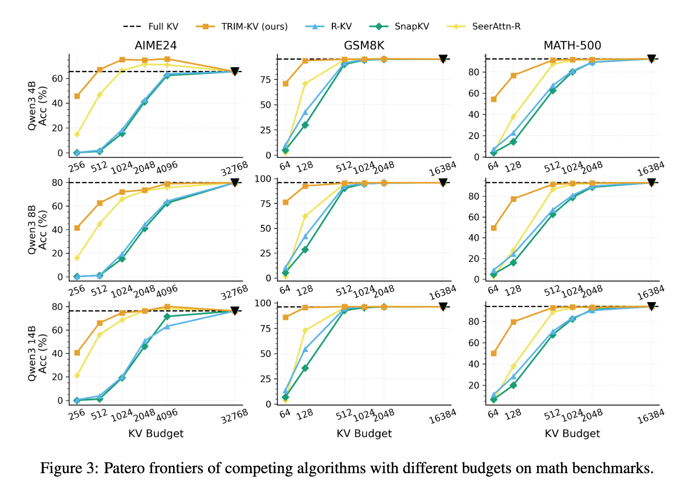
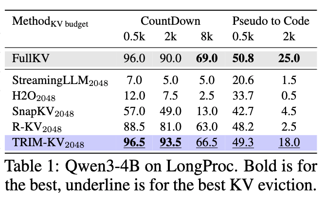
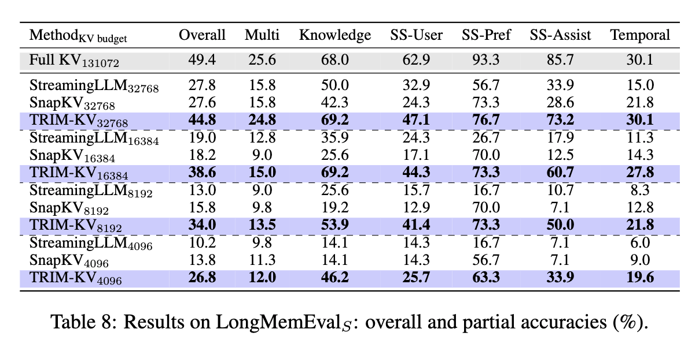
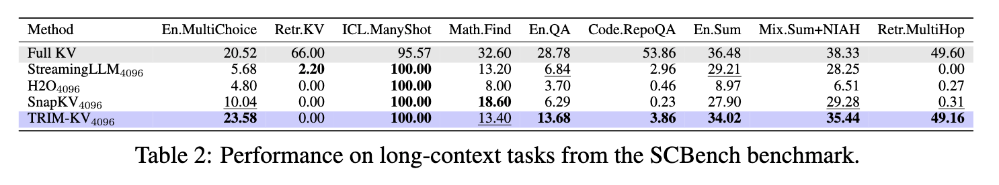
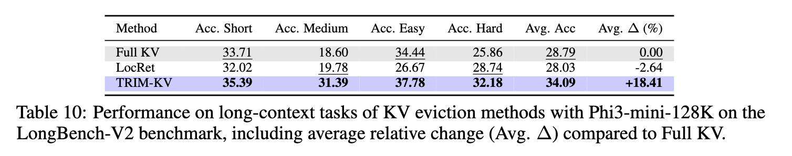

import { Authors, Badges } from '@/components/utils'

# Cache What Lasts: Token Retention for Memory-Bounded KV Cache in LLMs

<Authors
  authors="Ngoc Bui, Yale University; Shubham Sharma, JPMorganChase; Simran Lamba, JPMorganChase; Saumitra Mishra, JPMorganChase; Rex Ying, Yale University"
/>


<Badges
  venue="ICLR 2026"
  github="https://github.com/ngocbh/trimkv/"
  arxiv="https://arxiv.org/abs/2512.03324"
  pdf="https://arxiv.org/abs/2512.03324"
/>

## TL;DR

Large language models are getting better at handling long contexts, but there is still a major systems bottleneck: the **KV cache**. As a model generates more tokens, it stores more keys and values from previous steps, which increases memory use and slows inference.

Our paper introduces **TRIM-KV**, a new approach for memory-bounded inference that learns **which tokens are worth keeping** in the KV cache.

## Why this matters

Most existing KV eviction methods rely on recent attention patterns to decide what to keep. In practice, that can be brittle. A token that is not useful right now may still become important much later, especially in long reasoning or long-generation settings.

TRIM-KV takes a different view: instead of asking what the model attended to recently, we ask whether a token is **intrinsically important at the moment it is created**.

## The core idea

TRIM-KV adds a lightweight **retention gate** that assigns each token a score representing its long-term importance for a particular layer and head. This score gradually decays over time. When the cache reaches its memory budget, the model evicts the token with the lowest retention score.

This makes eviction a learned decision rather than a hand-designed heuristic.

## Why it works

Not all tokens contribute equally to future computation. Some carry key task information, such as instructions, facts, or core problem statements. Others are much less useful. TRIM-KV learns this distinction directly from token representations and keeps the most valuable tokens under a fixed memory budget.

Interestingly, the learned policy naturally recovers behaviors that resemble well-known heuristics such as sink tokens, sliding windows, and gist-like compression — but without explicitly hard-coding them.

## Results

We evaluate TRIM-KV on a diverse set of long-context and long-generation benchmarks. Across these settings, TRIM-KV consistently outperforms strong KV eviction and learnable retrieval baselines, especially in low-memory regimes. In several cases, it even performs better than full-cache inference, suggesting that selective retention can also act as a form of regularization by filtering out noisy or uninformative tokens.

- Long Mathematical Reasoning (AIME24, GSM8k, MATH-500)



- Long Procedural Generation (LongProc)



- Long Memory Conversation (LongMEmEval)



- Long-Context Understanding (SCBench, LongBench, LongBenchV2)





## Takeaway

TRIM-KV shows that efficient long-context inference is not just about compressing memory — it is about **learning what to remember**.

By predicting token importance at creation time, TRIM-KV turns KV cache eviction into a simple, trainable, and effective mechanism for scaling LLM inference under memory constraints.


---

## Citation

```bibtex
@article{bui2025cache,
  title={Cache what lasts: Token retention for memory-bounded kv cache in llms},
  author={Bui, Ngoc and Sharma, Shubham and Lamba, Simran and Mishra, Saumitra and Ying, Rex},
  journal={arXiv preprint arXiv:2512.03324},
  year={2025}
}
```